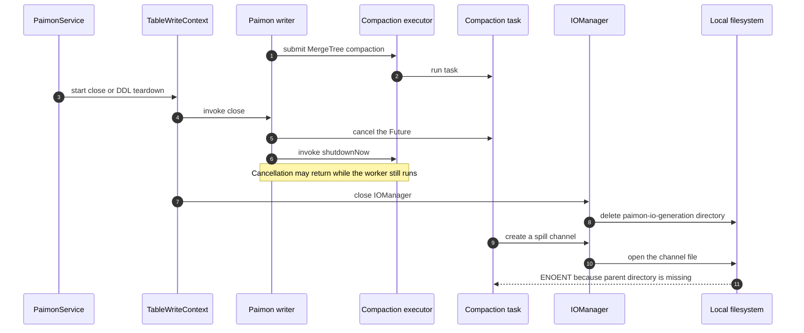
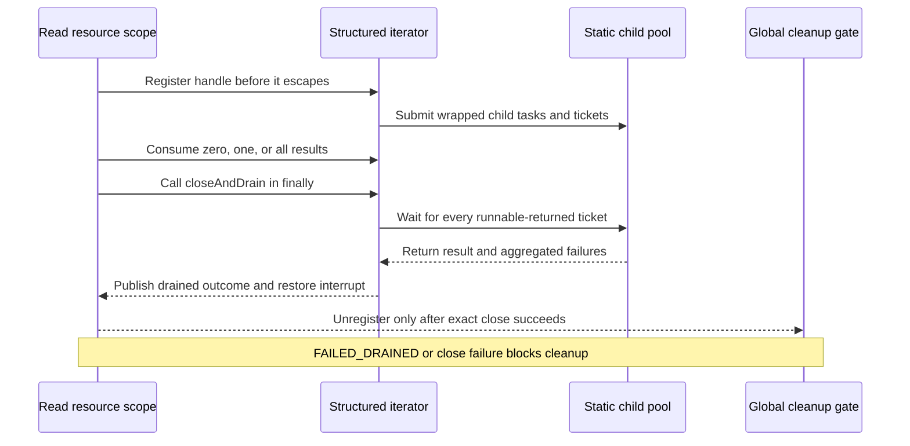
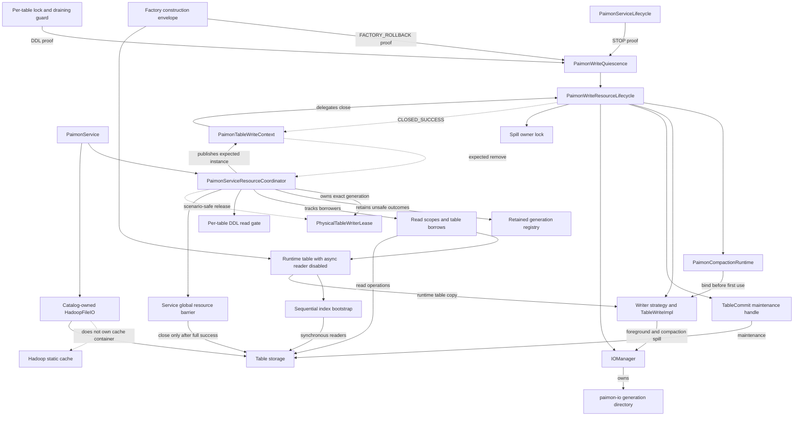
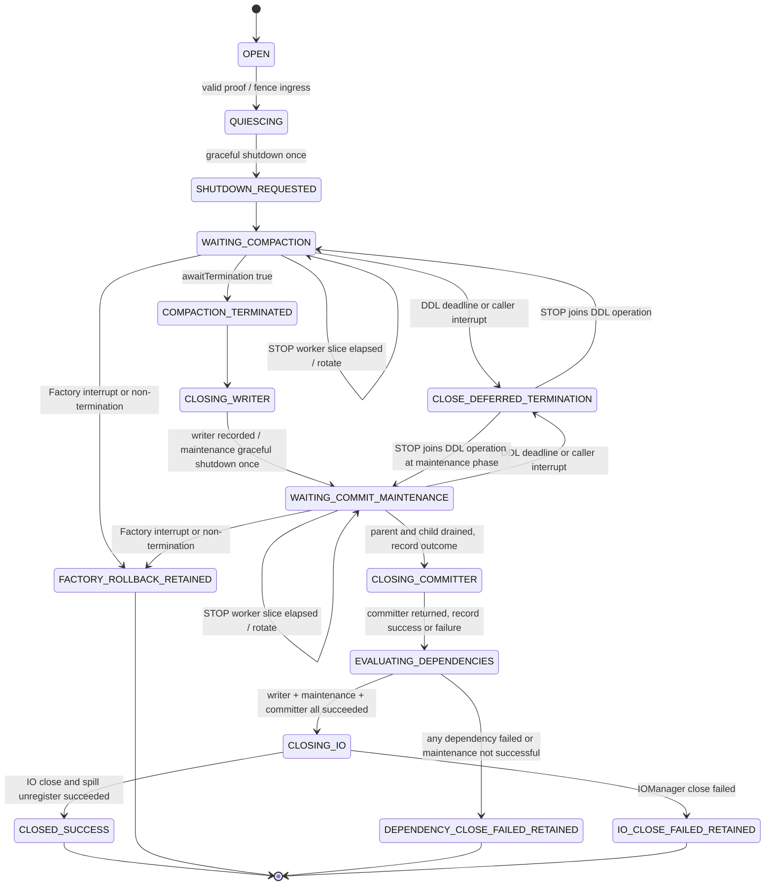
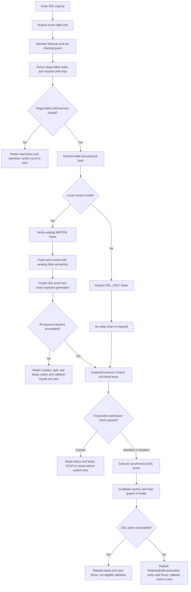

# Spec: Paimon Spill 与异步资源生命周期根治

> - 状态：APPROVED FOR PHASED IMPLEMENTATION v5.1；2026-09-01 已授权按 RED/GREEN 和阶段提交实施。Q4 只阻断 DDL action-admission policy 与对应 DDL 验证，不阻断 Paimon structured API、Connector read/global barrier 等非 DDL 工作
> - 基线分支：`develop`
> - 基线提交：`3b8e6d982266`
> - 目标模块：`connectors/paimon-plus-connector`
> - 运行时基线：Paimon `1.3.2`
> - 对照版本：Paimon `1.3.1`、`1.4.2`，Paimon Flink Connector `release-1.3.1`，Flink `1.20.1`
> - Notion：[Paimon Spill 与后台 Compaction 生命周期根治 Spec](https://app.notion.com/p/3cdde1e3b95d81e08521e2bbcf75097f?pvs=204)
> - 相关历史 Spec：[Paimon Bucket Writer 与 Commit 接口重构](https://app.notion.com/p/3a2de1e3b95d81ae9e38c0af3fde6d37)

## 0. 评审结论与修订记录

### 0.1 评审结论

v1 的根因方向正确，但不能进入实施：独立审查发现 DDL 提前释放物理表 owner、Context 等待全局 ingress 可能自锁、同 Service 的 owner token 不能区分 generation，以及关闭状态把“仍可继续等待”和“依赖 close 已不可安全重试”混为一谈。

v2 已按 correctness、failure semantics、API/compatibility、performance、security/observability 五个维度修正；v3 再对 DDL/read 隔离、Paimon static child、路径安全、可执行测试与量化性能门禁进行对抗审查；v4 对外部审查逐项反证，修正 GlobalIndex、DDL deadline、maintenance outcome 与 Hadoop FS ownership；v5 进一步修正 lazy iterator 提前放弃、Hadoop access probe/single-flight 与 Maven effective-POM 闭包。当前结论是：

- **Spec 已通过进入分阶段实施所需的架构评审**；
- **实施已获授权并已在 Paimon fork 开始；Connector 生产接入仍须逐 Task 通过 RED/GREEN 与本 Spec 门禁**；
- 源码事实可以由不可变 commit 和本地 source JAR 复核；
- 单次生产事件的实际删除者仍不能仅凭异常后的 `ls` 唯一定责，必须保留 `EXTERNAL_OR_UNATTRIBUTED` 分类。

### 0.2 阻断项修订

<table header-row="true" fit-page-width="true">
  <tr><td>级别</td><td>v1 问题</td><td>v2 修正</td></tr>
  <tr><td>Critical</td><td>DDL 在 action 前释放 owner</td><td>DDL 持有 generation lease 直到 Context 安全关闭、expected-remove、DDL action 完成以及 cache invalidation 完成</td></tr>
  <tr><td>Critical</td><td>Context 等待全局 foreground=0，DDL 自己又持有 ingress</td><td>改为调用方提供可校验的 `PaimonWriteQuiescence`；STOP、DDL、Factory rollback 分别证明</td></tr>
  <tr><td>Critical</td><td>owner=`service:tableKey`，同 Service 的新旧 generation 相同</td><td>引入不可变 `PhysicalTableWriterLease`，token 包含独立 `generationId`，所有删除均 exact compare-and-remove</td></tr>
  <tr><td>Critical</td><td>`CLOSE_DEFERRED` 同时表示 await timeout 和 dependency close failure</td><td>拆成可重试 termination wait 与不可重试 retained terminal failure；每个依赖维护一次性 close progress</td></tr>
  <tr><td>Critical</td><td>对 injected executor 直接 `shutdownNow()` 会绕过 Paimon 保存的 Future cancel 协议，interrupt-responsive task 可能以 EXCEPTIONAL 完成</td><td>foreground proof 后只用 graceful `shutdown() + awaitTermination()`；v1 不提供无真实 Future handle 的 force path</td></tr>
  <tr><td>Critical</td><td>STOP 资源关闭设计遗漏当前 stop-drain/callback-start fence</td><td>先完成 `flushTableInternal(..., "stop", true)` 与 callback admission，再 snapshot generation 并统一 shutdown；failure/deadline 后不 ack offset</td></tr>
  <tr><td>Critical</td><td>无本地 Context 的 DDL 没有 old-generation owner 可复用</td><td>在表锁内原子获取 DDL_ONLY lease；冲突时 action count=0，lease 跨越 action 与 invalidation</td></tr>
  <tr><td>Critical</td><td>retained table generation 后仍可能关闭共享 Catalog/FileIO</td><td>增加 Service-global borrower barrier 和 retained-generation registry；任一 retained generation 阻断全局 destructive cleanup</td></tr>
  <tr><td>Critical</td><td>禁用外层 bootstrap pool 后仍可能由大 ORC 创建 static `AsyncRecordReader`，且普通 read scope 未纳入 global barrier</td><td>所有 Connector read/write 使用禁用 async reader 的 runtime table；active read scope/executor 纳入全局 barrier，close failure retained</td></tr>
  <tr><td>Critical</td><td>若 read scope 在 `catalog.getTable()` 后注册，STOP 可能误判 registry 为空并关闭该 read 已借用的 Catalog/FileIO</td><td>public read 入口在任何下游访问前注册 provisional scope；scope admission 与 STOP fence 共用锁/CAS 线性化点，所有前置失败 exact-close</td></tr>
  <tr><td>Required</td><td>单体 `synchronized close()` 持锁等待</td><td>短锁创建/加入同一个 `CloseOperation`；shutdown、await、dependency close 均在 monitor 外执行</td></tr>
  <tr><td>Required</td><td>Factory 假定构造期可能已有 Compaction，但没有 retained handle</td><td>用 prepared-writer type boundary 与精确 submission flag 建立构造不变量；失败回滚正向证明 executor termination，否则 typed retained handoff</td></tr>
  <tr><td>Required</td><td>把 `prepareCommit(true)` 当作关闭优化</td><td>从 v1 根治方案完全移除；继续只使用现有 `prepareCommit(false, identifier)`</td></tr>
  <tr><td>Required</td><td>忽略 Paimon async commit maintenance executor</td><td>使用 patched maintenance handle；writer close 后 graceful shutdown、结构化等待 maintenance及其 static child，再 exactly-once close committer</td></tr>
  <tr><td>Required</td><td>已经取得 ingress 后等待表锁的 DML 可越过 DDL failure fence</td><td>所有 Context get/create 路径在取得 exact table lock 后二次校验 lifecycle、sticky failure 与 draining guard</td></tr>
  <tr><td>Critical</td><td>把 KEY_DYNAMIC bootstrap EOF/reader close 当作内部 reader pool 的 termination proof</td><td>生产路径不再调用 Paimon `IndexBootstrap#bootstrap`；用 version-locked sequential adapter 消除不可等待的 `ParallelExecution`，同步关闭每个 split reader</td></tr>
  <tr><td>Required</td><td>把 Paimon concrete writer 称为稳定公共 API</td><td>改称“版本锁定的 concrete extension seam”，增加编译/API 升级门禁，禁止反射回退</td></tr>
</table>

### 0.3 v3 五轴审查结论

第二轮按 correctness、readability、architecture、security、performance 重新审查，没有沿用 v2 的通过结论。v3 关闭以下阻断项：

<table header-row="true" fit-page-width="true">
  <tr><td>级别</td><td>发现</td><td>v3 修正</td></tr>
  <tr><td>Critical</td><td>DDL 只等待 writer，不等待目标表 active reader；drop/truncate 仍可能删除 reader 正在访问的数据文件</td><td>read operation 拆成 parent scope + per-table child borrow；DDL 在同一 table-read gate fence 新 borrower、请求目标表 child 停止并等待 exact-close，未完成时 action count=0</td></tr>
  <tr><td>Required</td><td>read scope 没有 single-owner close/join 状态机，STOP/caller/worker 可能 double-close</td><td>增加一次性 read close operation、resource owner、progress 和 join 规则；STOP/DDL 只 request/join，不越权关闭 reader</td></tr>
  <tr><td>Required</td><td>DDL action failure marker 只覆盖 DDL_ONLY lease，可能遗漏由 Context 转来的 WRITER lease</td><td>统一为 `RetainedDdlActionLease`，原子接管 WRITER 或 DDL_ONLY exact lease；global barrier 检查全部 marker</td></tr>
  <tr><td>Required</td><td>`PaimonService` 已超过 3,600 行，但 Spec 继续把 registry/barrier/DDL/STOP 状态直接堆入 Service，且缺少锁顺序</td><td>抽出 `PaimonServiceResourceCoordinator`，增加规范性锁/线性化契约，禁止在协调锁内执行外部调用或等待</td></tr>
  <tr><td>Required</td><td>19 个生产文件只有清单，没有依赖顺序和安全中间态</td><td>增加五个有依赖的 vertical slice 与 FR→类→测试→事件→出口门禁；未完成全链路前不得发布生产包</td></tr>
  <tr><td>Required</td><td>真实 Spill 测试命名为 `*IT`，但仓库没有 Failsafe/profile，列出的 `test` 命令不会执行它</td><td>改为本地确定性的 `PaimonCompactionSpillLifecycleTest`，加入 Surefire 精确列表和全模块默认 gate</td></tr>
  <tr><td>Required</td><td>sequential bootstrap/禁用 async reader 只有“灰度观察”，没有可判定性能预算</td><td>增加固定 workload、基线方法、P50/P95/P99 指标、低基数 metric contract、默认阈值与回滚条件</td></tr>
  <tr><td>Required</td><td>递归删除 spill 目录的安全边界只依赖名称/owner，没有写入 Spec 的 containment 与 symlink 约束</td><td>增加 approved-root containment、严格 basename、NOFOLLOW、identity revalidation 和 fail-closed 删除不变量</td></tr>
  <tr><td>Critical</td><td>maintenance 主 executor TERMINATED 后，static Manifest/FileOperation child task 仍可能使用 FileIO</td><td>routine maintenance 改为 graceful；Paimon Core 补丁要求异常/中断时结构化 drain 全部 child Future并暴露 maintenance outcome，未使用补丁的构建禁止发布</td></tr>
  <tr><td>Critical</td><td>sequential bootstrap/read planning/filterAndCommit 仍会借用 Paimon static pool，外层顺序读取不等于全链路无 executor</td><td>将 static child drain 作为 Paimon Core shipping gate；所有异常/中断进入 retained，测试用 sibling Future latch证明 global resources 不会提前关闭</td></tr>
  <tr><td>Required</td><td>`Long.MAX_VALUE` threshold 不能在 Factory construction 时检查未来 Compaction plan</td><td>删除不可实现的 construction proof；依赖 Core 新增显式 async-reader disable option，Connector runtime table只消费该正式 seam</td></tr>
  <tr><td>Required</td><td>`GlobalIndexAssigner.close()` 不清理 bootstrap buffer，失败构造器会丢失真实 handle</td><td>改为 staged construction，创建即登记 rollback envelope；Core 补丁令 close 清空 bootstrap state，`endBoostrap`（上游 typo）前失败一律 retained</td></tr>
</table>

### 0.4 人工评审导航

本文档将规范性设计、不可变源码证据、失败矩阵和测试门禁放在同一个可追溯 Spec 中，因此文件较长。评审者可按下列顺序阅读：

1. **事故机制与证据**：第 2、3 节；
2. **必须成立的安全不变量**：第 5 节；
3. **架构、锁顺序与 STOP/DDL 流程**：第 6 节；
4. **有序实施与可执行验证**：第 10.2、11 节；
5. **可上线裁决**：第 12、15、18 节。

### 0.5 v4 外部审查逐条裁决

外部审查报告只作为待验证输入，不作为事实来源。v4 以 Paimon/Hadoop 固定 commit、本地 sources JAR 和 Connector 当前/0730 Git 历史逐条复核，裁决如下：

<table header-row="true" fit-page-width="true">
  <tr><td>条目</td><td>裁决</td><td>v4 修正</td></tr>
  <tr><td>R1 GlobalIndex 源码锚点</td><td>成立，但报告给出的替换链仍不完整</td><td>区分字段、初始化、`endBoostrapWithoutEmit`、bulk-load/iterator 两条 buffer 释放分支与原版 `close`；保留上游方法名 typo</td></tr>
  <tr><td>R2 `WRITE_FAILURE` proof</td><td>成立</td><td>`initiatingReason` 只保留 STOP/DDL/FACTORY_ROLLBACK；写路径错误改由独立 `failureOrigin` 记录，不能伪造不存在的 quiescence proof</td></tr>
  <tr><td>R3 DDL 30 秒</td><td>核心风险成立，报告称“action 必须在 30 秒内完成”不成立</td><td>30 秒改为待人工裁决的 action-admission deadline；只在 wait/新阶段/action 开始前检查，不强行中断已开始的同步调用</td></tr>
  <tr><td>R4 永久 WAITING</td><td>现象成立，但不是遗漏，要求超时后发布终态是错误建议</td><td>elapsed time 不是 termination proof；只做一次性升级告警/重启建议，继续持有资源、lease 和 operation，绝不伪报 CLOSED</td></tr>
  <tr><td>R5 Hadoop cache</td><td>部分成立，当前影响描述错误</td><td>当前helper关闭wrapper而非raw FS，默认路径清理无效；最终方案为HDFS/S3A等HadoopFileIO路径使用exact owned raw，file按LocalFileIO处理，并禁止`closeAll*`</td></tr>
  <tr><td>N1 源码范围</td><td>部分成立</td><td>修正 `TableWriteImpl`、`IOManagerImpl` 精确行号；`FileChannelManagerImpl` 拆分 close 本体与递归删除 helper</td></tr>
  <tr><td>N2 PartitionExpire</td><td>部分成立</td><td>明确只对内建 UPDATE_TIME/VALUES_TIME 策略证明间接进入 manifest pool；CUSTOM 必须按实现复核</td></tr>
  <tr><td>N3 maintenance seam</td><td>成立</td><td>Factory 伪代码改取 patched opaque lifecycle handle，禁止消费 `@VisibleForTesting getMaintainExecutor()`</td></tr>
  <tr><td>N4 精确测试列表</td><td>成立</td><td>补入 `KeyDynamicBucketWriterStrategyTest` 并要求对应 Surefire XML `tests &gt; 0`</td></tr>
  <tr><td>N5 Flink 示例</td><td>部分成立</td><td>明确只参考 termination wait 位于 compactor close 前的偏序，不复制 `shutdownNow` 或 timeout fail-open</td></tr>
  <tr><td>N6 `maintainError`</td><td>成立且范围更广</td><td>SYNC/ASYNC 都须在 parent/child drain 后读取 `maintainError`；非空只能发布 `FAILED_DRAINED`</td></tr>
  <tr><td>FYI late submission</td><td>风险成立，但“所有调用必抛 REE”错误</td><td>fence 所有可能实际触发 compaction `submit` 的入口；测试同时证明正常 admission 拒绝与故意漏入后的确定性 rejection</td></tr>
</table>

### 0.6 v5 Paimon/Hadoop/Maven 事实审查裁决

v5 以本地 Paimon `1.3.2` source JAR、Hadoop `3.3.6` source JAR、Connector 当前 POM 和不可变上游 commit 复核 v4 的可实施性。以下条目是对 v4 的 Required 修正，不允许在 Plan 中降级为 Optional fallback：

<table header-row="true" fit-page-width="true">
  <tr><td>级别</td><td>v4 缺口</td><td>v5 规范性修正</td></tr>
  <tr><td>Critical</td><td>`ThreadPoolUtils` 返回普通 lazy `Iterator/Iterable`；调用方消费 0/1 条后正常放弃时没有 drain 入口</td><td>保留旧方法 descriptor，并新增显式 `AutoCloseable` structured operation/iterator API。每个 structured handle 恰有一个 resource owner：跨 read 边界时由 read child scope 接管；不逃逸边界时由 lexical owner eager-drain；所有 success、failure、early-stop、interrupt 路径执行 `closeAndDrain()`</td></tr>
  <tr><td>Critical</td><td>`FileIO.checkAccess` 创建 provisional FileIO、调用 `exists` 后丢失 handle；Hadoop fallback 随后又创建正式实例</td><td>access check 返回并复用同一个已 configure/validate 的 FileIO；无法复用的 provisional 必须 exact-close，rollback close 失败则 fail-fast</td></tr>
  <tr><td>Critical</td><td>`HadoopFileIO#getFileSystem` 的 `get/create/put` 在 owned mode 可并发创建并覆盖 unique raw</td><td>使用 `OwnedFileSystemEntry` single-flight reservation；`close` 与 creation 线性化，losing/late raw exact-close</td></tr>
  <tr><td>Required</td><td>把 `FAILED_DRAINED` 等同于父资源可释放</td><td>`FAILED_DRAINED` 只证明 runnable 已退出；业务失败仍进入 dependency retained。只有 maintenance `SUCCESS`、`maintainError == null`、writer/committer close 都成功时才允许关闭 IO/spill/lease</td></tr>
  <tr><td>Required</td><td>把 `newInstance` 描述为不进入 Hadoop static cache，并把 `file://` 当作 Hadoop raw FS</td><td>`newInstance` 以 unique key 被 static cache 跟踪，exact raw close只移除自己的 entry；禁止 broad close。`file://` 默认是 `LocalFileIO`，不作 Hadoop raw identity/count 断言</td></tr>
  <tr><td>Required</td><td>只发布 patched API/Common/Core，却未闭合 Core POM 中 `${project.version}` 依赖</td><td>归档 effective POM；patched stack 与 upstream ecosystem 分版本，显式固定 `paimon-codegen-loader`、`paimon-format` 等未 fork 模块为 `1.3.2`，或发布经证明的完整闭包</td></tr>
  <tr><td>Required</td><td>Factory rollback 采用普通逆序 close；DDL 等待自身 WRITER lease；fatal write error 被当作 STOP proof</td><td>Factory 使用固定安全偏序和 staged ownership；DDL 持有现有 WRITER/DDL_ONLY lease并只等其他 borrower；fatal write只 sticky-fence，只有真实 STOP/DDL/FACTORY_ROLLBACK 能建立 proof</td></tr>
  <tr><td>Required</td><td>生产 cleanup/capability 仍允许反射兼容回退</td><td>完全删除生产反射 fallback；只读诊断若保留，不得 unwrap、close、clear，也不得通过 capability gate</td></tr>
</table>

### 0.7 Markdown 图表兼容约定

- Mermaid fenced block只使用保守语法：`graph`、`sequenceDiagram`、`stateDiagram-v2`、显式节点ID和引号包裹的label；不使用HTML`<br/>`、未转义的复杂表达式或超大单图。
- 每个规范性时序图、所有权架构图、状态机和DDL流程图后都提供纯Markdown表格/`text` fallback；查看器不支持Mermaid时，fallback仍是完整规范，不依赖图片附件。
- Mermaid图与fallback必须在同一次变更中同步；发生冲突时，以紧邻图后的Markdown表格/编号流程及正文不变量为准。

### 0.8 当前实施事实

- Paimon fork：`codex/spill-lifecycle-root-fix`，基线为 `c05f7d1f1b1e5d37e64edab0f2978124d90b64f7`。
- `f70e5267e`、`98a18ab81`、`60044a2a7` 已新增并加固 `StructuredIterator`及escaping wrapper failure retention；旧 `sequentialBatchedExecute` 与 `randomlyExecuteSequentialReturn` JVM descriptor 保持不变，新 API 以 `*Structured` 方法 additive 提供。
- `8307184b0`、`844bc1d1b` 已用 RED/GREEN 修复 `SemaphoredDelegatingExecutor` 在 interrupt/rejection 下的 permit accounting，避免 structured submission 无法形成可靠 termination ticket。
- `0d9bb4a23` 已暴露 structured manifest operation，`41957490b` 已收口 `FileEntry` manifest read owner，`67655eb9a` 已让 `IncrementalDeltaStartingScanner` drain structured operation；Task 3A/3B仍需按调用点清单关闭剩余consumer。
- 上述提交只证明对应 API/Common/Core 局部切片已落地；maintenance、其余consumer、Core capability、制品闭包与 Connector 接入仍按 Plan 分阶段完成，不得提前宣称根治完成。

## 1. Objective

根治 Paimon foreground writer、后台 Compaction/Sort、commit maintenance 与 Connector-owned `IOManager`/spill 目录之间的异步资源生命周期竞态，消除：

```text
java.io.FileNotFoundException:
/tapdata_cache/paimon-io-<manager-id>/<channel-id>.channel
(No such file or directory)
```

实现必须建立以下生命周期顺序；这是资源有序释放约束，不把 Future 状态错误地解释为 Java Memory Model 的完整 happens-before 证明：

```text
本 table generation 的所有 foreground IOManager borrower 已静止
    ->
Connector-owned Compaction executor 已实际 TERMINATED
    ->
writer / rewriter close 已成功
    ->
commit-maintenance executor 已实际 TERMINATED
    ->
该 maintenance/scan/commit 派生的 manifest/file-operation child runnable 已全部返回
    ->
committer close 已成功
    ->
IOManager.close 已成功
    ->
spill owner lock 注销
    ->
Context expected-remove
    ->
物理表 generation lease 按调用场景安全释放
```

其中 DDL 的 generation lease 必须继续持有到 DDL action 与 cache invalidation 都结束；它不能在 Context close 后立刻释放。

Catalog/FileIO 是跨 generation/read operation 的共享下游，另有一个 Service-global barrier：所有上述 table close operation 已安全终结、active/retained read scope 为空、stream-read executor 已正向 TERMINATED、patched Paimon static-child scope 已结构化 drain 后，才允许关闭 Service-owned Catalog/FileIO。Hadoop raw `FileSystem` 另按第 3.10 节与 INV-19 的 ownership policy 处理，禁止把 Service-global barrier 误当成 Hadoop static cache 的所有权证明。

“实际 TERMINATED”只接受 `ExecutorService.awaitTermination(...) == true`。以下状态均不是终止证明：

- `Future.cancel(true)` 返回；
- `Future.isCancelled()` 或 `Future.isDone()` 为 true；
- `shutdownNow()` 返回；
- `MergeTreeWriter.close()` 或 `AppendOnlyWriter.close()` 返回；
- Paimon `CompactFutureManager.taskFuture` 已被置为 null。

## 2. 问题定义

### 2.1 计算机术语分类

该故障是一个 **asynchronous resource lifetime violation**，包含：

- **Use-after-close / use-after-delete**：后台 Compaction 仍访问 `IOManager` namespace 时，Connector 已关闭 manager 并删除目录；
- **Cancellation/termination conflation**：把 Future 取消完成误判为 worker 线程终止；
- **Ownership split**：Paimon 隐式拥有 Compaction executor，Connector 独立拥有 IOManager，两个 owner 没有共同 termination barrier；
- **TOCTOU race**：目录在检查/注册时存在，不代表稍后 `MergeSorter.spill()` 创建 channel 时仍存在；
- **Generation ABA**：旧 generation 的延迟 cleanup 可能删除同 Service 新 generation 的逻辑 owner；
- **Fail-open cleanup**：close/DDL/factory rollback 的异常分支仍继续删除下游资源。

### 2.2 现场栈对应调用链

```text
ScheduledThreadPoolExecutor worker
  -> MergeTreeCompactTask
  -> MergeTreeCompactRewriter
  -> MergeTreeReaders
  -> MergeSorter.spill
  -> IOManager.createChannel
  -> FileChannelUtil.createOutputView
  -> AbstractFileIOChannel(RandomAccessFile "rw")
  -> FileNotFoundException(parent paimon-io-* missing)
```

`RandomAccessFile(..., "rw")` 可以创建目标 `.channel` 文件；此处 `ENOENT` 说明父目录在该系统调用时不存在。它不是 Paimon 表数据文件、manifest 或对象存储文件丢失。

### 2.3 当前故障时序



纯 Markdown 等价时序：

```text
Writer submits compaction -> worker is still running
Service starts close/DDL -> writer cancellation returns
Context closes IOManager -> spill directory is deleted
Worker resumes -> createChannel tries to open a file -> ENOENT
```

### 2.4 当前 Connector 危险窗口

`PaimonTableWriteContextFactory` 当前创建 Connector-owned `IOManager` 并注入 raw writer，但没有调用 `withCompactExecutor`。Paimon 因此懒创建自己的单线程 executor。

当前关闭路径是：

```text
PaimonTableWriteContext.close
  -> writerStrategy.close
     -> StreamTableWrite.close
        -> MergeTreeWriter / AppendOnlyWriter cancelCompaction
        -> Future.cancel(true)
        -> sync catches CancellationException
        -> AbstractFileStoreWrite.shutdownNow without await
  -> tableCommitter.close
  -> ioManager.close
     -> FileChannelManagerImpl recursively deletes paimon-io-<uuid>
  -> unregisterLiveDirs
```

当前 adapter 还会在 delegate close 前先标记 `closed=true`。因此第一次 close 抛错后，第二次调用会被 no-op，不能把“第二次无异常返回”解释为依赖已成功关闭。

### 2.5 已有前台门禁不能覆盖 Paimon worker

当前 `PaimonServiceLifecycle` 已经：

- 为 `writeRecords`、DDL、scheduler 等入口发放 ingress permit；
- 在 STOP 时等待 scheduler、ingress 和 consumer quiescence；
- 允许 PDK caller 在 30 秒后返回，同时 daemon close worker 继续工作。

Paimon 内部 Compaction worker 不持有该 permit，因此 `activeIngress == 0` 不能证明 Compaction 已退出。另一方面，DDL 自己在 `runTableDdl` 内持有 ingress；如果 Context close 再等待全局 ingress 为 0，会形成自等待死锁。

### 2.6 生产事件归因边界

现有证据可以 100% 确认：

1. 报错发生时目标 `.channel` 的父目录不存在；
2. 当前 Connector/Paimon 关闭顺序存在可以删除活跃目录的竞态；
3. 1.3.1、1.3.2 和 1.4.2 的相关 Paimon close/cancel 语义均不能自行提供 termination barrier。

现有证据不能唯一确认本次生产目录由谁删除。异常之后执行 `ls` 只能确认“现在不存在”，不能回溯删除者。归因分类必须是：

```text
INTERNAL_CONTEXT_CLOSE
INTERNAL_STALE_CLEANER
EXTERNAL_OR_UNATTRIBUTED
```

不能把“没有观察到内部日志”直接等价成“必然是外部删除”，因为日志也可能丢失、降级或来自另一进程。

## 3. 版本与源码事实基线

### 3.1 Connector 历史对比

- `2026-07-30` 提交 `496a4d7a` 使用 Paimon 1.3.1。
- 该提交把 `paimon-connector` 重命名为 `paimon-plus-connector`；相关 Service、Context、Factory、Writer Strategy 和 Spill Cleaner 是 `R100` 重命名。
- 直接父版本 `f988bd3b`、0730 版本 `496a4d7a` 和当前 `develop@3b8e6d982266` 都没有向 raw writer 注入 Connector-owned Compaction executor。
- `f988bd3b` 与 `496a4d7a` 的模块 `pom.xml:20` 都锁定 Paimon 1.3.1；`2026-08-01` 的 `fc8b8017` 升级到 1.3.2 并增加 Service 前台 lifecycle gate，但没有把 Paimon 内部 executor 纳入 active-operation 计数；当前仍为 1.3.2。

<table header-row="true" fit-page-width="true">
  <tr><td>Connector 基线</td><td>Compaction executor</td><td>IO close 之前的 termination proof</td><td>结论</td></tr>
  <tr><td>0730 前 `f988bd3b`</td><td>Paimon 隐式创建</td><td>无</td><td>竞态已存在</td></tr>
  <tr><td>0730 `496a4d7a`</td><td>Paimon 隐式创建</td><td>无</td><td>重命名没有引入，也没有修复</td></tr>
  <tr><td>当前 `3b8e6d982266`</td><td>Paimon 隐式创建</td><td>只有 Connector foreground quiescence</td><td>后台竞态仍存在</td></tr>
</table>

当前代码精确位置：

- `PaimonTableWriteContextFactory.java:133-188`：创建 builder、IOManager、raw writer、committer 和 strategy；`161-164` 没有 `withCompactExecutor`；
- `PaimonTableWriteContextFactory.java:189-210`：构造失败后独立关闭 writer/committer/IO，并在 finally 注销 spill；
- `PaimonTableWriteContext.java:301-333`：write 与当前 close；`316` 在依赖关闭前设置 `closed=true`；
- `AbstractPaimonBucketWriterStrategy.java:109-145`：固定 `prepareCommit(false, identifier)`；`125` 在 delegate close 前设置 `closed=true`；
- `PaimonStreamTableCommitter.java:41-47`：`45` 在 delegate close 前设置 `closed=true`；
- `PaimonService.java:931-970`：DDL 当前在 `946` 先 remove Context，并在 `956` finally 无条件释放 owner；
- `PaimonService.java:1136-1172`：DML 只在 `1141`、进入表锁前检查 sticky failure，锁内读取/创建 Context 前没有二次 fence；
- `PaimonService.java:1445-1480` 与 `commit/PaimonServiceLifecycle.java:84-104`：callback admission 在 lifecycle failure/state/deadline fence 下发放 consumer permit；
- `PaimonService.java:1588-1634`：全量 cleanup 当前先 remove，`1619` finally 释放 owner，`1624` clear contexts；
- `PaimonService.java:1636-1668,1696-1735`：table cleanup 后无条件调用反射 helper、关闭 Catalog FileIO/Catalog并置 `catalog=null`；helper 实际关闭默认 wrapper而非 raw Hadoop FS，随后清空实例 `fsMap`；
- `PaimonService.java:1738-1828`：Context 创建与失败释放；
- `PaimonService.java:1891-1915`：owner token 当前为 `serviceWriterOwner:tableKey`，同 Service generation 不唯一；
- `PaimonService.java:2633-2809`：stream read 创建 table reader与每 split reader；`2840-2848` 在首轮 await timeout 后 `shutdownNow()`，没有第二次 await；
- `PaimonService.java:2929-3003,3141-3184,3224-3309`：batch read/count/query 直接创建 reader，reader close failure 只 WARN 后继续；
- `PaimonService.java:3338-3474`：STOP caller/worker 模型、scheduler/foreground quiescence，以及 `3431-3450` 的 stop-drain/callback 顺序；`3510-3524` 是 deadline 与 callback-start fence；
- `PaimonSpillDirCleaner.java:99-169,240-270`：IOManager 创建、owner lock 注册/注销与 stale 删除。

### 3.2 不可变源码版本

以下都是 annotated tag 解引用后的不可变 commit。sources JAR 的 SHA-256 是复核输入的一部分，避免“版本号相同、源码制品不同”造成伪证据：

<table header-row="true" fit-page-width="true">
  <tr><td>版本/制品</td><td>不可变 commit</td><td>本地 sources JAR SHA-256</td></tr>
  <tr><td>Paimon core 1.3.1</td><td>`28dfdfed24877c5f4c36b7c2409794fc8ef79607`</td><td>`b0f3c4c4f7d9a2985d7583dfd75e62334ca1ee8ddfb89ae053f633f01e53d8d2`</td></tr>
  <tr><td>Paimon core 1.3.2</td><td>`c05f7d1f1b1e5d37e64edab0f2978124d90b64f7`</td><td>`f8c6d7b57543fb1115dfbbeed1ce0f598d8322f2601c30838f983f64b7ddae63`</td></tr>
  <tr><td>Paimon common 1.3.2</td><td>`c05f7d1f1b1e5d37e64edab0f2978124d90b64f7`</td><td>`3816bd9c031ae90ad70efaa0c7d0fa149e28facfe4fc5bf2ff7720155764759b`</td></tr>
  <tr><td>Paimon api 1.3.2</td><td>`c05f7d1f1b1e5d37e64edab0f2978124d90b64f7`</td><td>`9fba8977d910c2dddeb2c27bf5bc9b77acc8995e365f9cd0b39fa55339227a08`</td></tr>
  <tr><td>Paimon core 1.4.2</td><td>`ac223f47d916f4c8e9c07fd1745db448e4e7d0d8`</td><td>`d14944fd220598dcdd71afaa10bc7ae034973cbaf16de9fc4ff191e7538864e7`</td></tr>
  <tr><td>Hadoop common 3.3.6</td><td>`1be78238728da9266a4f88195058f08fd012bf9c`</td><td>`623f48c2aa243e43b4c5046ad1c0da0f5b6e61f862e462334e785703569b1f7d`</td></tr>
  <tr><td>Flink 1.20.1</td><td>`cb1e7b5571b06ebe3d79f57030663af3e83aefcd`</td><td>本次未以本地制品参与 R1-R6 复核</td></tr>
</table>

tag 解引用由 `git ls-remote <official-repository> refs/tags/release-X refs/tags/release-X^{}` 复核；Paimon 1.3.2 本地抽查的 13 个关键文件还与固定 commit 的 GitHub raw 内容逐字节一致。

### 3.3 Paimon Core 精确证据

目标版本 1.3.2 的关键事实：

1. [`FileStoreTable#newWrite`](https://github.com/apache/paimon/blob/c05f7d1f1b1e5d37e64edab0f2978124d90b64f7/paimon-core/src/main/java/org/apache/paimon/table/FileStoreTable.java#L116-L120) 的声明返回 `TableWriteImpl<?>`。
2. [`TableWriteImpl#withCompactExecutor` lines 134-137](https://github.com/apache/paimon/blob/c05f7d1f1b1e5d37e64edab0f2978124d90b64f7/paimon-core/src/main/java/org/apache/paimon/table/sink/TableWriteImpl.java#L134-L137) 将外部 executor 下传给 `FileStoreWrite`。
3. [`AbstractFileStoreWrite#withCompactExecutor`](https://github.com/apache/paimon/blob/c05f7d1f1b1e5d37e64edab0f2978124d90b64f7/paimon-core/src/main/java/org/apache/paimon/operation/AbstractFileStoreWrite.java#L143-L151) 将 `closeCompactExecutorWhenLeaving=false`，把 executor lifecycle 转交调用方。
4. [`AbstractFileStoreWrite#close`](https://github.com/apache/paimon/blob/c05f7d1f1b1e5d37e64edab0f2978124d90b64f7/paimon-core/src/main/java/org/apache/paimon/operation/AbstractFileStoreWrite.java#L303-L316) 只在内部 owner 模式调用 `shutdownNow()`，没有 `awaitTermination()`。
5. [`AbstractFileStoreWrite#compactExecutor`](https://github.com/apache/paimon/blob/c05f7d1f1b1e5d37e64edab0f2978124d90b64f7/paimon-core/src/main/java/org/apache/paimon/operation/AbstractFileStoreWrite.java#L509-L516) 未注入时懒建 single-thread scheduled executor。
6. [`MergeTreeWriter#close`](https://github.com/apache/paimon/blob/c05f7d1f1b1e5d37e64edab0f2978124d90b64f7/paimon-core/src/main/java/org/apache/paimon/mergetree/MergeTreeWriter.java#L342-L381) 先 cancel/sync，再 close rewriter。
7. [`AppendOnlyWriter#close`](https://github.com/apache/paimon/blob/c05f7d1f1b1e5d37e64edab0f2978124d90b64f7/paimon-core/src/main/java/org/apache/paimon/append/AppendOnlyWriter.java#L250-L267) 也采用 cancel/sync/manager-close，不能只覆盖 MergeTree 模式。
8. [`CompactFutureManager`](https://github.com/apache/paimon/blob/c05f7d1f1b1e5d37e64edab0f2978124d90b64f7/paimon-core/src/main/java/org/apache/paimon/compact/CompactFutureManager.java#L31-L68) 在 `CancellationException` 后清空 `taskFuture`；这不是 worker 退出证明。
9. [`MergeTreeCompactManager` lines 231-241](https://github.com/apache/paimon/blob/c05f7d1f1b1e5d37e64edab0f2978124d90b64f7/paimon-core/src/main/java/org/apache/paimon/mergetree/compact/MergeTreeCompactManager.java#L231-L241) 保存 `executor.submit(task)` 返回的实际 Future；只有 Paimon 自己的 `cancelCompaction()` 会执行 `Future.cancel(true)`。
   Bucketed append 也只在条件满足并实际选出任务后提交：full compaction 见 [`BucketedAppendCompactManager` lines 99-123](https://github.com/apache/paimon/blob/c05f7d1f1b1e5d37e64edab0f2978124d90b64f7/paimon-core/src/main/java/org/apache/paimon/append/BucketedAppendCompactManager.java#L99-L123)，best-effort 见 [`136-153`](https://github.com/apache/paimon/blob/c05f7d1f1b1e5d37e64edab0f2978124d90b64f7/paimon-core/src/main/java/org/apache/paimon/append/BucketedAppendCompactManager.java#L136-L153)。因此 shutdown后“可能触发 submit 的漏入入口”是风险边界，并非每次 write/flush 都必然抛 rejection。
10. [`MergeTreeCompactManager#close`](https://github.com/apache/paimon/blob/c05f7d1f1b1e5d37e64edab0f2978124d90b64f7/paimon-core/src/main/java/org/apache/paimon/mergetree/compact/MergeTreeCompactManager.java#L286-L291) 直接关闭 rewriter。
11. [`MergeSorter#spill`](https://github.com/apache/paimon/blob/c05f7d1f1b1e5d37e64edab0f2978124d90b64f7/paimon-core/src/main/java/org/apache/paimon/mergetree/MergeSorter.java#L104-L190) 在 `163` 通过 `IOManager.createChannel()` 创建 spill channel。
12. [`IOManagerImpl#close` lines 73-78](https://github.com/apache/paimon/blob/c05f7d1f1b1e5d37e64edab0f2978124d90b64f7/paimon-core/src/main/java/org/apache/paimon/disk/IOManagerImpl.java#L73-L78) 委托 channel manager。
13. `FileChannelManagerImpl` 的 [`close` 本体 lines 123-137](https://github.com/apache/paimon/blob/c05f7d1f1b1e5d37e64edab0f2978124d90b64f7/paimon-core/src/main/java/org/apache/paimon/disk/FileChannelManagerImpl.java#L123-L137) 调用 [`getFileCloser` lines 139-153](https://github.com/apache/paimon/blob/c05f7d1f1b1e5d37e64edab0f2978124d90b64f7/paimon-core/src/main/java/org/apache/paimon/disk/FileChannelManagerImpl.java#L139-L153) 递归删除 manager 目录。
14. [`AbstractFileIOChannel`](https://github.com/apache/paimon/blob/c05f7d1f1b1e5d37e64edab0f2978124d90b64f7/paimon-core/src/main/java/org/apache/paimon/disk/AbstractFileIOChannel.java#L52-L63) 在 `58` 打开 `RandomAccessFile`。

Java 8 [`ExecutorService#shutdown`](https://docs.oracle.com/javase/8/docs/api/java/util/concurrent/ExecutorService.html#shutdown--) 会拒绝新任务并执行已提交任务；[`shutdownNow`](https://docs.oracle.com/javase/8/docs/api/java/util/concurrent/ExecutorService.html#shutdownNow--) 只尝试停止运行任务并返回未开始任务，它不会替 Paimon 保存的 Future 执行 `cancel(true)`。因此本 Spec 的 routine close 使用 `shutdown() + awaitTermination()`，不反转 Paimon 自己的 Future 状态协议。

跨版本行号矩阵：

<table header-row="true" fit-page-width="true">
  <tr><td>事实</td><td>1.3.1</td><td>1.3.2</td><td>1.4.2</td></tr>
  <tr><td>`FileStoreTable.newWrite`</td><td>117-119</td><td>117-119</td><td>120-122</td></tr>
  <tr><td>`TableWriteImpl.withCompactExecutor`</td><td>134-137</td><td>134-137</td><td>138-141</td></tr>
  <tr><td>`AbstractFileStoreWrite.withCompactExecutor`</td><td>147-150</td><td>147-150</td><td>163-166</td></tr>
  <tr><td>`AbstractFileStoreWrite.close`</td><td>303-316</td><td>303-316</td><td>319-332</td></tr>
  <tr><td>lazy Compaction executor</td><td>509-516</td><td>509-516</td><td>529-536</td></tr>
  <tr><td>`MergeTreeWriter.close`</td><td>342-381</td><td>342-381</td><td>342-381</td></tr>
  <tr><td>`CompactFutureManager`</td><td>31-68</td><td>31-68</td><td>31-68</td></tr>
  <tr><td>`MergeSorter.spill`</td><td>104-190</td><td>104-190</td><td>112-198</td></tr>
  <tr><td>`AppendOnlyWriter.close`</td><td>250-267</td><td>250-267</td><td>270-287</td></tr>
  <tr><td>`IOManagerImpl.close`</td><td>73-78</td><td>73-78</td><td>75-80</td></tr>
  <tr><td>`FileChannelManagerImpl.close + getFileCloser`</td><td>123-153</td><td>123-153</td><td>123-153</td></tr>
</table>

1.3.1 与 1.4.2 的不可变对照：

- [Paimon 1.3.1 `AbstractFileStoreWrite`](https://github.com/apache/paimon/blob/28dfdfed24877c5f4c36b7c2409794fc8ef79607/paimon-core/src/main/java/org/apache/paimon/operation/AbstractFileStoreWrite.java#L303-L316)
- [Paimon 1.4.2 `AbstractFileStoreWrite`](https://github.com/apache/paimon/blob/ac223f47d916f4c8e9c07fd1745db448e4e7d0d8/paimon-core/src/main/java/org/apache/paimon/operation/AbstractFileStoreWrite.java#L319-L332)
- [Paimon 1.4.2 `MergeSorter`](https://github.com/apache/paimon/blob/ac223f47d916f4c8e9c07fd1745db448e4e7d0d8/paimon-core/src/main/java/org/apache/paimon/mergetree/MergeSorter.java#L112-L198)
- [Paimon 1.4.2 `FileChannelManagerImpl`](https://github.com/apache/paimon/blob/ac223f47d916f4c8e9c07fd1745db448e4e7d0d8/paimon-core/src/main/java/org/apache/paimon/disk/FileChannelManagerImpl.java#L123-L153)

### 3.4 Commit maintenance 的相邻异步边界

Paimon `TableCommitImpl` 还有一个与 DDL/重启重叠的 maintenance executor：

- [`TableCommitImpl` 1.3.2 lines 79-128](https://github.com/apache/paimon/blob/c05f7d1f1b1e5d37e64edab0f2978124d90b64f7/paimon-core/src/main/java/org/apache/paimon/table/sink/TableCommitImpl.java#L79-L128)：`SYNC` 使用 direct executor，`ASYNC` 使用 single-thread executor；
- [`maintain` lines 348-360](https://github.com/apache/paimon/blob/c05f7d1f1b1e5d37e64edab0f2978124d90b64f7/paimon-core/src/main/java/org/apache/paimon/table/sink/TableCommitImpl.java#L348-L360)：SYNC/ASYNC 共用的 runnable 捕获 `Throwable` 写入 `maintainError`，只在下一次 `maintain` 开始时重抛；最后一次 maintenance 失败可能在 close 前无人观察；
- [`close` lines 397-410](https://github.com/apache/paimon/blob/c05f7d1f1b1e5d37e64edab0f2978124d90b64f7/paimon-core/src/main/java/org/apache/paimon/table/sink/TableCommitImpl.java#L397-L410)：先 `commit.close()`，再对 maintenance executor 调用 `shutdownNow()`，没有 await；同时提供 `getMaintainExecutor()`；
- [`CoreOptions` lines 435-439](https://github.com/apache/paimon/blob/c05f7d1f1b1e5d37e64edab0f2978124d90b64f7/paimon-api/src/main/java/org/apache/paimon/CoreOptions.java#L435-L439)：默认 `snapshot.expire.execution-mode=SYNC`。

Spill 根因来自 Compaction executor；但如果 Spec 宣称 DDL action 与旧 generation 的所有异步工作隔离，就必须同时等待 commit maintenance及其派生 static child。v4 不再复制 Paimon原生 `shutdownNow()`：routine close通过 patched handle执行 graceful shutdown，等待父 executor和全部 child runnable实际返回，再读取 `maintainError` 与明确 outcome后 close committer delegate。该约束同时覆盖 SYNC direct executor 与 ASYNC single-thread executor。

`awaitTermination == true` 只证明 maintenance父 executor退出；只有 patched structured drain + maintenance outcome才能证明没有 child borrower。业务失败不能被伪造成成功：`FAILED_DRAINED` 允许记录完整失败但仍进入 dependency retained，`WAITING/UNKNOWN` 保持 active/retained并阻断 Catalog/FileIO cleanup。

### 3.5 KEY_DYNAMIC bootstrap 的相邻线程边界

KEY_DYNAMIC 构造还存在一个不使用 Connector `IOManager` 的 Paimon reader pool：

- [`IndexBootstrap` lines 113-125](https://github.com/apache/paimon/blob/c05f7d1f1b1e5d37e64edab0f2978124d90b64f7/paimon-core/src/main/java/org/apache/paimon/crosspartition/IndexBootstrap.java#L113-L125) 调用 parallel read；
- [`SplitsParallelReadUtil` lines 70-89](https://github.com/apache/paimon/blob/c05f7d1f1b1e5d37e64edab0f2978124d90b64f7/paimon-core/src/main/java/org/apache/paimon/io/SplitsParallelReadUtil.java#L70-L89) 构造 `ParallelExecution`；
- [`ParallelExecution` lines 65-93](https://github.com/apache/paimon/blob/c05f7d1f1b1e5d37e64edab0f2978124d90b64f7/paimon-common/src/main/java/org/apache/paimon/utils/ParallelExecution.java#L65-L93) 自建线程池并提交 readers；
- [`ParallelExecution#take` lines 95-109](https://github.com/apache/paimon/blob/c05f7d1f1b1e5d37e64edab0f2978124d90b64f7/paimon-common/src/main/java/org/apache/paimon/utils/ParallelExecution.java#L95-L109) 在 `latch == 0 && results.isEmpty()` 时报告 EOF；
- [`ParallelExecution#asyncRead` lines 112-153](https://github.com/apache/paimon/blob/c05f7d1f1b1e5d37e64edab0f2978124d90b64f7/paimon-common/src/main/java/org/apache/paimon/utils/ParallelExecution.java#L112-L153) 在 `114` 于 try/catch 外创建 reader，并在 `150` 先 `latch.countDown()`、退出 try 时才 close iterator；
- [`ParallelExecution#close` lines 166-169](https://github.com/apache/paimon/blob/c05f7d1f1b1e5d37e64edab0f2978124d90b64f7/paimon-common/src/main/java/org/apache/paimon/utils/ParallelExecution.java#L166-L169) 只有 `shutdownNow()`，没有 await。

这产生两个不能用概率忽略的缺陷：

- 正常路径可先观察 EOF，再由 worker 执行 iterator close；EOF + outer reader close 不是 worker termination proof；
- `readerSupplier.get()` 抛错时异常只进入未保存的 submit Future，`exception` 不设置、`latch` 不递减，caller 可永久轮询，Factory 根本无法构造 retained marker。

1.3.1 与 1.3.2 上述代码相同。1.4.2 的 [`ParallelExecution` lines 112-177](https://github.com/apache/paimon/blob/ac223f47d916f4c8e9c07fd1745db448e4e7d0d8/paimon-common/src/main/java/org/apache/paimon/utils/ParallelExecution.java#L112-L177) 已把 supplier exception 纳入 catch，因此修复“异常永久 poll”，但仍在 iterator close 前 countDown，且 `close()` 仍只有 `shutdownNow()`；正常路径 termination 缺口仍存在。1.4.2 [`IndexBootstrap` lines 89-127](https://github.com/apache/paimon/blob/ac223f47d916f4c8e9c07fd1745db448e4e7d0d8/paimon-core/src/main/java/org/apache/paimon/crosspartition/IndexBootstrap.java#L89-L127) 还新增 deletion-vector level filter，因此 Paimon 升级门禁必须同步更新 sequential adapter，而不能静默沿用 1.3.2 contract。

该 pool 读取 table FileIO，不引用 Connector spill IOManager，因此不是现场 `.channel ENOENT` 的直接成因；但它是 Service-global Catalog/FileIO barrier 的真实 borrower。当前 Connector 在 `DefaultPaimonBucketWriterRuntimeFactory.java:42-45` 的 KEY_DYNAMIC bootstrap，以及 `PaimonDynamicBucketPreflight.java:83-96` 的 HASH_DYNAMIC pollution preflight 都调用这条路径。

v3 的根治选择是：新增 version-locked `PaimonSequentialIndexBootstrap`，上述两个生产路径都不得再调用 `IndexBootstrap#bootstrap`。adapter 按 [`IndexBootstrap#bootstrap` lines 72-125](https://github.com/apache/paimon/blob/c05f7d1f1b1e5d37e64edab0f2978124d90b64f7/paimon-core/src/main/java/org/apache/paimon/crosspartition/IndexBootstrap.java#L72-L125) 逐项保持：`LATEST` scan、trimmed-primary-key projection、assigner bucket filter、一次采样 current time 的 index-TTL split filter、partition+bucket 拼接；区别是依次创建并同步消费/关闭每个 split reader，不创建 outer `ParallelExecution`。scan planning仍会进入 patched static manifest scope，因此 child-drain patch也是 shipping prerequisite。split reader、batch release 或 close任一失败均同步传播并进入 Factory/preflight retained failure，禁止 Catalog/FileIO cleanup。

这会让 Connector 的 KEY_DYNAMIC bootstrap 不再使用 `cross-partition-upsert.bootstrap-parallelism`，属于启动阶段的性能取舍，不改变行、bucket、TTL 或 snapshot 语义；必须用等价性测试、启动耗时指标和灰度门禁验证。禁止 thread-name 扫描、reflection 或“等待一段时间”替代 ownership。

### 3.6 Split reader 内层 `AsyncRecordReader` 边界

只替换外层 `ParallelExecution` 仍不完整。Paimon 1.3.2 的 key-value file reader 还有一个 static 全局 reader executor：

- [`CoreOptions.FILE_READER_ASYNC_THRESHOLD` lines 1654-1658](https://github.com/apache/paimon/blob/c05f7d1f1b1e5d37e64edab0f2978124d90b64f7/paimon-api/src/main/java/org/apache/paimon/CoreOptions.java#L1654-L1658) 默认 10 MiB；
- [`KeyValueFileReaderFactory#createRecordReader` lines 98-104](https://github.com/apache/paimon/blob/c05f7d1f1b1e5d37e64edab0f2978124d90b64f7/paimon-core/src/main/java/org/apache/paimon/io/KeyValueFileReaderFactory.java#L98-L104) 对 `fileSize >= threshold` 的 ORC 返回 `AsyncRecordReader`；[`build` lines 268-279](https://github.com/apache/paimon/blob/c05f7d1f1b1e5d37e64edab0f2978124d90b64f7/paimon-core/src/main/java/org/apache/paimon/io/KeyValueFileReaderFactory.java#L268-L279) 从 table option 取得该阈值；
- [`AsyncRecordReader` lines 37-49](https://github.com/apache/paimon/blob/c05f7d1f1b1e5d37e64edab0f2978124d90b64f7/paimon-core/src/main/java/org/apache/paimon/utils/AsyncRecordReader.java#L37-L49) 使用不可注入、不可关闭的 static cached executor并保存 Future；
- [`asyncRead` lines 58-68](https://github.com/apache/paimon/blob/c05f7d1f1b1e5d37e64edab0f2978124d90b64f7/paimon-core/src/main/java/org/apache/paimon/utils/AsyncRecordReader.java#L58-L68) 先把 EOF element 放入 queue，随后退出 try 时才关闭底层 reader；[`close` lines 107-110](https://github.com/apache/paimon/blob/c05f7d1f1b1e5d37e64edab0f2978124d90b64f7/paimon-core/src/main/java/org/apache/paimon/utils/AsyncRecordReader.java#L107-L110) 只 `Future.cancel(true)`，没有 termination proof。
- [`AbstractFileStoreTable#copy` lines 295-356](https://github.com/apache/paimon/blob/c05f7d1f1b1e5d37e64edab0f2978124d90b64f7/paimon-core/src/main/java/org/apache/paimon/table/AbstractFileStoreTable.java#L295-L356) 合并 dynamic options 到新 `TableSchema` 并返回 table copy，不写回 Catalog schema，是 runtime override seam。

该 reader 读取 table FileIO，不直接使用 Connector spill IOManager；但 Compaction、KEY_DYNAMIC bootstrap 和 HASH_DYNAMIC preflight 都可能经它读取大 ORC，因此仍会破坏 Service-global barrier。

Paimon 1.3.2 原版没有数学上完整的 disable seam。把 threshold 设成 `MemorySize.MAX_VALUE` 仍会在 `fileSize == Long.MAX_VALUE` 时命中 `>=`；而 runtime table Factory发生在未来 scan/Compaction planning之前，无法检查所有后续 `DataFileMeta`。因此 v3 禁止把 threshold sentinel写成根治证明。

随 `1.3.2-tapdata.1` 增加显式、不持久化的动态 option：

```text
file-reader-async-enabled = false
```

`KeyValueFileReaderFactory` 必须在判断 threshold前先检查该 boolean；false 时无条件返回同步 reader，不受 fileSize sentinel影响。Factory 的 raw writer/committer/strategy、sequential bootstrap/preflight read builder，以及 `PaimonService` 的 stream read、batch read/count/query 全部使用该 runtime table；Catalog/DDL 和物理 identity 仍使用原表。原表 options 不得被修改或持久化；启动时读取 option并断言 patched seam存在且为 false，否则 fail-fast。

普通 read path 还必须进入 `PaimonReadResourceScope`：同步 read 的 batch/reader close failure 从 WARN-only 提升为 retained failure；stream read 的 local executor 在 graceful wait 后若需 `shutdownNow()`，必须再次 await 并仅在正向 TERMINATED 后 unregister scope。Service-global barrier 同时要求 active/retained read-scope registry 为空。否则即使 write generation 全部安全，仍不能关闭 Catalog/FileIO。

这同样是性能换 termination ownership 的明确取舍：大 ORC 读取改为当前 Compaction/caller thread 同步执行。write 热路径不变，但 Compaction/bootstrap 延迟和吞吐必须灰度量化。

### 3.7 Manifest/FileOperation static child task 边界

v2 只等待外层 Compaction、maintenance、stream executor，仍不能证明所有 table FileIO borrower 退出。Paimon 1.3.2 还有两个 **classloader-static** pool：

- [`ManifestReadThreadPool` lines 32-71](https://github.com/apache/paimon/blob/c05f7d1f1b1e5d37e64edab0f2978124d90b64f7/paimon-core/src/main/java/org/apache/paimon/utils/ManifestReadThreadPool.java#L32-L71) 持有 static cached executor；
- [`AbstractFileStoreScan#readPartitionEntries` lines 335-340](https://github.com/apache/paimon/blob/c05f7d1f1b1e5d37e64edab0f2978124d90b64f7/paimon-core/src/main/java/org/apache/paimon/operation/AbstractFileStoreScan.java#L335-L340) 与 [`readAndMergeFileEntries` lines 393-409](https://github.com/apache/paimon/blob/c05f7d1f1b1e5d37e64edab0f2978124d90b64f7/paimon-core/src/main/java/org/apache/paimon/operation/AbstractFileStoreScan.java#L393-L409) 把 manifest read 投给该 pool；
- [`ThreadPoolUtils#randomlyExecuteSequentialReturn` lines 132-165](https://github.com/apache/paimon/blob/c05f7d1f1b1e5d37e64edab0f2978124d90b64f7/paimon-api/src/main/java/org/apache/paimon/utils/ThreadPoolUtils.java#L132-L165) 在某个 Future 的 `get()` 抛错/中断时立即退出 iterator，未 join剩余 sibling；[`awaitAllFutures` lines 185-195](https://github.com/apache/paimon/blob/c05f7d1f1b1e5d37e64edab0f2978124d90b64f7/paimon-api/src/main/java/org/apache/paimon/utils/ThreadPoolUtils.java#L185-L195) 同样在第一个失败/interrupt后返回；
- [`FileOperationThreadPool` lines 27-44](https://github.com/apache/paimon/blob/c05f7d1f1b1e5d37e64edab0f2978124d90b64f7/paimon-common/src/main/java/org/apache/paimon/utils/FileOperationThreadPool.java#L27-L44) 是另一个 static cached executor；[`TableCommitImpl#checkFilesExistence` lines 281-330](https://github.com/apache/paimon/blob/c05f7d1f1b1e5d37e64edab0f2978124d90b64f7/paimon-core/src/main/java/org/apache/paimon/table/sink/TableCommitImpl.java#L281-L330) 的 recovery `filterAndCommit` 使用它；
- [`PartitionExpire#doExpire` lines 143-146](https://github.com/apache/paimon/blob/c05f7d1f1b1e5d37e64edab0f2978124d90b64f7/paimon-core/src/main/java/org/apache/paimon/operation/PartitionExpire.java#L143-L146) 调用 strategy；Paimon 内建 [`UPDATE_TIME` lines 41-48](https://github.com/apache/paimon/blob/c05f7d1f1b1e5d37e64edab0f2978124d90b64f7/paimon-core/src/main/java/org/apache/paimon/partition/PartitionUpdateTimeExpireStrategy.java#L41-L48) 与 [`VALUES_TIME` lines 57-61](https://github.com/apache/paimon/blob/c05f7d1f1b1e5d37e64edab0f2978124d90b64f7/paimon-core/src/main/java/org/apache/paimon/partition/PartitionValuesTimeExpireStrategy.java#L57-L61) 才经 `scan.readPartitionEntries()` 间接进入 manifest pool；[`CUSTOM` strategy lines 83-91](https://github.com/apache/paimon/blob/c05f7d1f1b1e5d37e64edab0f2978124d90b64f7/paimon-core/src/main/java/org/apache/paimon/partition/PartitionExpireStrategy.java#L83-L91) 不受此源码链保证，必须按实际实现复核。另有 [`FileDeletionBase#deleteFiles` lines 456-470](https://github.com/apache/paimon/blob/c05f7d1f1b1e5d37e64edab0f2978124d90b64f7/paimon-core/src/main/java/org/apache/paimon/operation/FileDeletionBase.java#L456-L470) 把实际删除投给 FileOperation pool。

对本地`paimon-api/common/core-1.3.2-sources.jar`执行全量符号搜索后，lazy helper的生产consumer还包括：[`FileEntry` lines 222,256](https://github.com/apache/paimon/blob/c05f7d1f1b1e5d37e64edab0f2978124d90b64f7/paimon-core/src/main/java/org/apache/paimon/manifest/FileEntry.java#L222-L256)、[`IncrementalDeltaStartingScanner` lines 82,109](https://github.com/apache/paimon/blob/c05f7d1f1b1e5d37e64edab0f2978124d90b64f7/paimon-core/src/main/java/org/apache/paimon/table/source/snapshot/IncrementalDeltaStartingScanner.java#L82-L109)、[`IcebergCommitCallback` line 931](https://github.com/apache/paimon/blob/c05f7d1f1b1e5d37e64edab0f2978124d90b64f7/paimon-core/src/main/java/org/apache/paimon/iceberg/IcebergCommitCallback.java#L931)、[`ListUnexistingFiles` line 65](https://github.com/apache/paimon/blob/c05f7d1f1b1e5d37e64edab0f2978124d90b64f7/paimon-core/src/main/java/org/apache/paimon/operation/ListUnexistingFiles.java#L65)与[`LocalOrphanFilesClean` line 219](https://github.com/apache/paimon/blob/c05f7d1f1b1e5d37e64edab0f2978124d90b64f7/paimon-core/src/main/java/org/apache/paimon/operation/LocalOrphanFilesClean.java#L219)。这些位置与`AbstractFileStoreScan`、`TableCommitImpl`一起构成1.3.2完整迁移清单；实现时仍须在固定commit重新运行`rg`，防止fork差异漏项。

因此存在两类反例：

1. `maintenanceExecutor.shutdownNow()` interrupt父任务，父 executor 已 TERMINATED，但 static child仍在读/删 table FileIO；
2. sequential bootstrap、普通 read planning 或 `filterAndCommit` 的某个 child失败，caller已得到异常，其他 sibling仍运行。

这个缺口没有 Connector public API 可以观察或 join；把 `scan.manifest.parallelism=1` 或 `file-operation.thread-num=1` 也不是证明。更重要的是，现有 `randomlyExecuteSequentialReturn`/`sequentialBatchedExecute` 只返回普通 `Iterator/Iterable`：即使 child ticket 正确实现，调用方正常消费 0/1 条后提前停止也没有 close/drain入口。因此 v5 将显式 structured operation 纳入 Paimon API/Common/Core shipping unit，而不是 reflection、thread-name polling或等待固定时间：

- `ThreadPoolUtils` 保留旧方法 descriptor，并以 additive 新方法返回 `StructuredIterator<T>`；其契约至少是 `Iterator<T> + AutoCloseable`，并显式提供幂等 `closeAndDrain()`。handle持有本次 invocation 的全部 completion ticket，不能只持有尚未消费的 Future；
- 每个已提交 callable/runnable都由 wrapper 在 `finally` 中完成 ticket；Future只承载 result/failure，不承载 runnable termination proof。`closeAndDrain()`在 success、异常、消费 0/1 条后的 early-stop 和 interrupt路径都 drain全部 ticket，保留 first failure + suppressed，drain完成后恢复 interrupt flag；不得用 `cancelled/done` 代替 runnable completion；
- **每handle单一owner**：跨scan/read边界返回的structured iterator必须在逃逸前立即登记到对应`PaimonReadResourceScope`，该scope成为该exact handle的唯一close owner，并在reader/batch关闭前执行`closeAndDrain()`；不逃逸当前边界的handle由lexical owner eager-drain。STOP/DDL只能request/join owner operation，不能绕过owner直接close iterator；
- 如果某个现有调用边界无法向上暴露 structured handle，则必须在该边界返回前 eager drain，不能退回普通 lazy iterator。`randomlyExecuteSequentialReturn`、`sequentialBatchedExecute` 的全部生产调用点都必须枚举审计，不能只验证 manifest、commit、deletion四类已知入口；
- `FileDeletionBase` 当前 `CompletableFuture.allOf()` 在普通 child failure时会等待全部 child；独立缺口是 caller interrupt可提前退出，以及 multi-error aggregation不足。它必须迁移到同一个 canonical structured drain helper，等待所有 runnable-returned后再恢复 flag；`ManifestReadThreadPool`/`FileOperationThreadPool` 若实现只委托/暴露 pool则不做无依据改写，只补 compatibility tests；
- `TableCommitImpl` 暴露一次性 maintenance shutdown/await/outcome seam，Connector routine close 使用 graceful shutdown；maintenance outcome或 child drain失败进入 retained；
- `KeyValueFileReaderFactory` 增加显式 `file-reader-async-enabled=false` seam，不能再用 `Long.MAX_VALUE` threshold近似“禁用”；
- `GlobalIndexAssigner.close()` 清空/关闭 bootstrap buffers；Connector仍用 staged construction envelope保留真实 handle。

规范性调用流程如下：



不支持 Mermaid 的 Markdown 查看器使用下表；它与上图是同一个规范性合同：

| 顺序 | Owner | 动作 | 完成条件 |
|---:|---|---|---|
| 1 | Read scope | 在 structured handle 逃逸前登记所有权 | handle 已进入 active read registry |
| 2 | Structured operation | 提交 child wrapper 与 completion ticket | 每个已提交任务都有 ticket |
| 3 | Caller | 消费 0、1 或全部结果 | 消费数量不改变 close 义务 |
| 4 | Read scope | 在 `finally` 调用 `closeAndDrain()` | 所有 runnable-returned ticket 已完成 |
| 5 | Structured operation | 聚合 first failure、suppressed failure，并恢复 interrupt flag | outcome 为 `SUCCESS` 或携带错误的 `FAILED_DRAINED` |
| 6 | Read scope | exact-close 后注销 borrower | 仅完整成功允许继续 global cleanup；其他结果保持阻断 |

`GlobalIndexAssigner` 的必修范围有精确源码依据：字段声明在 [`bootstrapKeys/bootstrapRecords` lines 91-92](https://github.com/apache/paimon/blob/c05f7d1f1b1e5d37e64edab0f2978124d90b64f7/paimon-core/src/main/java/org/apache/paimon/crosspartition/GlobalIndexAssigner.java#L91-L92)，初始化在 [`open` lines 169-180](https://github.com/apache/paimon/blob/c05f7d1f1b1e5d37e64edab0f2978124d90b64f7/paimon-core/src/main/java/org/apache/paimon/crosspartition/GlobalIndexAssigner.java#L169-L180)。`endBoostrap()`（上游 typo）在 [`199-205`](https://github.com/apache/paimon/blob/c05f7d1f1b1e5d37e64edab0f2978124d90b64f7/paimon-core/src/main/java/org/apache/paimon/crosspartition/GlobalIndexAssigner.java#L199-L205) 委托 public `endBoostrapWithoutEmit()`；后者在 [`207-241`，尤其 232-233](https://github.com/apache/paimon/blob/c05f7d1f1b1e5d37e64edab0f2978124d90b64f7/paimon-core/src/main/java/org/apache/paimon/crosspartition/GlobalIndexAssigner.java#L207-L241) 清理 `bootstrapKeys`，并经 bulk-load 分支 [`320-340`](https://github.com/apache/paimon/blob/c05f7d1f1b1e5d37e64edab0f2978124d90b64f7/paimon-core/src/main/java/org/apache/paimon/crosspartition/GlobalIndexAssigner.java#L320-L340) 或返回 iterator 的 `close()` [`381-417`](https://github.com/apache/paimon/blob/c05f7d1f1b1e5d37e64edab0f2978124d90b64f7/paimon-core/src/main/java/org/apache/paimon/crosspartition/GlobalIndexAssigner.java#L381-L417) 清理 `bootstrapRecords`。原版 [`close` lines 275-285](https://github.com/apache/paimon/blob/c05f7d1f1b1e5d37e64edab0f2978124d90b64f7/paimon-core/src/main/java/org/apache/paimon/crosspartition/GlobalIndexAssigner.java#L275-L285) 只关 state factory/RocksDB 并删除 RocksDB path，不清理上述 bootstrap buffers；因此 Connector staged ownership 与 Core null-safe/idempotent cleanup 必须同时交付。

交付依赖必须锁定经过上述回归测试的 patched `paimon-api`、`paimon-common`、`paimon-core` 非 SNAPSHOT 制品（建议版本 `1.3.2-tapdata.1`，最终 Maven coordinates 与 SHA-256 由构建团队在评审门禁中固化）。但版本闭包不能只看三个 JAR：Paimon Core 1.3.2 [`pom.xml` lines 38-112](https://github.com/apache/paimon/blob/c05f7d1f1b1e5d37e64edab0f2978124d90b64f7/paimon-core/pom.xml#L38-L112) 对Common、codegen-loader、format等使用`${project.version}`；Connector当前`pom.xml:20,53-90`又用单一`paimon.version`控制Core/Common/Format/S3。构建必须生成并归档effective POM，采用“patched stack version + upstream ecosystem version”显式分离：API/Common/Core指向`1.3.2-tapdata.1`，未fork的codegen-loader/format/filesystem plugin等明确固定到upstream`1.3.2`；若无法重写并验证该闭包，才发布经证明必要的完整artifact closure。父POM也必须可解析。若没有该补丁或等价上游版本，或dependency tree出现upstream/patched API/Common/Core混装，Connector构建与启动capability gate都必须fail-fast。禁止Connector复制Core大类、生产反射绕过或在缺失capability时静默回退。upstream提交须另行获得外部发布授权，可并行准备但不阻断Connector根治或本地验证。

static pool 不暴露给 Connector、也不按线程名扫描。安全证明通过 **per invocation structured-child outcome** 向上传播。每个 structured handle 恰有一个 resource owner：handle 跨 read 边界时，在向调用方发布前原子登记到对应 read child scope；handle 不逃逸当前调用边界时，由该 lexical scope 在返回前 eager-drain。ownership transfer 只能发生一次并记录 exact identity；STOP/DDL 只能 join owner 的 close operation。异步 maintenance由patched `TableCommitImpl`将同一proof纳入maintenance outcome。`PaimonServiceResourceCoordinator`检查的是这些owner operation outcome，不是不可靠的classloader-global executor状态。

### 3.8 Paimon Flink Connector 的可复用事实与反例

Paimon Flink Connector 证明 concrete seam 被官方代码实际使用，但它现有的 close 顺序不能直接复制：

- [`StoreSinkWriteImpl` lines 61-100](https://github.com/apache/paimon/blob/28dfdfed24877c5f4c36b7c2409794fc8ef79607/paimon-flink/paimon-flink-common/src/main/java/org/apache/paimon/flink/sink/StoreSinkWriteImpl.java#L61-L100) 直接持有 `TableWriteImpl<?>` 并调用 `withCompactExecutor`；
- [`StoreSinkWriteImpl#close` lines 171-178](https://github.com/apache/paimon/blob/28dfdfed24877c5f4c36b7c2409794fc8ef79607/paimon-flink/paimon-flink-common/src/main/java/org/apache/paimon/flink/sink/StoreSinkWriteImpl.java#L171-L178) 在 writer close 正常返回后立即关闭 IOManager，没有 termination proof；writer close 抛错时 IO 不会继续关闭，这一点比 TapData 当前聚合式 close 更保守；
- [`StoreSinkWriteImpl#replace` lines 180-190](https://github.com/apache/paimon/blob/28dfdfed24877c5f4c36b7c2409794fc8ef79607/paimon-flink/paimon-flink-common/src/main/java/org/apache/paimon/flink/sink/StoreSinkWriteImpl.java#L180-L190) 创建新 writer 时不会自动继承已注入 executor，证明 executor 注入必须是 **每一个 writer generation** 的不变量；
- [`CdcRecordStoreMultiWriteOperator` lines 103-146](https://github.com/apache/paimon/blob/28dfdfed24877c5f4c36b7c2409794fc8ef79607/paimon-flink/paimon-flink-cdc/src/main/java/org/apache/paimon/flink/sink/cdc/CdcRecordStoreMultiWriteOperator.java#L103-L146) 创建共享 executor 并注入 writer；
- [`CdcRecordStoreMultiWriteOperator` lines 134-184](https://github.com/apache/paimon/blob/28dfdfed24877c5f4c36b7c2409794fc8ef79607/paimon-flink/paimon-flink-cdc/src/main/java/org/apache/paimon/flink/sink/cdc/CdcRecordStoreMultiWriteOperator.java#L134-L184) 在 replace 前注入，replace 创建新 writer 后当前 record 直接 write，进一步证明 replacement 必须主动 reinject；
- [`CdcRecordStoreMultiWriteOperator#close` lines 226-239](https://github.com/apache/paimon/blob/28dfdfed24877c5f4c36b7c2409794fc8ef79607/paimon-flink/paimon-flink-cdc/src/main/java/org/apache/paimon/flink/sink/cdc/CdcRecordStoreMultiWriteOperator.java#L226-L239) 先 close writers，后 `shutdownNow()`，没有 await；
- [`AppendCompactWorkerOperator#close` lines 104-114](https://github.com/apache/paimon/blob/28dfdfed24877c5f4c36b7c2409794fc8ef79607/paimon-flink/paimon-flink-common/src/main/java/org/apache/paimon/flink/sink/AppendCompactWorkerOperator.java#L104-L114) 展示 `shutdownNow()` → `awaitTermination(120s)` → compactor close 的粗略偏序；本 Spec 只复用“termination wait 在 dependency close 前”，不复制 force-stop，也不复制 timeout 后仅 WARN 并继续 close 的 fail-open 行为；
- [`PrepareCommitOperator` lines 92-120](https://github.com/apache/paimon/blob/28dfdfed24877c5f4c36b7c2409794fc8ef79607/paimon-flink/paimon-flink-common/src/main/java/org/apache/paimon/flink/sink/PrepareCommitOperator.java#L92-L120) 的 `prepareCommit(true)` 属于 bounded-input transaction drain，不是通用资源终止 API；
- [`FlinkSink`](https://github.com/apache/paimon/blob/28dfdfed24877c5f4c36b7c2409794fc8ef79607/paimon-flink/paimon-flink-common/src/main/java/org/apache/paimon/flink/sink/FlinkSink.java#L88-L243) 与 [`FlinkWriteSink`](https://github.com/apache/paimon/blob/28dfdfed24877c5f4c36b7c2409794fc8ef79607/paimon-flink/paimon-flink-common/src/main/java/org/apache/paimon/flink/sink/FlinkWriteSink.java#L50-L70) 负责 topology/committer 连接，不拥有 writer spill executor。

Flink 1.20.1 的 [`StreamTask` lines 157-218](https://github.com/apache/flink/blob/cb1e7b5571b06ebe3d79f57030663af3e83aefcd/flink-streaming-java/src/main/java/org/apache/flink/streaming/runtime/tasks/StreamTask.java#L157-L218) 说明 operator chain 在同一 task thread 中执行，mailbox 外调用也必须回到 task thread。这种 foreground serialization 仍不能替代 Paimon 自己 executor 的 termination barrier。

对 Flink Connector 的落地决策：

<table header-row="true" fit-page-width="true">
  <tr><td>参考点</td><td>决策</td><td>理由</td></tr>
  <tr><td>`TableWriteImpl#withCompactExecutor` concrete seam</td><td>Reuse</td><td>官方 Flink Connector 已用，且可在首次 writer use 前注入</td></tr>
  <tr><td>per-generation / replacement reinjection</td><td>Adapt</td><td>TapData 当前无 in-place replace，但把 generation 不变量固化在 prepared type</td></tr>
  <tr><td>`AppendCompactWorkerOperator` force-stop → await 偏序</td><td>Adapt</td><td>只保留 termination wait 位于 dependency close 前；拒绝 `shutdownNow()` 与 timeout fail-open</td></tr>
  <tr><td>`StoreSinkWriteImpl` / CDC close</td><td>Reject</td><td>无完整 termination/child-drain proof，不满足本 Spec global barrier</td></tr>
  <tr><td>`prepareCommit(true)`</td><td>Reject</td><td>它是 bounded-input transaction drain，不是异步资源终止 API</td></tr>
</table>

### 3.9 API 稳定性定性

`FileStoreTable` 是 public implementation-facing interface，`TableWriteImpl` 和 `TableCommitImpl` 是 public concrete classes；这些类型都没有 Paimon `@Public` 稳定性承诺，[`getMaintainExecutor()` lines 408-411](https://github.com/apache/paimon/blob/c05f7d1f1b1e5d37e64edab0f2978124d90b64f7/paimon-core/src/main/java/org/apache/paimon/table/sink/TableCommitImpl.java#L408-L411) 还标记为 `@VisibleForTesting`。本 Spec 把它们定义为：

> **Paimon 1.3.2 version-locked concrete extension seam**

实施约束：

- 只面向当前锁定的 1.3.2 编译；
- 不用 reflection、`Unsafe` 或 catch 后退回隐式 executor；
- 升级 Paimon 时，方法签名变化必须成为编译失败或显式兼容门禁失败；
- 不需要“运行时 raw writer 类型不兼容”测试，因为直接调用 `FileStoreTable#newWrite` 的返回类型已经在编译期确定。
- `ThreadPoolUtils` 不通过修改返回类型替换已有 public static method descriptor；旧 `Iterable`/`Iterator` 方法保持二进制兼容，新 structured API 使用独立方法名。patched consumer 必须迁移到新方法，禁止对 structured handle 调用普通 `.iterator()` 后丢失 owner。
- ABI 门禁使用 `javap -s` 或等价字节码检查，断言两个旧 descriptor 存在且不变，同时断言新 structured descriptor 存在。

### 3.10 Hadoop FileSystem wrapper、cache 与关闭所有权

当前与 0730 版本都存在 `closeHadoopFileIOCachedFileSystems`：当前 [`develop@3b8e6d98` lines 1696-1735](https://github.com/tapdata/tapdata-connectors/blob/3b8e6d982266e430d825b1309038e84f4645d3ef/connectors/paimon-plus-connector/src/main/java/io/tapdata/connector/paimon/service/PaimonService.java#L1696-L1735)、0730 [`496a4d7a` lines 1431-1470](https://github.com/tapdata/tapdata-connectors/blob/496a4d7a0e850a9693fc1dc84a40bdbf722a2cd1/connectors/paimon-plus-connector/src/main/java/io/tapdata/connector/paimon/service/PaimonService.java#L1431-L1470) 都反射单个 `HadoopFileIO.fsMap`，对 value 调用 `close()` 后清空 map。它不是本次 `.channel` ENOENT 的直接删除者，但它本身也不是可靠清理协议：

1. Paimon [`HadoopFileIO#getFileSystem/createFileSystem` lines 173-209](https://github.com/apache/paimon/blob/c05f7d1f1b1e5d37e64edab0f2978124d90b64f7/paimon-common/src/main/java/org/apache/paimon/fs/hadoop/HadoopFileIO.java#L173-L209) 先执行 Hadoop `path.getFileSystem(conf)`，再经 `HadoopSecuredFileSystem.trySecureFileSystem` 包装；
2. 当前 Service 用空 security `Options`，而 [`SecurityConfiguration#isLegal` lines 85-96](https://github.com/apache/paimon/blob/c05f7d1f1b1e5d37e64edab0f2978124d90b64f7/paimon-common/src/main/java/org/apache/paimon/security/SecurityConfiguration.java#L85-L96) 在 keytab/principal 都为空时返回 true，因此默认 map value 是 wrapper；
3. [`HadoopSecuredFileSystem` 完整类 lines 42-212](https://github.com/apache/paimon/blob/c05f7d1f1b1e5d37e64edab0f2978124d90b64f7/paimon-common/src/main/java/org/apache/paimon/fs/hadoop/HadoopSecuredFileSystem.java#L42-L212) 保存 raw delegate，但没有覆盖 `close()`。当前 helper 调用继承的 Hadoop `FileSystem.close()`，不会转发到底层 HDFS/S3A client，随后清空 `fsMap` 反而丢失精确 owner handle；
4. Hadoop 3.3.6 [`FileSystem.get` lines 536-557](https://github.com/apache/hadoop/blob/1be78238728da9266a4f88195058f08fd012bf9c/hadoop-common-project/hadoop-common/src/main/java/org/apache/hadoop/fs/FileSystem.java#L536-L557) 在未设置 `fs.&lt;scheme&gt;.impl.disable.cache=true` 时使用定义该类的 ClassLoader 内 static cache；[`FileSystem.close` lines 2691-2711](https://github.com/apache/hadoop/blob/1be78238728da9266a4f88195058f08fd012bf9c/hadoop-common-project/hadoop-common/src/main/java/org/apache/hadoop/fs/FileSystem.java#L2691-L2711) 会关闭当前 raw 实例并移除其 cache key。相同 scheme、authority、UGI 且共享 Hadoop ClassLoader 的 Service 可能借用同一 raw instance；
5. 当前 Service 对 S3A 显式设置 `fs.s3a.impl.disable.cache=true`，其 raw FS 通常是 Service 独占；因此“一律不关闭 Hadoop FS”虽避免 HDFS 跨 Service 破坏，却会保留 S3A 线程/连接，不能作为最终根治。

v5 选择 **owned raw handle**，而不是 JVM-wide 引用计数：随 patched Paimon Common 增加 version-locked `HadoopFileIO` owned-instance capability。启用后，实际解析到 `HadoopFileIO` 的 scheme使用 Hadoop [`FileSystem.newInstance` lines 585-611](https://github.com/apache/hadoop/blob/1be78238728da9266a4f88195058f08fd012bf9c/hadoop-common-project/hadoop-common/src/main/java/org/apache/hadoop/fs/FileSystem.java#L585-L611) 创建不与其他 borrower共享identity的 raw FS。需要准确区分“identity不共享”和“不进入static cache”：`newInstance` 经 [`Cache#getUnique` lines 3666-3669](https://github.com/apache/hadoop/blob/1be78238728da9266a4f88195058f08fd012bf9c/hadoop-common-project/hadoop-common/src/main/java/org/apache/hadoop/fs/FileSystem.java#L3666-L3669) 仍以 unique key被该ClassLoader的static cache跟踪；Service不遍历或拥有cache container，只保存并exact-close自己创建的raw handle，正常`raw.close()`可移除自己的unique entry。`closeAll()`、`closeAllForUGI()`、反射unwrap和直接清空`fsMap`全部禁止。

owned mode 必须在 `CatalogContext`/catalog options 中配置，并在 `CatalogFactory.createCatalog` 以及第一次 FileIO access probe **之前**不可变地生效。只在 `FileIO.get()` 返回后给最终对象设置标记太晚，因为 [`FileIO#checkAccess` lines 609-619](https://github.com/apache/paimon/blob/c05f7d1f1b1e5d37e64edab0f2978124d90b64f7/paimon-common/src/main/java/org/apache/paimon/fs/FileIO.java#L609-L619) 会先 `load/configure/exists` 一个 provisional FileIO；S3A 等 Hadoop fallback随后还会再load正式对象。v5要求 access check返回并复用同一个已configure/validate实例；如果具体loader不能复用，则provisional对象必须在`finally`中exact-close，rollback close失败必须fail-fast并保留原异常/suppressed，禁止继续fallback后遗失handle。

[`HadoopFileIO#getFileSystem` lines 178-201](https://github.com/apache/paimon/blob/c05f7d1f1b1e5d37e64edab0f2978124d90b64f7/paimon-common/src/main/java/org/apache/paimon/fs/hadoop/HadoopFileIO.java#L178-L201) 的原始 `get -> create -> put` 不是原子发布；owned mode 下并发first access会创建两个unique raw并覆盖一个handle。patched实现必须使用per-key `OwnedFileSystemEntry` single-flight reservation：短锁内登记creator，锁外执行认证/网络初始化，再短锁发布。`close()`在线性化点执行 `OPEN -> CLOSING`，禁止新reservation并join已登记creator；publish时发现非OPEN的raw、speculative losing raw、wrapper构造或UGI安装失败都必须exact-close。终态只有 `CLOSED_SUCCESS | CLOSE_FAILED_RETAINED`；close失败保留entry、exact raw和sticky failure，同进程重复close返回同一failure且不得再次调用未知部分close。

operational wrapper与raw owner必须分离：`OwnedFileSystemEntry`分别持有`operationalFileSystem`和owned mode下非空的`ownedRawFileSystem`。generic `HadoopSecuredFileSystem.close()`永远不取得delegate ownership；cached/default mode的raw owner为空。capability gate绑定实际Catalog-owned FileIO实例、resolved scheme与不可变owned mode，不能只检查类/方法存在。

如果某个实际解析到`HadoopFileIO`的scheme无法建立独占raw ownership，启动capability gate必须fail-fast；不得退回shared cached raw或等待JVM退出。`file://`在Paimon 1.3.2默认由`LocalFileIOLoader`解析成`LocalFileIO`，没有Hadoop raw FS；local测试验证每Service FileIO/stream scope隔离，不断言raw identity或close count。`s3://` native plugin与`s3a://` Hadoop fallback也必须分开验证，Hadoop-owned capability不能冒充native-S3生命周期证明。

## 4. Scope

### 4.1 In Scope

1. Connector 显式创建、拥有每个 Context generation 的 Compaction executor。
2. 在 raw writer 首次 write/restore/prepare 之前调用 `TableWriteImpl#withCompactExecutor`。
3. 以 `PaimonWriteResourceLifecycle` 统一 Context close、DDL、STOP 和 unpublished Factory rollback 的资源关闭顺序。
4. 对 Compaction executor 和 commit-maintenance executor 都建立正向 termination barrier；maintenance 必须先终止，随后才关闭 committer delegate。
5. 用 generation-scoped `PhysicalTableWriterLease` 消除 ABA 和旧 generation 延迟释放。
6. 区分可重试 termination waiting 与不可重试 dependency/IO close failure。
7. 用 Connector-owned sequential bootstrap 替换 KEY_DYNAMIC 与 HASH_DYNAMIC preflight 中不可等待的 Paimon `ParallelExecution`。
8. 用 patched explicit option 的不持久化 runtime table copy禁用 static `AsyncRecordReader`。
9. 将 stream/batch/count/query 的 reader、batch 和 stream executor 纳入 `PaimonReadResourceScope` 与 Service-global barrier。
10. 将每个 read operation 拆成 parent scope 与 per-table child borrow；DDL 必须 fence 并等待目标表 borrower，不阻塞无关表读取。
11. 对 stale spill 删除增加 approved-root containment、NOFOLLOW 与目标 identity 复核。
12. 增加来源可归因、参数化且有界的结构化日志。
13. 增加确定性并发测试、真实 Paimon spill 回归测试与全 BucketMode 回归。
14. 交付并锁定最小 Paimon Core/Common/API 补丁：显式 `AutoCloseable` structured iterator/operation、read-scope `closeAndDrain()`、maintenance outcome、explicit async-reader disable、GlobalIndex bootstrap cleanup。
15. 删除 Connector 对 `HadoopFileIO.fsMap` 的反射清理；交付并锁定 Paimon Common 的 access-probe复用、owned raw single-flight与close/create状态机。HDFS/S3A等实际HadoopFileIO路径exact-close；`file://`按LocalFileIO/stream scope验证。

### 4.2 Out of Scope

- 不修改 Paimon snapshot、commit identifier、pending commit、source offset、callback barrier 或 exactly-once 边界。
- 不调用或引入 `prepareCommit(true)`；正常提交继续固定 `prepareCommit(false, identifier)`。
- 不关闭业务 Compaction，不自动设置 `write-only=true`。
- 不复制 Paimon Core 类到 `src/main/overwrite`；允许一个只复现 `IndexBootstrap` 公开 scan/projection/filter contract 的小型 version-locked sequential adapter，并用 golden equivalence test 锁定。
- 不以 Connector 反射/同名类覆盖代替 Paimon 修复；Core delta必须作为独立、可复核的 patched artifact交付并运行其原生模块测试。
- 不实现跨 JVM 分布式 lease；继续遵守现有“一个物理表只由一个 JVM writer”部署契约。
- 不承诺阻止 root、cron、tmpfiles、容器卷替换或人工删除活跃目录。
- 不在父目录丢失后执行 `mkdirs` 伪恢复；旧 channel 数据可能已丢失。
- 不把 PDK retry 变成 failed Context 的原地恢复。
- v1 不新增用户可见 timeout 配置。

## 5. 正确性不变量

### INV-1：每 generation 单一 Compaction Executor Owner

每个 Context generation 只拥有一个 Connector-created single-thread scheduled executor；同一 raw writer 的所有 bucket/partition writer 共享它。不同表不共享 executor，保持当前每个 `AbstractFileStoreWrite` 一个 executor 的并发度和故障域。

### INV-2：每 generation 注入，且必须发生在首次使用之前

Factory 必须通过 `FileStoreTable#newWrite(commitUser)` 获得 `TableWriteImpl<?>`，在任何 write/restore/prepare 和 strategy publication 之前注入 IOManager 与 Compaction executor。未来 writer replacement 也必须重新注入，不能假定 executor 会跨 generation 继承。

### INV-3：调用方证明 foreground quiescence

Context 不自行等待 Service 全局 ingress。首次 `OPEN -> QUIESCING` 必须提供与 `tableKey + generationId + initiatingReason` 绑定的 `PaimonWriteQuiescence`：

- **STOP**：scheduler 已终止，Service lifecycle 已证明 ingress quiescent，现有 stop-drain/callback-admission 阶段已结束且没有 active consumer；
- **DDL**：调用线程持有该表 exact `commitLocks`，`drainingTables` 已设置，当前 generation 已按既有语义 flush/commit；
- **FACTORY_ROLLBACK**：Context 尚未发布，prepared-writer 仍未转交给 strategy且 raw writer 从未 write/restore/prepare，Compaction runtime 的精确 monotonic submission flag 为 false。

首次 proof 不匹配必须 fail-fast。后续 join 使用不可伪造的 CloseOperation identity 和显式 transition matrix，不重新伪造 initiating proof。

`initiatingReason` 只允许 `STOP | DDL | FACTORY_ROLLBACK`。写路径错误不是 quiescence proof，只写入独立 `failureOrigin=WRITE_PATH` 并 sticky-fence；该 generation 直到后续 STOP 生成真实 proof 才能开始 teardown。proof 发布与 Compaction executor `shutdown()` 之间，coordinator 必须继续 fence write/flush/prepareCommit/explicit compact/checkpoint/scheduler 等所有可能实际选择 compaction unit 并调用 `executor.submit(...)` 的入口；正常调用在 raw writer 前被拒绝，不能让 `RejectedExecutionException` 泄漏成业务错误。

### INV-4：Termination Before Dependency Close

Foreground proof 成立后，对 Compaction executor调用 graceful `shutdown()`；只有 `awaitTermination == true` 后才允许 close writer/rewriter。writer close无论成功或抛错，都必须继续通过 patched handle对 commit-maintenance执行一次 graceful shutdown，结构化等待父 executor和全部 child runnable实际返回，随后读取 `maintainError` 并记录 outcome，再 exactly-once尝试 committer close。只有 maintenance=`SUCCESS`、`maintainError == null` 且 writer、committer close都成功后，才允许 `IOManager.close()`；drain 完成但 `maintainError != null` 必须发布 `FAILED_DRAINED` 并保留原始 Throwable，`WAITING/UNKNOWN` 继续等待或 retained。

### INV-5：Cancellation Is Not Termination

Future cancelled/done、`shutdownNow()` 返回、writer close 返回或 taskFuture=null 均不构成 termination proof。

### INV-6：可重试等待与不可重试 close failure 分离

- Compaction 或 commit-maintenance **仍未终止**：可继续 await，同一 CloseOperation 可被后续 caller 加入；
- writer/committer delegate close **已抛错**：不得再次调用该 delegate close；进入 `DEPENDENCY_CLOSE_FAILED_RETAINED`；
- IOManager close **已抛错**：删除状态可能部分完成，不得重试并伪报成功；进入 `IO_CLOSE_FAILED_RETAINED`；
- terminal retained 状态只能通过 Engine/JVM restart 终止进程内 borrower，不能原地重开写入。

### INV-7：破坏性操作 fail-closed

executor 未终止、dependency close 失败或 IO close 失败时：

- Context 永久拒绝新 write/prepare/commit；
- 不注销 spill owner lock；
- 不释放 exact physical-table generation lease；
- DDL action 为零执行；
- Service 记录 sticky failure；
- 可以泄漏临时资源，不允许 use-after-delete 或同表双 writer。

### INV-8：Generation-scoped Exact Lease

writer generation 和 DDL-only generation 都必须使用不可变物理表 lease：

```text
PhysicalTableWriterLease {
  physicalTableHash,
  logicalTableKey,
  serviceOwnerId,
  generationId,
  purpose = WRITER | DDL_ONLY,
  ownerToken = serviceOwnerId:logicalTableKey:generationId:purpose
}
```

Service logical map 与 JVM static registry 都只能用 expected lease/token compare-and-remove。旧 generation 永远不能释放新 generation。

### INV-9：DDL lease 必须存在并跨越 action

有 Context 时，DDL 使用并校验其 WRITER lease；无本地 Context但物理表存在时，DDL 必须先原子获取 DDL_ONLY lease。若 static registry 已有另一 Service writer 或 retained factory generation，action count 必须为 0。

Context `CLOSED_SUCCESS` 后才能 expected-remove；physical lease继续持有到 action与 unconditional cache invalidation/guard cleanup完成。action成功后 exact-release；action抛错时在 coordinator短临界区把来源为 WRITER或DDL_ONLY的 lease原子转移为 `RetainedDdlActionLease`，由 sticky-fenced Service最终 STOP在确认无 borrower后释放，或随 JVM restart消失。action未开始、marker尚未成功发布时不得释放。

### INV-10：提交语义隔离

生命周期修复不得改变：

- stable commitUser；
- strictly monotonic identifier；
- pending CommitMessage recovery；
- `prepareCommit(false, identifier)`；
- callback/offset drain；
- table stateMap 格式。

### INV-11：Factory 发布前无 raw-writer Compaction 或 hidden bootstrap executor

Factory 在 Context publication 前禁止 raw writer write/restore/prepare。未绑定的 concrete writer 只能存在于一个短的 private local scope；完成 IOManager/Compaction executor注入后立即封装为不可变 `PaimonPreparedWriterRuntime`，strategy factory只接受该 prepared type，不在 write热路径增加 guard wrapper。Compaction runtime用精确 monotonic flag交叉验证没有任何 submission。`ScheduledThreadPoolExecutor#getTaskCount()` 和 `queue.size()` 只能用于诊断，不能作为证明。

KEY_DYNAMIC bootstrap 与 HASH_DYNAMIC pollution preflight 必须使用 `PaimonSequentialIndexBootstrap`；生产代码禁止调用会创建 `ParallelExecution` 的 `IndexBootstrap#bootstrap`。adapter 在同一 caller thread 逐 split 创建、消费和关闭 reader/batch，因此 reader 创建异常可以同步传播。任一 batch release/reader close/assigner close 失败都按 construction dependency failure 进入 typed retained handoff，不能释放 physical lease、spill owner 或 global Catalog/FileIO。

### INV-12：禁止不可等待的内层 AsyncRecordReader

Factory 必须基于原始 `FileStoreTable` 创建只在本 generation/read scope 内使用的 runtime copy，将 patched `file-reader-async-enabled` 设为 false。raw writer、committer、writer strategy、KEY_DYNAMIC bootstrap、HASH_DYNAMIC preflight和普通 read都使用 runtime copy；原始 table options、Catalog metadata 与 physical-table hash 不变。

启动与升级门禁必须通过 compile-time API和真实 ORC reader断言该 explicit disable seam存在；原版 1.3.2 或退回 `MemorySize.MAX_VALUE` sentinel 的构建直接失败。不得用 static executor thread状态、Future cancellation或“实际文件不可能达到 Long.MAX_VALUE”冒充 termination proof。

### INV-13：Read scope 必须正向关闭

所有 `PaimonService` stream/batch/count/query 路径必须在 public read operation 入口、任何 `catalog.getTable()` 或其他 Catalog/Table/FileIO 访问之前注册不可伪造的 provisional `PaimonReadResourceScope`，并一次性声明规范化、去重后的请求 `tableKey` 集合。scope admission、STOP 的 new-scope fence 和 per-table DDL read fence 必须在 `PaimonServiceResourceCoordinator` 的同一线性化点完成：admission 先赢则 STOP/目标表 DDL 必须观察对应 borrower；STOP/DDL fence 先赢则 read 必须在首次下游访问前失败。多表 stream 为每个 table 创建独立 child borrow，目标表 DDL 只等待该表 child，不阻塞其他表 reader。TableNotExist、参数校验和 runtime-table 构造失败也必须通过 provisional parent/child 的正常 exact-close 退出，不能形成未跟踪 borrower。

表解析成功后，child borrow 绑定 lifetime-safe runtime table，并跟踪 current batch、reader、scan worker及从Paimon返回的所有 `AutoCloseable` structured iterator/operation；parent scope跟踪stream executor与consumer thread。child状态为 `OPEN -> STOP_REQUESTED -> CLOSING_BY_RESOURCE_OWNER -> CLOSED_SUCCESS | RETAINED`，parent在所有child结束后进入 `WAITING_TERMINATION -> CLOSED_SUCCESS | RETAINED`。每个scope只有一个不可伪造的close operation；每个 structured handle 也必须绑定一个且仅一个 resource owner。创建 handle 的代码要么在返回前将 exact handle 转交给 read child scope，要么在本 lexical scope eager-drain，禁止无 owner 返回。创建reader/batch/structured iterator的resource owner负责按“停止消费 → `closeAndDrain()` → batch release → reader close”的顺序exact-close并发布progress，public caller是parent finalizer，STOP/DDL只能request + join，禁止直接double-close。正常消费0/1条后提前停止同样必须进入该finally路径。structured drain、batch release或reader close失败不得只WARN；scope进入terminal retained并保留原异常/handle。

stream scope 的 executor 在 graceful await timeout 后可按现有语义 `shutdownNow()`，但必须执行第二次正向 await；未 TERMINATED 时保持 active/retained。Service close 先 fence 新 read scope并请求所有 child 停止；DDL 在持有 table DDL fence 后请求目标表 child 停止并等待其 exact-close，deadline/close failure 时 action count=0、fence 保留。只有所有同步 child 退出、stream executor TERMINATED、reader close成功后，read registry 才允许 expected-remove。caller/STOP/DDL interruption只改变各自 wait outcome，不转移 resource owner，也不把 close progress伪装为成功。

### INV-14：表锁后重新校验 ingress fence

所有已经取得 ingress、随后等待 per-table lock 的 DML/scheduler/initial-sync 路径，在获得 exact table lock 后、读取或创建 Context 前必须重新检查：

- lifecycle 仍允许该操作；
- sticky failure 仍为空；
- `drainingTables` 不包含该表。

成功 DDL 后等待者可以创建新 generation；DDL timeout/action failure 后等待者必须被拒绝。

### INV-15：Service-global resource barrier

`Catalog` 与 Catalog-owned `FileIO` 是所有 table generation 的共享下游资源；Catalog-owned `HadoopFileIO`持有的exact owned raw只能在同一barrier后关闭。Hadoop static cache container不属于单个Service，但`newInstance`的unique entry可由exact raw close移除。只有以下条件全部成立才允许关闭Service-owned global resources：

- scheduler 已 TERMINATED；
- ingress/consumer 已 quiescent；
- active read scope 与 retained read-scope registry 均为空；
- published Context map 与 retained-generation registry 均不存在可能的 borrower；
- 所有已移除 generation 都已 `CLOSED_SUCCESS`；
- 所有 `RetainedDdlActionLease` 已在 STOP 的安全终态 exact-release；marker 必须携带原始 lease purpose=`WRITER | DDL_ONLY`、完整 exact token 和 action outcome。

任一 Context 处于 termination waiting、dependency/IO retained failure 或 Factory/preflight retained rollback 时，不得关闭/null Catalog/FileIO，也不得 `clear()` Context/lease/marker map。两类结果必须严格分开：

- `CLOSE_DEFERRED_TERMINATION`：非 terminal；Service 保持 `STOPPING/CLOSE_IN_PROGRESS`，CloseOperation 或 STOP daemon worker 仍可继续等待/被 STOP join，不能发布 CLOSED；
- dependency/IO/construction terminal retained：不再进程内重试破坏性 close，Service 才发布 `CLOSED_WITH_RETAINED_RESOURCES` 并等待 Engine/JVM recovery。

### INV-16：Spill destructive cleanup 必须受路径能力约束

configured tmp root 属于不可信配置输入。创建 owner lock 或递归删除之前必须：

- 拒绝空 segment、根目录、workspace/warehouse 根和不可解析 canonical/real path；
- 保存 approved root 的稳定 real identity，manager path 必须是该 root 的直接子目录，basename 严格匹配 Paimon manager UUID 格式；仅 `startsWith("paimon-io-")` 不足以授权删除；
- 对 root、manager、owner marker 和遍历项使用 `NOFOLLOW_LINKS`，不跨越 symbolic link；
- stale cleaner 在取得 owner lock 后、删除前再次核对 manager 的 parent、basename 与 `BasicFileAttributes.fileKey`；identity 变化、缺失或平台不提供可验证 identity 时 fail-closed；
- 优先使用 `SecureDirectoryStream` 做descriptor-relative、NOFOLLOW递归删除；运行平台无法提供等价descriptor-relative能力时，自动化递归cleanup必须fail-closed，而不是降级成可被TOCTOU/symlink替换的普通路径遍历；
- 删除回调与日志只使用脱敏、截断后的路径或 `spillManagerId`，不得暴露 credential-bearing URI。

任何 containment/identity 检查失败都只记录 retained/skip 事件，不得扩大删除范围或回退到普通 absolute path。

### INV-17：Static child task 必须结构化结束

任何可能调用 `ManifestReadThreadPool` 或 `FileOperationThreadPool` 的 scan planning、manifest iteration、maintenance、file deletion 和 `filterAndCommit` operation，只有在 patched scope确认全部已提交 runnable实际返回后才能发布success。lazy API必须返回显式`AutoCloseable` structured iterator/operation并由read scope执行`closeAndDrain()`；消费0/1条后提前停止也不得绕过。父executor TERMINATED、普通iterator抛错/被放弃、`CompletableFuture` cancelled/done或第一个Future失败都不是sibling termination proof。

routine maintenance 只能 `shutdown() + awaitTermination()`，不得主动 interrupt正在执行的 maintenance。patched `TableCommitImpl` 必须返回 `SUCCESS | FAILED_DRAINED | WAITING`：parent/child drain 后必须对 SYNC/ASYNC 一致读取 `maintainError`；非空只能返回携带原始 Throwable 的 `FAILED_DRAINED`，不能在最后一次 maintain 后被吞成 SUCCESS；`WAITING` 可继续 join。若运行时缺少 patched seam、scope无法 drain或 outcome未知，Catalog/FileIO/owned raw FS 保留到 JVM restart。

### INV-18：GlobalIndex bootstrap 必须 staged-own

`GlobalIndexAssigner` 创建后、执行 `open/bootstrapKey/endBoostrap` 前立即登记到 construction rollback envelope，禁止只保存在复杂构造器局部变量。patched `close()` 必须清空 `bootstrapKeys`、`bootstrapRecords` 并关闭 RocksDB/index资源。

只有 successful `endBoostrap` 后才能把 assigner转交 ACTIVE strategy；此前任一步异常均进入 typed retained，不能以原版 `assigner.close()` 正常返回推断 IOManager已无 borrower。Connector测试和 Paimon Core测试都必须覆盖 open、bootstrapKey、endBoostrap三个失败注入点。

### INV-19：Hadoop raw FileSystem 必须有可证明的 owner

Connector不拥有Hadoop static cache container，也不能覆盖同一ClassLoader中其他connector/library borrower。生产路径只接受在Catalog创建前通过options启用、并由实际Catalog-owned patched `HadoopFileIO`持有的exact raw FS handle；wrapper identity不能作为ownership key。`OwnedFileSystemEntry`以single-flight处理并发creation，以`OPEN -> CLOSING -> CLOSED_SUCCESS | CLOSE_FAILED_RETAINED`处理close/create竞态；generic secured wrapper始终non-owning。Service-global barrier成立后，Catalog/FileIO close才可exactly-once close这些owned raw handles。反射`fsMap`/delegate、`FileSystem.closeAll*`、关闭shared raw和无条件`fsMap.clear()`全部禁止。capability必须绑定resolved FileIO实例和scheme；缺失、access probe泄漏或scheme不能创建独占实例时启动fail-fast。`file://`使用LocalFileIO时不适用raw-FS identity不变量。

## 6. 目标架构

### 6.1 Ownership 架构图



纯 Markdown 所有权视图：

```text
PaimonService
├─ PaimonServiceResourceCoordinator
│  ├─ PhysicalTableWriterLease
│  ├─ active/retained generation registry
│  ├─ read scope + per-table borrow registry
│  ├─ DDL read gate
│  └─ Service-global resource barrier
├─ Catalog-owned FileIO
│  └─ exact owned Hadoop raw handle (HDFS/S3A and other HadoopFileIO schemes)
│     └─ unique cache entry; the Service never enumerates the cache container
└─ PaimonTableWriteContext
   └─ PaimonWriteResourceLifecycle
      ├─ PaimonCompactionRuntime
      ├─ writer strategy / TableWriteImpl
      ├─ TableCommit maintenance handle
      ├─ IOManager
      └─ spill owner lock and paimon-io generation directory

Close permission:
quiescence proof -> compaction TERMINATED -> writer success
-> maintenance SUCCESS -> committer success -> IO close
-> spill unregister -> exact lease release -> global barrier
```

所有权被明确拆成五层：

1. `PaimonRuntimeTableFactory` 创建显式禁用 static async reader的不落盘 table copy；`PaimonSequentialIndexBootstrap` 在 construction scope内同步拥有当前 split reader/batch，不创建 outer executor，并依赖 patched static manifest scope完成 structured drain；
2. `PaimonCompactionRuntime` 只拥有 injected executor；
3. `PaimonWriteResourceLifecycle` 拥有 writer、committer、IOManager、spill lease 和一次性 close progress；
4. `PaimonServiceResourceCoordinator` 拥有 physical-table generation lease、Context map、retained-generation/DDL-action registry、active/retained read-scope registry、per-table DDL read gate 与 Catalog/FileIO global barrier；
5. patched `HadoopFileIO`拥有由本Service创建的exact raw FS handles；Hadoop static cache container位于所有权边界外，但exact close可移除自己的unique entry；
6. `PaimonService` 只保留 PDK ingress、业务 flush/callback、Catalog DDL action 与 coordinator orchestration，不再直接实现资源状态机。

物理表 lease 不属于 IO/spill lifecycle，因为 DDL 必须在资源已关闭后继续持有它跨越 action。

### 6.2 `PaimonServiceResourceCoordinator` 与锁契约

新增 package-private `service/PaimonServiceResourceCoordinator.java`。它集中拥有 read/write registry、STOP admission fence、per-table DDL read gate、retained marker 和 `canCloseGlobalResources()`；`PaimonService` 不得复制这些 map 或维护第二套状态。

线性化与锁规则是规范性要求：

<table header-row="true" fit-page-width="true">
  <tr><td>协调域</td><td>允许持有的数据</td><td>允许动作</td><td>禁止动作</td></tr>
  <tr><td>Coordinator admission lock</td><td>service phase、read parent/child registry、table DDL read fence</td><td>短临界区 register/fence/snapshot/expected-remove</td><td>Catalog/Table/FileIO、Paimon close、callback、await、磁盘或网络 IO</td></tr>
  <tr><td>Per-table commit lock</td><td>该表 draining guard、Context/lease transition</td><td>revalidate、flush/commit、DDL orchestration</td><td>获取另一个 table lock；持锁等待 coordinator condition</td></tr>
  <tr><td>CloseOperation lock</td><td>单 generation 或 read scope 的 state/progress/failure</td><td>幂等 transition、join registration、snapshot</td><td>获取 table/admission/static-registry lock；调用外部 close/await</td></tr>
  <tr><td>Static physical-lease registry</td><td>physical hash → exact lease</td><td>单次 put-if-absent/compare-remove</td><td>与其他锁嵌套；任何外部调用</td></tr>
</table>

不存在“持有 admission lock 再等待 table lock”的路径：ingress/read admission 在短临界区取得 permit/scope 后立即释放；DDL/STOP 先发布 fence并 snapshot，再在零协调锁状态等待。取得 per-table lock 后的 lifecycle revalidation只能读取 atomic phase/sticky snapshot，或调用不等待且不回调 Service 的短检查。所有 Paimon writer/reader/committer/Catalog/FileIO 调用、callback 和 `awaitTermination` 都必须在 admission/CloseOperation/static-registry lock 外执行。

多表 read admission 对排序、去重后的 tableKey 集合一次性注册 parent + child，不能逐表加锁形成部分 admission。DDL `beginTableDdlFence(tableKey)` 与 read child admission 共用同一临界区；DDL fence 返回 borrower snapshot 后释放锁，再 request stop/await。每个线性化点都必须用“左方先赢/右方先赢”双向 latch测试。

### 6.3 `PaimonCompactionRuntime`

新增 package-private：

```text
write/PaimonCompactionRuntime.java
```

职责：

- 创建一个惰性启动线程的 single-thread `ScheduledThreadPoolExecutor`；
- 使用 Paimon `ExecutorThreadFactory` 的 daemon/fatal-handler 语义和可诊断线程名；
- 通过受控 `ScheduledExecutorService` facade 暴露 executor，并在所有 task-admission 方法（`execute`、全部 `submit/invoke/schedule` 变体）设置精确、单调的 `submissionObserved=true`；重复设置允许，false 必须严格表示从未提交；
- `beginShutdown()` 非阻塞、幂等地调用一次 graceful `shutdown()`；有效 foreground proof 已禁止新提交，queued/running task 不被 lifecycle 主动 interrupt。成功 task 保持 Future SUCCESS；task 自然异常仍由后续 writer `sync/get` 传播并进入 dependency retained failure；
- `awaitTermination(absoluteDeadline)` 只在返回 true 时发布 TERMINATED；
- timeout/interruption 后保留真实状态；
- 支持测试注入 clock/await seam，不使用 sleep 推测时序。

v1 禁止对 injected Compaction executor 使用 `shutdownNow()` force path。标准 executor 无法把外部 interrupt 与 Paimon 保存的 Future 转换为 CANCELLED；interrupt-responsive task 可能以 EXCEPTIONAL 完成，导致后续 `writer.close()->sync()->Future.get()` 抛错。若未来需要强制取消，必须先取得并 cancel Paimon 实际 Future handle，另行设计。

### 6.4 Runtime table 与 sequential bootstrap

新增 package-private：

```text
write/PaimonRuntimeTableFactory.java
write/bucket/PaimonSequentialIndexBootstrap.java
```

Service 在解析原始 `FileStoreTable`、取得 exact physical lease 后，先调用 `PaimonRuntimeTableFactory.create(originalTable)`。它：

1. 保存 original table只用于 Catalog/DDL、write semantic contract、commit-state binding、physical identity与 option 对照；
2. 验证运行时依赖包含 patched `file-reader-async-enabled` option和 structured child-drain capability marker；缺失时 fail-fast；
3. 用 `FileStoreTable.copy(...)` 创建 generation-scoped runtime table，仅覆盖 `file-reader-async-enabled=false`；
4. 断言原表 options 未改变、runtime table location/uuid/physical hash 与原表一致；
5. 将同一个 runtime table 交给 HASH_DYNAMIC preflight、raw writer/committer、bucket strategy 与 KEY_DYNAMIC bootstrap。

`PaimonSequentialIndexBootstrap` 只对 runtime table操作，并提供 version-locked composite `RecordReader<InternalRow>`：

- planning 一次完成并只采样一次 current time；
- 按 Paimon 1.3.2 contract执行 `LATEST`、trimmed-key projection、bucket filter、TTL filter和 partition+bucket 拼接；
- 每次只持有一个 split reader 和一个 batch；batch EOF 先 exact-release batch，再 exact-close reader，再进入下一个 split；
- `readBatch`、batch release、reader close 的多异常按 primary + suppressed 保留，不能在 finally 丢失；
- `close()` 幂等但不把第一次 close failure 伪装成成功；失败通过 construction resource snapshot向 Service typed handoff；
- 不创建 outer executor，不调用 `IndexBootstrap#bootstrap`，不返回 `AsyncRecordReader`；scan planning 仍使用 patched Paimon static manifest scope，其 success/exception/interrupt都必须 drain已提交 child。

runtime table 和 sequential adapter 都是 patched 1.3.2 version-locked seam。升级检查必须 diff `IndexBootstrap`、`KeyValueFileReaderFactory`、`AsyncRecordReader`、`ThreadPoolUtils`、`ManifestReadThreadPool` 和 `FileOperationThreadPool`，再更新 golden fixture与 child-drain tests；编译成功本身不够。

另新增 `read/PaimonReadResourceScope.java` 与 `read/PaimonTableReadBorrow.java`。每个 public read operation 在任何 Catalog/Table/FileIO 借用之前，用 `readOperationId + serviceOwnerId + requestedTableKeys` 注册 provisional parent；coordinator 同时原子创建每表 child borrow。parent 只通过 expected identity注销并拥有 stream executor/consumer；child 解析成功后绑定 operation-scoped runtime table、当前 reader/batch和 scan owner。任何前置失败也按 child → parent 顺序 exact-close。

read close 使用单一 `ReadCloseOperation`：

```text
OPEN
  -> STOP_REQUESTED
  -> CLOSING_BY_RESOURCE_OWNER
  -> WAITING_TERMINATION
  -> CLOSED_SUCCESS | READ_RESOURCE_CLOSE_FAILED_RETAINED
```

创建资源的 scan/caller owner 执行 batch release 和 reader close并记录一次性 progress；parent finalizer 只在 child 全部 terminal 后关闭/等待 stream executor与 consumer。STOP 请求全部 child停止并 join parent；DDL 只请求并 join目标表 child。两者都不得直接调用 reader close，caller interruption也不转移 close owner。同步 close failure形成 `PAIMON_READ_RESOURCE_CLOSE_FAILED_RETAINED`；stream executor 首轮 graceful await timeout 后允许 `shutdownNow()`，但第二轮 await 未返回 true时仍不得注销。Service close 只 request/join，不在 reader仍活跃时关闭 Catalog。

### 6.5 `PaimonWriteResourceLifecycle`

新增 package-private：

```text
write/PaimonWriteResourceLifecycle.java
```

它持有：

- generation metadata；
- `PaimonCompactionRuntime`；
- writer strategy；
- concrete `TableCommitImpl` adapter 及 maintenance executor handle；
- IOManager；
- spill paths/owner lock；
- 唯一 `CloseOperation`；
- 每个资源的 `NOT_STARTED | IN_PROGRESS | SUCCEEDED | FAILED` progress。

它提供概念 API：

```java
CloseOperation beginClose(PaimonWriteQuiescence proof);
void beginCompactionShutdown(CloseOperation operation);
CloseOutcome awaitAndFinish(CloseOperation operation, long absoluteDeadlineNanos);
CloseSnapshot closeSnapshot();
```

创建/读取 `CloseOperation` 只持有短协调锁。`shutdown`、`awaitTermination`、writer/committer/IO close 不能在 Context 或 Service monitor 内执行。并发 caller 必须加入同一 operation，不创建第二次 resource-close attempt。

### 6.6 Concrete Factory 协议

Service construction envelope 固定为 `resolve original table + semantic/commit-state contract -> acquire exact lease -> create runtime table -> HASH_DYNAMIC sequential preflight（如适用）-> Context Factory`。为同时捕获 Compaction 与 commit-maintenance executor，Factory 不再依赖只暴露 interface 的 builder 返回值，而是等价展开当前 `StreamWriteBuilderImpl`：

```text
create IOManager + register spill owner
create PaimonCompactionRuntime
receive generation-scoped runtimeTable from PaimonRuntimeTableFactory

runtimeTable.newWrite(commitUser) -> TableWriteImpl<?>
rawWriter.withIOManager(ioManager) when required
rawWriter.withCompactExecutor(compactionRuntime.executor())
PaimonPreparedWriterRuntime.bind(rawWriter, ioManager, compactionRuntime)

runtimeTable.newCommit(commitUser) -> patched TableCommitImpl
rawCommitter.ignoreEmptyCommit(false)
maintenanceLifecycle = rawCommitter.maintenanceLifecycle()

for KEY_DYNAMIC: create assigner and immediately register it in construction envelope
open/bootstrap/endBoostrap through staged factory using PaimonSequentialIndexBootstrap(runtimeTable)
only after successful endBoostrap transfer assigner to ACTIVE strategy
create writer strategy from PaimonPreparedWriterRuntime
construct PaimonWriteResourceLifecycle
transfer ownership to PaimonTableWriteContext
```

`ignoreEmptyCommit(false)` 保持当前 `StreamWriteBuilderImpl#newCommit` 的 streaming semantics。`maintenanceLifecycle()` 是 patched one-shot opaque handle，统一负责 graceful shutdown、parent/structured-child drain 和 `maintainError` outcome；Connector 禁止通过原版 `@VisibleForTesting getMaintainExecutor()` 推导 child-drained。禁止任何 reflection 回退。

### 6.7 Factory rollback

Factory 使用 `PaimonPreparedWriterRuntime` 形成显式类型边界：只有完成 IO/Compaction注入的 writer才能进入 strategy factory。holder不代理 hot-path方法，只携带已准备 writer、runtime table、Compaction runtime和 generation identity。测试 fake writer记录首次 use序号，证明 bind先于任何 write/restore/prepare；未来改动若绕过 prepared type必须编译失败或结构测试失败。

失败回滚：

1. 创建 `FACTORY_ROLLBACK` proof；
2. `beginCompactionShutdown()`；
3. 断言 prepared-writer first-use 尚未发生且 Compaction runtime `submissionObserved=false`；executor approximate task count/queue size只写入诊断；
4. 正向确认 executor 同步 TERMINATED；
5. 按一次性progress关闭已构造的strategy/raw writer；未transfer的staged `GlobalIndexAssigner`在此dependency阶段exact-close其自有state/buffer/RocksDB，但不得关闭外部`IOManager`；随后通过patched handle graceful shutdown并结构化等待maintenance/child，再关闭committer；
6. 最后关闭 IOManager并注销 spill owner；
7. 只有所有阶段成功，typed rollback outcome 才允许 Service exact-release physical lease。

如果“不可能”的 executor non-termination，或 sequential bootstrap 的 batch/reader/assigner close、任意 dependency/IO close failure发生：

- 不释放 physical lease；
- 不注销 spill owner；
- 抛出 `PaimonContextCreationFailure`，携带 generation、exact lease、`SAFE_ROLLBACK | RETAINED_RESTART_REQUIRED`、resource snapshot；
- Service 在 `retainedWriteGenerations` 保存 `PaimonRetainedWriteGeneration` 强引用 marker，包含 resource lifecycle、spill lease、physical lease 和原始 failure；
- Service sticky-fence；
- 要求 Engine/JVM restart；
- 测试必须让未来任何在 publication 前提交 Compaction 的改动失败。

`PaimonDynamicBucketPreflight` 位于 Context Factory 之前，但已经在 physical lease 之内。它必须复用相同的 construction outcome：sequential split reader、preflight `GlobalIndexAssigner` 或专用 IOManager 的 close 失败时，抛出同一 typed `PaimonContextCreationFailure`（`phase=HASH_DYNAMIC_PREFLIGHT`），携带仍需保留的 IO/spill/lease handle；现有 finally 不得无条件 unregister spill owner。Service 对该异常执行同样的 retained registry handoff。

普通安全 rollback 才允许 Service exact-release lease。retained marker 不得被 `cleanupAllResources.clear()` 或 broad owner loop 删除。

### 6.8 Quiescence proof

`PaimonWriteQuiescence` 是不可伪造的 package-private immutable token，由 Service 内部工厂产生：

```text
initiatingReason = STOP | DDL | FACTORY_ROLLBACK
failureOrigin = NONE | WRITE_PATH | DDL_PATH | STOP_DRAIN | FACTORY_CONSTRUCTION | DEPENDENCY_CLOSE
tableKey
generationId
proofEpoch
stopSchedulerTerminated?
stopIngressQuiescent?
ddlTableLockIdentity?
ddlDrainingGuardHeld?
factoryUnpublished?
```

首次 `beginClose(proof)` 校验 token 的 table、generation、`initiatingReason` 和各场景断言；`failureOrigin` 只做诊断，绝不能赋予 proof 能力。它不尝试在 Context 内重新等待 Service ingress。写失败只 sticky-fence并保留 `firstFailure`，后续由真实 STOP proof 发起 teardown。

同一 generation 已存在 CloseOperation 时，后续 caller 不得因 `reason` 不同创建第二个 operation。加入规则：

- operation identity 是不可伪造的 `CloseOperationId + tableKey + generationId`；
- initiating reason 不可变，另记录 join reason；
- join transition matrix 只允许 `STOP -> STOP` 与 `DDL -> STOP`；其他组合拒绝；失败后的普通 DDL ingress 已被 sticky fence 拒绝，不设计不可到达的 DDL cleanup-only 入口；
- `STOP` 在 scheduler/global ingress 已 quiescent后可以加入此前由 `DDL` 启动且已 fenced 的 operation；
- `close()` 必须通过仅供内部 cleanup 的 lifecycle transition 将 `FAILED -> STOPPING`，保留原始 `firstFailure`，拒绝所有普通 ingress，再生成 STOP proof；
- join 不重复 shutdown 或任何 dependency close；
- `FACTORY_ROLLBACK` generation 从未发布，不允许被 STOP/DDL 加入；
- 日志同时输出 `initiatingReason` 与 `joinReason`，避免把 DDL timeout 后的 STOP cleanup 误归类。

### 6.9 Close 状态机



纯 Markdown 状态摘要：

| 状态组 | 可继续动作 | 禁止动作 |
|---|---|---|
| `WAITING_COMPACTION` / `WAITING_COMMIT_MAINTENANCE` | 同一个 operation 继续 join；STOP worker 可轮转 | 不得关闭下游依赖，不得发布 `CLOSED` |
| `CLOSE_DEFERRED_TERMINATION` | 只允许内部 STOP 加入原 operation | 普通 DDL 重试、IO close、lease release |
| `FAILED_DRAINED` | 记录原业务错误；可尝试尚未调用且独立的 committer close | 不得进入 IO close 分支 |
| `DEPENDENCY_CLOSE_FAILED_RETAINED` / `IO_CLOSE_FAILED_RETAINED` | 保留 exact handle 与 sticky failure，等待 restart | 同进程重试未知部分 close |
| `CLOSED_SUCCESS` | expected-remove、spill unregister、lease release | 无 |

该图描述 resource operation，不描述 STOP caller outcome。STOP caller deadline/interrupt 不改变 resource state；daemon worker 继续，slice 到期只轮转。`CLOSE_DEFERRED_TERMINATION` 仅表示同步 DDL caller 已停止等待，没有隐式后台 worker，必须由后续内部 STOP join。Factory rollback 不能 join，interrupt/non-termination 直接 retained。`DEPENDENCY_CLOSE_FAILED_RETAINED` 和 `IO_CLOSE_FAILED_RETAINED` 是进程内 terminal failure。

completion-driven WAITING 可以无限持续，这是 fail-closed 设计而非可用性终态。经过既有 30 秒运维阈值时发一次 `paimon_termination_wait_escalated`（同 operation/phase exactly-once），携带 restart recommendation；但 elapsed time 不是 worker termination proof，状态仍为 `STOPPING/WAITING`，资源、lease、Catalog/FileIO/owned raw FS 与 daemon operation 都必须保留，不得只因超时发布 `CLOSED_WITH_RETAINED_RESOURCES` 或 `CLOSED`。latch 后续释放时仍由同一 operation完成。

### 6.10 一次性 dependency close

关闭顺序：

```text
validated foreground proof
  -> Compaction executor graceful shutdown exactly once
  -> awaitTermination returns true
  -> Compaction TERMINATED
  -> writerStrategy.close exactly once; record outcome without short-circuit
  -> patched maintenanceHandle.shutdown gracefully exactly once
  -> await parent TERMINATED and all static child scopes drained
  -> record maintenance SUCCESS / FAILED_DRAINED / WAITING
  -> rawCommitter.close exactly once even if writer close failed
  -> evaluate Compaction + writer + maintenance + committer outcomes
  -> only when all are successful and maintainError == null: IOManager.close exactly once
  -> unregister spill owner only after IO close success
  -> release exact physical lease only after spill unregister success
```

现有 writer/committer adapter 在 delegate close 前标记 closed，因此一旦 delegate 抛错就不能安全重试。v2 不用第二次 no-op 掩盖第一次失败；它保存原始 failure 和 progress。

不能先调用原版 `TableCommitImpl#close()` 再等待 maintenance：其源码先执行 `commit.close()`，之后才 `maintainExecutor.shutdownNow()`；如果 `commit.close()` 抛错，shutdown还会被跳过，而且 force interrupt会让 static child脱离父 barrier。v3 在 writer close后先调用 patched graceful maintenance handle，结构化 drain并记录 outcome，再调用 delegate close；patched delegate的后续 shutdown是幂等 no-op。writer close抛错不能跳过 maintenance drain或独立 committer close；maintenance非 SUCCESS或 writer/committer任一失败时，IO分支都禁止执行。

### 6.11 STOP 编排

保留“PDK caller 有 30 秒总预算、daemon close worker 可继续安全清理”的产品行为，但拆开 caller outcome 与 resource cleanup outcome：

```text
CloseOutcome {
  callerOutcome,
  cleanupOutcomesByGeneration,
  retainedResources,
  firstFailure
}
```

STOP：

1. Service 进入 STOPPING；
2. coordinator fence新 read parent/child admission，请求所有 child resource owner停止；STOP只 join各 `ReadCloseOperation`，不直接关闭 batch/reader；
3. 终止 async commit scheduler，并等待当前 ingress/consumer quiescent；
4. 在 writer 仍为 OPEN 且持有每表 lock 时，按当前代码对所有表执行 stop-drain：`flushTableInternal(tableKey, "stop", true)`，继续使用 `prepareCommit(false, identifier)`；
5. 收集 ready callbacks。只有 drain 无失败、lifecycle 没有 firstFailure、且 caller absolute deadline 尚未赢得 callback-start fence时，才允许启动 callback consumer；deadline/任何 failure 后 reservation 保留且 offset 不 acknowledge；
6. callback 已开始时不 interrupt；close worker 上 callback 重入调用 `close()` 必须保留当前 self-worker fast return，不能等待自己；
7. stop-drain/callback 阶段结束、active consumer=0 后，snapshot exact Context + lease并创建 STOP proof；
8. 对所有 Context 先调用 `beginClose(STOP proof)` 和 graceful `beginCompactionShutdown()`，再开始任何 await；
9. close worker 用 bounded-slice round-robin 等待各 executor。表 A Compaction 永久卡住时，只要表 B 的 dependency close 不阻塞，B 必须完成 writer → maintenance → committer → IO → lease release；
10. v1 不隔离第三方 writer/committer/IO close 的永久阻塞；若某个已终止 generation 的 dependency close 自身卡死，单 worker 可能延迟后续表，不创建无上限 per-table threads；
11. PDK caller 的 30 秒 absolute deadline同时控制 caller wait 和 **新 callback consumer admission**，但不 interrupt resource close worker，也不授权 unsafe delete；worker 使用独立 bounded slice，不复用已经过期的 caller deadline作为 cleanup 终止条件；
12. Context `CLOSED_SUCCESS` 后才 expected-remove并 exact-release其 lease；read child由 resource owner exact-close，parent只在全部 child和stream executor成功后 expected-remove；
13. 所有table generation/read scope、maintenance与patched manifest/file child scope成功且Service-global barrier成立后才关闭Catalog/FileIO及其Service-owned raw FS handles并发布CLOSED；绝不枚举或broad-close Hadoop static cache container，exact raw close只处理自己的unique entry；dependency/IO/construction/read/static-child terminal retained时保留强引用并发布`CLOSED_WITH_RETAINED_RESOURCES`；仍在termination waiting时operation/daemon worker保持active，绝不能提前发布CLOSED或无条件clear/null。

中断语义按调用场景区分：

- STOP caller 被中断：恢复 caller flag，daemon worker 继续；
- STOP daemon worker 被中断：记录并清除该次 flag，继续只做安全等待；
- DDL caller 被中断：action count=0，Context/lease/operation 保留；没有隐式 daemon continuation，只等待后续内部 STOP join；完成 fencing 后、向上抛出原 `InterruptedException` 前恢复 caller interrupt flag；
- Factory rollback 被中断或不能同步 termination：不得 publication/release，进入 retained failure；保存 typed marker 后、向上抛出原 `InterruptedException` 前恢复 caller interrupt flag。

### 6.12 DDL 编排



纯 Markdown DDL 流程：

1. 取得 DDL ingress 与 exact table lock，并二次校验 lifecycle/sticky fence。
2. 发布目标表 read fence，request/join 该表 child borrower；未关闭则 `action count = 0`。
3. 有 Context 时继续持有其 WRITER lease；无 Context 时原子申请 DDL_ONLY lease，绝不等待自己持有的 lease。
4. 有 Context 时 flush/commit，并用 DDL proof 关闭 expected generation；任一 barrier 失败都保留 Context、spill 与 exact lease。
5. 在 action 前执行一次最终 admission check；deadline 已过则保持 deferred，只有内部 STOP 可加入原 operation。
6. action 一旦开始就同步等待结果，不因随后越过 deadline 而强制中断。
7. success/exception 都在 `finally` 执行 cache/guard cleanup；成功时释放 lease/fence，失败时原子转移到 `RetainedDdlActionLease`。

DDL 细则：

- DDL 是否启用独立 action-admission deadline 及其默认值尚未被现有产品行为授权，列为 Q4 人工门禁；建议值为 30 秒，但在 Q4 裁决前不得写成已选默认或实现常量；
- deadline 只决定是否允许进入新的阻塞 wait/cleanup phase，以及在 DDL action **开始前** 的最后 admission。已经开始的同步 flush/commit/dependency close 或 DDL action 不做不安全的 `Thread.interrupt`，因此整个 API 调用可能超过该 deadline；
- deadline 必须是单调时钟的单个 cumulative absolute value，不得按表、资源或阶段重置。每次 wait 前、wait 返回后、进入新阶段前和 action invocation 前都检查同一值；action invocation 一旦通过最后 admission，执行结果按正常 success/failure 处理，不再以时钟反转为“未执行”；
- 进入表锁后首先重新检查 lifecycle/sticky failure，防止 DDL 失败前已经取得 ingress、随后等待锁的 DML 越过 fence；
- 在任何 table Catalog action前，coordinator原子发布目标表 DDL read fence，拒绝新 child borrow；对已有 child只 request stop并在零协调锁状态等待 resource owner exact-close。deadline/close failure时 action count=0且 fence保留；另一表 child不参与等待；
- 在表锁内解析当前 `FileStoreTable` 和 physical hash。有 Context 时校验其 WRITER lease；无 Context 时原子获取 DDL_ONLY lease；与另一 Service/retained generation 冲突时 action count=0；
- 目标表不存在时保持当前 drop/clear 的 idempotent no-op 语义，不创建虚假的 lease；
- deadline 在 action admission 前到期，或 DDL caller interrupt：action 零执行，callback 零执行，expected Context 与 lease 保留，Context 继续 fenced；DDL 没有隐式后台 worker；interrupt 路径在完成 fencing 后恢复 caller flag；用户必须 STOP/restart 后显式重试该 DDL；
- DDL 不在 caller 返回后自动执行 action；sticky failure 会拒绝后续普通 DDL，只有 Service `close()` 可以通过内部 FAILED→STOPPING cleanup transition 按 join matrix 加入同一 resource operation；用户必须在任务/Engine restart 后显式重试业务 DDL；
- Context close成功后才 expected-remove；lease继续跨越 action。若 action失败，coordinator在同一短临界区把来源为 WRITER或DDL_ONLY的 exact lease转移给统一 `RetainedDdlActionLease`，禁止先 release再publish marker；
- cache invalidation、writer-derived-state cleanup、dynamic ingress guard cleanup 保持当前 finally 语义；
- teardown 或 DDL action 失败会先记录 lifecycle firstFailure；随后 callback admission 返回 null。因此已 commit reservation 保留、offset 不 acknowledge，不能写成失败后仍执行 callback；
- DDL action 成功且 callback admission 仍允许时才执行 ready callbacks；
- DDL action抛错时记录 sticky failure并重新抛出原异常；cache/guard cleanup后保留 `RetainedDdlActionLease`和table read fence，最终 STOP在无 borrower条件下 exact-release；
- 不调用 `prepareCommit(true)`。

### 6.13 表锁后的二次 ingress fence

`writeRecords`、`afterInitialSync`、scheduler flush 和所有 Context get/create 路径必须在取得 exact table lock 后调用统一的 `revalidateTableIngressUnderLock(tableKey)`。该检查必须发生在读取 `tableWriteContexts` 和申请新 lease 之前。

DDL success 后没有 sticky failure，已排队 DML 可以在 guard 移除后建立新 generation；DDL timeout、teardown failure 或 action failure 后，它必须被拒绝，不能因为之前已拿到 Service ingress permit 而继续。

### 6.14 Service-global cleanup

现有 `cleanupAllResources` 必须拆为三个阶段：

1. table-generation cleanup：drain、termination barriers、dependency/IO close、expected map/lease release；
2. read-scope cleanup：fence new parent/child、request resource owners stop、join close operation、正向等待 local executor；STOP不得代替 owner关闭 batch/reader；
3. global cleanup：只有`canCloseGlobalResources()`为true才关闭Catalog、Catalog FileIO和patched`HadoopFileIO`明确拥有的exact raw FS handles；禁止枚举/broad-close Hadoop static cache，允许exact raw close移除自己的unique entry。

`canCloseGlobalResources()` 必须检查 Context map、retained-generation registry、所有 `RetainedDdlActionLease`、read parent/child、patched static-child scope和所有 close outcome，禁止：

- active/retained read-scope registry 非空时继续；

- `tableWriteContexts.clear()`；
- broad loop 无条件 unregister physical owner；
- retained marker 存在时 `catalog.close()`、`fileIO.close()`、owned raw FS close 或 `catalog=null`；
- 用 Service ingress CLOSED 代替“无异步 borrower”。

如果 table resources后来在 STOP daemon worker中全部达到 `CLOSED_SUCCESS`，且 patched child-drain outcome全部可证明，再执行一次 global barrier并关闭 Catalog/FileIO/owned raw FS。dependency/IO/construction/static-child terminal retained只能通过 Engine/JVM restart释放。sequential bootstrap只消除了 outer `ParallelExecution`；manifest/file static pool由 patched Paimon structured scope证明，不能继续称为“无隐藏线程”。当前反射 `closeHadoopFileIOCachedFileSystems` 必须删除，不允许以“修正反射 unwrap”替代 owned-handle capability。

### 6.15 外部目录丢失处理

如果 `.channel` 打开失败且 manager 父目录不存在：

- 包装为 fatal `PAIMON_SPILL_DIRECTORY_LOST`；
- fence Context/Service；
- 不尝试 mkdir/retry 当前 writer；
- 保留 generation lease，直到安全 cleanup 或 JVM restart；
- 记录分类证据，但没有内部删除事件时只能标为 `EXTERNAL_OR_UNATTRIBUTED`。

## 7. Functional Requirements

- **FR-1**：每个 `TableWriteImpl` generation 在首次使用前注入 Connector-owned Compaction executor。
- **FR-2**：首次 close 只接受匹配 table/generation/initiatingReason 的 proof；后续只按 CloseOperation identity + join matrix 加入。
- **FR-3**：Compaction termination 未正向确认时，writer、committer、IO、spill 和 physical lease 均不释放。
- **FR-4**：writer close 即使失败也继续对 maintenance执行 graceful shutdown、structured child drain并 exactly-once close committer；maintenance outcome非 SUCCESS时不进入 IO close。
- **FR-5**：STOP、DDL、Factory rollback 与失败 teardown 使用同一 resource lifecycle。
- **FR-6**：可重试 await 与不可重试 dependency/IO close failure 使用不同状态和错误码。
- **FR-7**：DDL 无论是否已有 Context 都持有匹配 physical hash 的 WRITER/DDL_ONLY lease；teardown 未完成时 action 调用次数为 0。
- **FR-8**：旧 generation 的延迟 cleanup 不能 remove/release 新 generation。
- **FR-9**：正常提交只使用 `prepareCommit(false, identifier)`；STOP 先 drain/callback-admission 再 shutdown；失败/deadline 后不 acknowledge offset。
- **FR-10**：Factory publication前 strategy只能接收 `PaimonPreparedWriterRuntime`，Compaction runtime exact submission flag为 false；KEY/HASH preflight不创建 outer `ParallelExecution`，其 manifest child scope必须可结构化 drain。
- **FR-11**：内部 Context 删除、stale cleaner 删除与 external-or-unattributed 三类具有不同 provenance。
- **FR-12**：Paimon concrete seam 不兼容时编译/升级门禁失败，不回退到隐式 executor。
- **FR-13**：table lock 后重新校验 lifecycle/sticky/draining，失败 DDL 后已排队 DML 不能创建新 generation。
- **FR-14**：retained generation存在时Catalog/FileIO/Service-owned raw FS handles保持打开且强引用可诊断；本Service不枚举/拥有/broad-close Hadoop static cache container，正常exact raw close可移除自己的unique entry。
- **FR-15**：KEY_DYNAMIC 与 HASH_DYNAMIC preflight 使用与 Paimon 1.3.2 scan/projection/filter 语义等价的 sequential adapter，split/batch/reader exact-close，生产路径禁止 `IndexBootstrap#bootstrap`。
- **FR-16**：termination waiting 保持 active operation、不得发布 CLOSED；只有不可进程内重试的 retained failure 才发布 `CLOSED_WITH_RETAINED_RESOURCES`。
- **FR-17**：所有 Connector read/write/compaction使用 patched `file-reader-async-enabled=false` runtime table copy；原始 options/identity不修改，缺少 explicit seam时构建/启动 fail-fast。
- **FR-18**：stream/batch/count/query 在任何 Catalog/Table/FileIO 访问之前注册 read scope；admission 与 STOP fence 共用线性化点。reader/batch close 与 stream executor termination 未正向成功时，scope retained并阻断 global cleanup。
- **FR-19**：read parent在 admission时原子注册每表 child borrow；DDL fence新目标表 borrower并 request/join现有 child，未全部 `CLOSED_SUCCESS` 时 action count=0，其他表不受阻塞。
- **FR-20**：所有 manifest/file-operation static child在 success/异常/interrupt路径都结构化 drain；patched Paimon artifact缺失、maintenance outcome未知或 sibling未结束时禁止 global cleanup。
- **FR-21**：DDL action failure统一发布 `RetainedDdlActionLease`，原子接管来源为 WRITER或DDL_ONLY的 exact lease；global barrier不得漏检任一来源。
- **FR-22**：stale spill递归删除只允许 approved root直接子目录，严格校验 basename、NOFOLLOW和稳定 identity；校验失败 fail-closed skip。
- **FR-23**：删除`closeHadoopFileIOCachedFileSystems`；owned mode必须在Catalog创建/首次probe前启用。patched`FileIO`复用或exact rollback provisional对象，patched`HadoopFileIO`以single-flight持有HDFS/S3A等resolved Hadoop scheme的exact raw并exactly-once close；`file://`按LocalFileIO/stream scope验证。缺失capability、probe泄漏或scheme不支持时初始化fail-fast，禁止production reflection、`closeAll*`和broad static-cache清理。

## 8. Non-functional Requirements

- **Correctness**：零 Connector-caused active spill use-after-delete；所有 timeout/error 分支 fail-closed。
- **Consistency**：旧 generation 未安全结束时，不允许同 JVM 新 writer 取得同一物理表。
- **Performance**：每表仍一个惰性 Compaction thread；write/commit热路径只增加常量级 generation/fence读取，不增加目录扫描或长持有全局锁。KEY/HASH bootstrap改为逐 split sequential，大 ORC read禁用 static async reader；必须满足 9.3 的固定 workload和 hard gate，不能只写“灰度观察”。
- **Termination-wait fairness**：多表先统一 shutdown，再 bounded-slice round-robin；卡住的 Compaction executor 不阻止其他 dependency-close 非阻塞的 generation 完成，v1 不隔离第三方 dependency close 自身的永久阻塞。
- **Memory**：不缓存 row、CommitMessage 副本或 Compaction 结果；retained terminal failure 为安全性保留必要 resource lifecycle、owner 和 failure 强引用，直到 JVM restart。
- **Compatibility**：Connector 模块按 effective POM 的 Java source/target 11 编译；patched Paimon fork继续保持 source/target 1.8 与 Java 8 字节码兼容。验证 Paimon 时可使用受支持的 JDK 11，但不能据此把 Connector 声称为 Java 8 compatible。无新增非 Paimon三方依赖、无表 schema/持久化 option/stateMap变化；原版1.3.2 capability gate必须失败。
- **Security**：日志不打印记录数据、credentials、完整 table options；table/path字段去除 CR/LF并限制长度。stale cleanup只删除 approved-root直接子目录，NOFOLLOW并复核稳定 identity，防止路径逃逸、symlink swap、log forging与超大日志。
- **Observability**：按 manager/generation 记录目录级事件，不在每个 channel/spill record 热路径打印 INFO。

## 9. 可观测性与错误契约

### 9.1 结构化事件

使用参数化日志，不拼接未清洗外部字符串：

```text
event=paimon_write_generation_created
event=paimon_index_bootstrap_started
event=paimon_index_bootstrap_completed
event=paimon_read_scope_created
event=paimon_read_scope_closed
event=paimon_read_scope_failed_retained
event=paimon_table_read_fenced
event=paimon_table_read_borrow_closed
event=paimon_compaction_shutdown_requested
event=paimon_compaction_terminated
event=paimon_commit_maintenance_terminated
event=paimon_static_child_scope_drained
event=paimon_static_child_scope_failed_retained
event=paimon_spill_delete_requested
event=paimon_spill_deleted
event=paimon_spill_delete_target_rejected
event=paimon_close_wait_deferred
event=paimon_termination_wait_escalated
event=paimon_dependency_close_failed_retained
event=paimon_io_close_failed_retained
event=paimon_owned_hadoop_fs_closed
event=paimon_spill_directory_lost
```

公共字段：

```text
tableKeySafe
physicalTableHash
serviceOwnerId
generationId
readOperationId
initiatingReason=<STOP|DDL|FACTORY_ROLLBACK>
joinReason=<NONE|STOP>
failureOrigin=<NONE|WRITE_PATH|DDL_PATH|STOP_DRAIN|FACTORY_CONSTRUCTION|DEPENDENCY_CLOSE>
spillManagerId
closeState
executorState
readScopeState
deleteProvenance=<INTERNAL_CONTEXT_CLOSE|INTERNAL_STALE_CLEANER|EXTERNAL_OR_UNATTRIBUTED>
bootstrapMode=<SEQUENTIAL>
bootstrapSplitCount
bootstrapRowCount
bootstrapDurationMs
```

不得记录 row payload、认证参数、完整 catalog options。canonical local path 只在确认不含 credentials 后以截断形式输出；常规 correlation 使用 `spillManagerId`。

### 9.2 错误类型

```text
PAIMON_COMPACTION_TERMINATION_TIMEOUT
PAIMON_COMMIT_MAINTENANCE_TERMINATION_TIMEOUT
PAIMON_DEPENDENCY_CLOSE_FAILED_RETAINED
PAIMON_IO_CLOSE_FAILED_RETAINED
PAIMON_OWNED_HADOOP_FS_CLOSE_FAILED_RETAINED
PAIMON_SPILL_DIRECTORY_LOST
PAIMON_WRITE_GENERATION_LEASE_CONFLICT
PAIMON_FACTORY_ROLLBACK_RETAINED
PAIMON_INDEX_BOOTSTRAP_CLOSE_FAILED_RETAINED
PAIMON_READ_RESOURCE_CLOSE_FAILED_RETAINED
PAIMON_DDL_ACTION_FAILED_RETAINED
PAIMON_GLOBAL_RESOURCES_RETAINED
PAIMON_DDL_READ_BORROWERS_TIMEOUT
PAIMON_STATIC_CHILD_DRAIN_FAILED_RETAINED
PAIMON_PATCHED_CORE_CAPABILITY_MISSING
PAIMON_SPILL_DELETE_TARGET_REJECTED
```

错误消息必须说明资源是否 retained、DDL action 是否执行、是否需要 restart；不声称 timeout 后已经清理成功。

### 9.3 Metrics 与可判定性能门禁

metrics label只允许低基数枚举；`generationId`、`readOperationId`、table/path只进入有界日志，禁止作为 label：

<table header-row="true" fit-page-width="true">
  <tr><td>类型</td><td>名称</td><td>单位 / labels</td><td>用途</td></tr>
  <tr><td>Counter</td><td>`paimon_close_total`</td><td>`reason,outcome`</td><td>成功、waiting、retained分布</td></tr>
  <tr><td>Counter</td><td>`paimon_retained_resource_total`</td><td>`resource_type,cause`</td><td>任意增长立即告警</td></tr>
  <tr><td>Counter</td><td>`paimon_termination_wait_escalated_total`</td><td>`executor_type,initiating_reason`</td><td>同 operation/phase 超过30秒只增一次；触发 page/restart recommendation，不改变resource state</td></tr>
  <tr><td>Counter</td><td>`paimon_owned_hadoop_fs_close_total`</td><td>`scheme,outcome`</td><td>验证只关闭Service-private raw FS；scheme须归一化到允许列表</td></tr>
  <tr><td>Counter</td><td>`paimon_spill_directory_lost_total`</td><td>`provenance`</td><td>任意增长立即告警</td></tr>
  <tr><td>Gauge</td><td>`paimon_active_resource`</td><td>`resource_type`</td><td>write generation/read child/static child</td></tr>
  <tr><td>Histogram</td><td>`paimon_termination_seconds`</td><td>`executor_type,reason`</td><td>Compaction/maintenance/read/static-child P50/P95/P99</td></tr>
  <tr><td>Histogram</td><td>`paimon_bootstrap_seconds`</td><td>`bucket_mode`</td><td>sequential bootstrap门禁</td></tr>
  <tr><td>Histogram</td><td>`paimon_read_seconds`</td><td>`operation`</td><td>stream/batch/count/query latency</td></tr>
</table>

基准对照固定为 Connector `develop@3b8e6d982266e430d825b1309038e84f4645d3ef` + upstream Paimon `1.3.2@c05f7d1f1b1e5d37e64edab0f2978124d90b64f7`；候选固定为当前 Connector/Paimon implementation commit。除候选 patch 外，两组必须使用同一 JDK distribution/version、JVM flags、CPU allocation、heap、direct-memory、磁盘设备/filesystem/mount options、数据生成 seed 和 Paimon/Connector options。Task 0 先归档环境与命令 manifest；Task 37 安装并执行仓库内 benchmark harness。没有 baseline command、candidate command、硬件 manifest 与原始结果时，W1-W4 状态只能是 `NOT_RUN`，不能标记通过。每组5次 warmup + 10次测量，报告 P50/P95/P99、records/s、CPU-seconds、peak heap和spill bytes：

<table header-row="true" fit-page-width="true">
  <tr><td>Workload</td><td>固定维度</td><td>默认发布门禁</td></tr>
  <tr><td>W1 steady write + spill</td><td>1,000万行、256B/row、HASH_FIXED/KEY_DYNAMIC/BUCKET_UNAWARE、`sort-spill-threshold=2` correctness run与生产阈值 performance run</td><td>throughput ≥ baseline 95%；write P99 ≤ baseline 110%；Compaction P95 ≤ baseline 120%</td></tr>
  <tr><td>W2 bootstrap/preflight</td><td>100万/1,000万 key、16/128 split、ORC 32/128/512MiB、KEY_DYNAMIC/HASH_DYNAMIC</td><td>P95 ≤ baseline 200% 且最大数据集 ≤ 300s；超限不发布，改用可拥有的并行 reader设计</td></tr>
  <tr><td>W3 reads</td><td>1/16表，stream/batch/count/query，ORC 32/128/512MiB，cold/warm cache分别报告</td><td>throughput ≥ baseline 80%；P99 ≤ baseline 125%</td></tr>
  <tr><td>W4 lifecycle</td><td>1/10/100 Context、running Compaction/maintenance/static child、STOP与DDL</td><td>正常样本 retained=0；termination P99 < 25s；现有 STOP caller 30s预算内完成率100%；DDL deadline结果按Q4裁决单列</td></tr>
</table>

所有 workload 的 peak heap增幅≤15%、CPU-seconds增幅≤15%、spill bytes增幅≤10%。阈值是默认 hard gate；若生产 owner要接受更大回退，必须在人工评审中记录具体 workload、数值、期限和回滚条件，不能用“灰度观察”代替裁决。任一 `retained_resource`/`spill_directory_lost`、正常关闭超过30s或连续5分钟 termination P99>20s触发停止扩量；安全 barrier不得为了性能降级。

## 10. Project Structure

### 10.1 文件与制品边界

预计生产代码变更面：

```text
src/main/java/io/tapdata/connector/paimon/
  write/PaimonCompactionRuntime.java
  write/PaimonPreparedWriterRuntime.java
  write/PaimonWriteQuiescence.java
  write/PaimonWriteResourceLifecycle.java
  write/PaimonContextCreationFailure.java
  write/PaimonRetainedWriteGeneration.java
  write/PaimonRuntimeTableFactory.java
  write/bucket/PaimonSequentialIndexBootstrap.java
  write/bucket/PaimonBucketWriterRuntimeFactory.java
  write/bucket/DefaultPaimonBucketWriterRuntimeFactory.java
  write/bucket/KeyDynamicBucketWriterStrategy.java
  read/PaimonReadResourceScope.java
  read/PaimonTableReadBorrow.java
  read/PaimonReadCloseOperation.java
  write/PaimonTableWriteContextFactory.java
  write/PaimonTableWriteContext.java
  write/PaimonStreamTableCommitter.java
  service/PaimonServiceResourceCoordinator.java
  service/PhysicalTableWriterLease.java
  service/RetainedDdlActionLease.java
  service/PaimonDynamicBucketPreflight.java
  service/PaimonService.java
  util/PaimonSpillDirCleaner.java

connectors/paimon-plus-connector/pom.xml
  pin paimon.version to released, immutable 1.3.2-tapdata.1 coordinates
```

必须同时交付的 Paimon fork delta（独立仓库/构建，不复制到 Connector）：

```text
paimon-api/.../ThreadPoolUtils.java
paimon-api/.../StructuredIterator.java (or equivalent explicit AutoCloseable operation API)
paimon-api/.../CoreOptions.java
paimon-common/.../FileOperationThreadPool.java (tests/compatibility only if implementation unchanged)
paimon-common/.../FileIO.java (access-check instance reuse / exact provisional rollback)
paimon-common/.../HadoopFileIO.java
paimon-common/.../HadoopSecuredFileSystem.java (owned-handle support only; generic wrapper close must not acquire ownership)
paimon-core/.../ManifestReadThreadPool.java (tests/compatibility only if implementation unchanged)
paimon-core/.../FileDeletionBase.java
paimon-core/.../TableCommitImpl.java
paimon-core/.../KeyValueFileReaderFactory.java
paimon-core/.../GlobalIndexAssigner.java
```

预计测试：

```text
src/test/java/io/tapdata/connector/paimon/
  write/PaimonCompactionRuntimeTest.java
  write/PaimonWriteResourceLifecycleTest.java
  write/PaimonTableWriteContextFactoryTest.java
  write/PaimonRuntimeTableFactoryTest.java
  write/bucket/PaimonSequentialIndexBootstrapTest.java
  write/bucket/KeyDynamicBucketWriterStrategyTest.java
  read/PaimonReadResourceScopeTest.java
  read/PaimonTableReadBorrowTest.java
  write/PaimonCompactionSpillLifecycleTest.java
  service/PaimonServiceResourceCoordinatorTest.java
  service/PaimonServiceCloseTest.java
  service/PaimonServiceTableDdlCacheInvalidationTest.java
  service/PaimonHadoopFileSystemOwnershipTest.java
  service/PaimonDynamicBucketPreflightTest.java
  service/PhysicalTableWriterLeaseTest.java
  util/PaimonSpillDirCleanerSecurityTest.java
```

异常可复用现有 fatal 基类；不得为匹配 Spec 机械增加无行为抽象。

### 10.2 有序实施切片与 traceability

以下是可独立审查的 stacked changes，不是可独立上线的 feature flags。生产包只有 S0、S1、S2、S3a、S3b、S4全部通过才允许发布；任何中间 slice都不得放宽旧 global cleanup或删除 retained marker。Q4只阻断S3b，不阻断S3a或S4实施。

<table header-row="true" fit-page-width="true">
  <tr><td>Slice</td><td>依赖 / FR</td><td>主要落点</td><td>测试与事件</td><td>出口门禁</td></tr>
  <tr><td>S0 Paimon structured async/owned FS</td><td>无；FR-17/20/23</td><td>`StructuredIterator`/`ThreadPoolUtils`、`FileDeletionBase`、`TableCommitImpl`、`KeyValueFileReaderFactory`、`GlobalIndexAssigner`、`FileIO`、`HadoopFileIO`，先形成隔离本地仓库可复现的 patched candidate stack及闭合effective POM</td><td>0/1-item early-close sibling latch、maintenance outcome、async-reader disabled、bootstrap-buffer cleanup、probe/single-flight/owned raw FS lifecycle</td><td>Paimon API/Common/Core目标模块测试全绿；effective POM/dependency tree闭合；Connector compatibility test能识别全部 capability，原版1.3.2为RED；远端deploy另受发布授权门禁约束</td></tr>
  <tr><td>S1 Coordinator foundation</td><td>S0；FR-6/8/14/16/21/22</td><td>`PaimonServiceResourceCoordinator`、exact lease、retained registry、spill deletion security、metrics</td><td>ABA、lock-order双向latch、containment/symlink tests；created/retained/delete events</td><td>只建立 fail-closed状态和观察，不切换资源关闭；不存在 broad clear/unregister API</td></tr>
  <tr><td>S2 Write lifecycle root fix</td><td>S1；FR-1..5/10/12</td><td>prepared writer、Compaction runtime、resource lifecycle、staged Factory/GlobalIndex、committer handle</td><td>Runtime/Factory/lifecycle tests和 `PaimonCompactionSpillLifecycleTest`；shutdown/terminated/delete events</td><td>真实 `.channel` RED fixture在旧路径稳定失败、候选路径稳定通过；IO只在完整 write barrier后关闭</td></tr>
  <tr><td>S3a Service/STOP orchestration</td><td>S2；FR-7/13/21</td><td>Service delegation、STOP/callback、fatal write fence</td><td>STOP/read双向latch、callback throws、real-spill STOP；close events</td><td>offset/callback语义回归通过；不依赖Q4</td></tr>
  <tr><td>S3b DDL orchestration</td><td>S3a + Q4；FR-9/19/21</td><td>table read gate、DDL exact lease、RetainedDdlActionLease</td><td>DDL/read双向latch、WRITER/DDL_ONLY transfer、real-spill DDL；DDL events</td><td>目标表reader/worker未关闭时DDL action=0；另一表不阻塞</td></tr>
  <tr><td>S4 Read/global barrier</td><td>S3a；FR-11/14/15/17..20/23</td><td>runtime table、sequential bootstrap、parent/child read scope、global cleanup、移除 Hadoop reflection helper</td><td>manifest/file child drain、reader exact-close、HDFS/S3A ownership、全BucketMode、performance suite；read/bootstrap metrics</td><td>非DDL correctness、security、performance和全模块命令通过；最终发布仍需S3b</td></tr>
</table>

每个 slice 的 change description必须独立说明行为和不足；S0依赖升级单独提交并审阅 Paimon fork changelog/patch与制品 checksum，S1、S2、S3a、S3b、S4不得夹带无关重构。若 S0 无法交付，允许只提交分析/测试，不允许把 Connector-only workaround标记为根治。

## 11. Testing Strategy

### 11.0 Patched Paimon 制品门禁

S0 必须在 Paimon fork 先建立 RED/GREEN 测试，再在隔离空本地 Maven repository 构建/install 非 SNAPSHOT 候选制品：

- `ThreadPoolUtils` 保留旧 `Iterable`/`Iterator` descriptor并新增显式 `AutoCloseable` structured iterator/operation；分别消费0条、1条和全部结果后调用`closeAndDrain()`。一个child立即失败、一个卡在latch时，close在latch释放前不得返回，释放后抛first failure并保留suppressed；
- caller 在 child drain 期间被 interrupt 时，先等所有 runnable 返回，再恢复 interrupt flag 并传播结果；
- `FileDeletionBase` 的 all-of 在中断/子任务失败时不能早退；
- `TableCommitImpl` 验证 `SUCCESS | FAILED_DRAINED | WAITING`，且 routine close 不 interrupt 正在运行的 maintenance；SYNC/ASYNC 的最后一次 runnable 抛错都写入并在 drain 后观察 `maintainError`，只能返回携带同一 Throwable 的 `FAILED_DRAINED`；
- `file-reader-async-enabled=false` 对ORC且`fileSize == Long.MAX_VALUE`的本次factory invocation也不构造`AsyncRecordReader`、不提交reader Future；不要求不存在classloader-static executor对象；
- `GlobalIndexAssigner` 在 open、bootstrapKey、endBoostrap 三个故障注入点 close 后清空自有bootstrap keys/records并关闭index/RocksDB；不得关闭外部注入的`IOManager`；
- `FileIO.checkAccess` 对S3A/Hadoop fallback的成功probe只保留一个live raw；configure/exists/rollback-close失败按exact rollback/fail-fast验证；
- `HadoopFileIO` owned-instance mode 对HDFS/S3A保存并exactly-once close raw handle；single-flight first-access和close/create双向latch证明无losing raw。cached/default mode不声称ownership，generic secured wrapper的`close()`不得关闭shared delegate；`file://`仅验证LocalFileIO/stream隔离；
- Connector capability test 对原版 1.3.2 必须 RED，对锁定补丁制品必须 GREEN。

发布前还必须归档patched API/Common/Core的effective POM与dependency tree，证明未fork的`paimon-codegen-loader`、`paimon-format`及filesystem/plugin artifacts解析为upstream `1.3.2`，patched stack不存在混版；仅归档三个JAR或六个checksum不构成Maven闭包证据。

Paimon fork 至少执行：

```bash
mvn -pl paimon-api,paimon-common,paimon-core -am -DskipITs test
```

没有这组 GREEN 证据、本地可复现 coordinates 和 SHA-256，S1、S2、S3a、S3b、S4只能作为开发分支，不能生成可上线包。远端 deploy 需要独立的 repository URL/id、凭证注入方式和明确发布授权；缺少授权只阻断发布，不阻断本地实现与验证。

### 11.1 Runtime 确定性并发测试

使用 latch 控制一个任务：

1. worker 进入 RUNNING；
2. `beginShutdown()` 调用 graceful `shutdown()`，新提交被拒绝；
3. worker 没有收到外部 interrupt，仍等待 latch；
4. `awaitTermination(deadline)` 返回 false；
5. writer/committer/IO close invocation count 均为 0；
6. 释放 latch；
7. `awaitTermination` 返回 true；
8. 之后才允许 dependency close。

另设两个回归：

- 显式 `Future.cancel(true)` 后 Future cancelled/done，但用 latch 证明忽略 interrupt 的任务线程仍未退出；
- 同一个可成功、interrupt-responsive 的 test task 在 `shutdownNow()` 下会以异常完成，而 graceful `shutdown()` 下正常完成；锁定 Compaction v1 不得切回 force shutdown。另设自然抛错 task，证明 graceful 不会伪造 SUCCESS，writer close 传播原异常且 IO fail-closed。

Runtime exact monotonic `submissionObserved` 必须覆盖 `execute`、全部 `submit/invoke/schedule` task-admission 变体；任一入口后为 true，未提交时严格为 false，不以 JDK approximate `getTaskCount()` 代替。

另用两个线性化 latch 覆盖 proof/shutdown 边界：入口先赢时 proof必须等待该 foreground borrower；proof先赢时 write/flush/prepareCommit/explicit compact/scheduler在 raw writer前收到 typed admission rejection。再构造一个故意绕过 fence且预置了足以选出 compaction unit 的 test-only路径，证明真正执行 `executor.submit(...)` 时才产生 rejection；无 compaction unit 的调用不得被错误断言为必抛 `RejectedExecutionException`。

不得用 `Thread.sleep` 推测时序。

### 11.2 Resource lifecycle 状态测试

- invalid initiating proof 立即失败；错误 generation/operation id join 被拒绝；
- `DDL timeout/interrupt -> STOP join` 使用同一 operation，shutdown/writer/committer/IO 均恰好一次；Factory rollback 禁止 join；
- timeout 后进入可重试 termination waiting；
- STOP caller interruption 恢复 flag 且 daemon worker 继续；DDL interruption 无后台 continuation，fence 后恢复 flag；Factory interruption进入 retained，marker 保存后恢复 flag；
- STOP caller deadline/interrupt 不改变 resource state；STOP worker slice timeout只轮转；DDL deadline/interrupt进入 deferred 等待 STOP join；Factory interrupt/non-termination直接 retained；
- `FAILED -> internal cleanup STOPPING` 保留 firstFailure并加入 DDL operation；普通 DDL/DML ingress 仍被拒绝；
- writer close 抛错后仍 graceful shutdown/drain maintenance、exactly-once尝试 committer；maintenance structured outcome前不发布 terminal，最终 IO绝不关闭；
- committer close 抛错：maintenance 已先 TERMINATED，但 outcome 仍 FAILED，IO 不关闭；
- maintenance executor timeout：可继续 await，IO 不关闭；
- patched `TableCommitImpl` 的 ASYNC maintenance用 latch验证 routine close不 interrupt running task、queued task完成、static manifest/file child全部返回后才发布 SUCCESS；SYNC direct executor保持同步完成；
- SYNC 与 ASYNC 各自让最后一次 maintenance runnable 抛错且不再调用下一次 `maintain`；drain后都必须返回 `FAILED_DRAINED`、保留同一 `maintainError`，IO close count=0；
- WAITING 超过 30 秒阈值只发一次 `paimon_termination_wait_escalated`；state仍为 WAITING/STOPPING、资源和lease不释放。释放 latch后同一 operation最终成功，不能新建 close operation或提前发布 terminal；
- 两个 static child中一个抛错、另一个被 latch阻塞：父 maintenance/scan/filterAndCommit不得发布 drained；释放 sibling后返回 `FAILED_DRAINED`、保留 first failure并恢复 interrupt flag；Catalog/FileIO close count始终为0；
- IO close 抛错：spill owner 和 physical lease 不释放，第二次 close 不重试 IO；
- 正常顺序严格一次：Compaction termination → writer → maintenance termination → committer → IO → spill unregister。

### 11.3 Factory construction invariant

- concrete raw writer 收到 Context runtime 的同一 executor；
- executor 注入发生在 `PaimonPreparedWriterRuntime` 构造、strategy 创建和任何 raw writer use 之前；strategy factory API 不接受 raw writer；
- fake writer 记录 bind/transfer/first-use 序号，断言 bind < transfer < write/restore/prepare；prepared holder 不代理热路径方法；
- `TableCommitImpl.ignoreEmptyCommit(false)` 保持 builder 语义；
- Factory publication 前 first-use violation=false、exact submission flag=false；
- runtime table 的 patched `file-reader-async-enabled` 精确为 false，original table options/uuid/location不变；任意 fileSize（含 sentinel fixture）都不返回 `AsyncRecordReader`；原版 1.3.2 option缺失时 compatibility gate失败；
- 用真实大于默认 10 MiB 的 ORC file 和 `KeyValueFileReaderFactory` 验证 runtime table 分支不返回 `AsyncRecordReader`；raw writer/Compaction、KEY bootstrap、HASH preflight 都接收同一 runtime table；
- KEY_DYNAMIC 与 HASH_DYNAMIC preflight 生产路径均使用 sequential adapter，不调用 `IndexBootstrap#bootstrap`，不创建 `ParallelExecution`；
- 多 split golden fixture 比较 Paimon 1.3.2 `IndexBootstrap` 成功输出与 sequential adapter 输出 multiset，覆盖 trimmed key projection、bucket filter、partition+bucket、TTL 边界和一次 current-time sample；
- split reader create/read/batch release/reader close 均发生在 caller thread；创建异常同步返回，不存在 Paimon `readerSupplier.get()` 丢失异常后的永久 poll；
- batch release/reader/assigner close 失败必须产生 typed retained marker，physical lease、spill owner、Catalog/FileIO 都不关闭；
- `GlobalIndexAssigner` 创建后立即登记 construction envelope；open/bootstrapKey/endBoostrap 任一故障不会丢失 handle，未完成 ownership transfer 前一律按 retained 处理；
- `cross-partition-upsert.bootstrap-parallelism=1` 与大于 1 时结果一致，并记录 sequential bootstrap duration/split/row 指标；
- rollback 正常完成后才允许 Service release exact lease；
- typed create failure 的 SAFE/RETAINED 分支分别 exact-release 或保存包含 resource lifecycle 的强引用 marker；
- 同一物理表连续创建两个 Context generation，各自 raw writer 都在首次 use 前收到各自 executor；当前 TapData 不做 in-place replace，未来如新增必须先 reinject 再 restore/write；
- API compatibility 是编译门禁，不写虚假的 runtime incompatible-writer test。

### 11.4 Physical lease 与 ABA 测试

- 同 service/table 连续 generation 的 token 必须不同；
- 旧 lease 的 delayed release 对新 lease compare-remove 返回 false；
- 同 physical hash、不同 logical key 仍冲突；
- Factory safe rollback 只释放 expected generation；
- retained rollback 不允许下一代获得 physical hash；
- 无 Context DDL 获取 DDL_ONLY lease；另一 Service writer/retained factory lease 存在时 action count=0；
- DDL Context close 后、action latch 未释放前，lease 仍存在；
- 有Context的WRITER lease与无Context的DDL_ONLY lease分别在 action抛错/invalidation后原子转移为 `RetainedDdlActionLease`，STOP安全终态才 exact-release；旧 token delayed release均失败。

### 11.5 STOP/DDL 测试

- buffered row 尚未 commit 时 STOP 必须先 drain/commit，再进入所有 Context shutdown；
- STOP drain failure 或 caller deadline 赢得 callback-start fence时 callback count=0、reservation retained、offset unacknowledged；
- callback 正常执行及 callback 内重入 `close()` 不发生 self-wait；
- STOP 在所有 Context 上先 graceful shutdown，再开始等待；
- 表 A Compaction 永久卡住、表 B dependency close 不阻塞时，B 完成 writer → maintenance → committer → IO → lease；
- 表 A executor 已终止但 writer.close 被 latch 卡住时，v1 不承诺 B cleanup 公平；释放 latch 后最终完成；
- PDK caller 30 秒 absolute budget 到期后再释放 Compaction latch，证明 daemon worker用独立 bounded slice继续，不按表重置 caller deadline；
- DDL 自己持 ingress 时不会等待全局 ingress=0；
- 目标表 reader child 被 latch 卡住时，drop/truncate/alter action count=0，Catalog DDL 不得被调用；释放并 exact-close child 后才可继续 action；
- DDL table-read fence 先赢时，后续目标表 read 在首次 Catalog 调用前失败；表 A 的 DDL 不阻断仅借用表 B 的 read；
- 一个 parent read 同时借用表 A/B 时，A 的 DDL 只停止/join A child，B child 可继续；parent 仅在全部 child terminal 后结束；
- DDL termination/dependency/IO failure 时 action count=0、Context/lease retained；
- fake monotonic clock覆盖一个 cumulative action-admission deadline：跨 read-child wait、Compaction wait和maintenance wait不重置；在 action前过期时 action/callback=0并要求 STOP/restart后显式重试；action通过最后 admission 后即使时钟越界也只等待其同步 success/failure，不能谎报零执行；
- 无 Context 正常 DDL、无 Context + 另一 Service writer、无 Context + failed-construction retained 三种 lease 场景；
- DDL action 执行期间 lease retained，cache invalidation 后才释放；
- action/teardown failure 仍执行现有 cache/guard cleanup、传播原异常，但 callback count=0、offset 不 acknowledge；
- 一个 DML 在 DDL 前取得 ingress、阻塞于表锁：DDL success 后允许新 generation；DDL failure 后二次 fence 必须拒绝；
- retryable/terminal retained Context 时 Catalog/FileIO/owned raw FS close count=0，map/marker 不 clear；retryable waiting 不发布 CLOSED，全部 success 后恰好关闭一次；terminal retained 才发布 `CLOSED_WITH_RETAINED_RESOURCES`；Hadoop `closeAll*`调用次数恒为0；
- DDL timeout/interrupt 后普通 DDL 被拒绝；Service `close()` 通过内部 FAILED→STOPPING 转换加入同一 operation并保留原始 failure；

### 11.6 Read scope 与全局 barrier

- stream/batch/count/query 在 public operation 入口、任何 `catalog.getTable()`/Catalog/Table/FileIO 访问之前注册 provisional scope，并只使用 runtime table；未注册路径通过结构/API 测试失败；
- 用 admission/STOP 双向 latch 证明共享线性化点：read admission 先完成时 STOP 必须观察并等待；STOP fence 先完成时 read 在首次 Catalog 调用前失败且 Catalog 调用次数为 0；
- TableNotExist、参数校验与 runtime-table construction failure 都 exact-close provisional scope，active registry 最终为空；
- 每个 batch release、reader close 恰好一次；reader close 抛错时不再 WARN-only，scope/原异常强引用 retained，Catalog/FileIO close count=0；
- caller、STOP、DDL 与 stream worker 四方并发只有 resource owner 进入 `CLOSING_BY_RESOURCE_OWNER`；其他方只 request/join，batch/reader/consumer/executor close count均为 1；
- resource owner 的 close callback 抛错时也必须发布 terminal retained 并唤醒 joiner；joiner interrupt 不接管 ownership、不将 IN_PROGRESS 写成 SUCCESS；
- stream executor graceful termination 成功才 unregister；首轮 timeout 后 `shutdownNow()`，第二轮仍未 TERMINATED时保持 active waiting，不发布 CLOSED；
- reader worker 忽略 interrupt 的 latch测试证明 `shutdownNow()` 返回不是 scope completion；释放 latch、第二轮 await=true 后才允许 global cleanup；
- Service close 与 batch read并发时先 fence new scope，等待 active scope；caller deadline不触发 Catalog close；
- real ORC >10 MiB 的 stream/batch/count/query 与 writer Compaction 均不创建 `AsyncRecordReader`；original table option保持不变；
- read terminal retained 与 writer terminal retained 都只允许 `CLOSED_WITH_RETAINED_RESOURCES`，map/marker 不 clear。

### 11.7 Spill 删除路径安全测试

- approved root 为 blank、文件系统根、workspace root 或 warehouse root 时拒绝启动 cleaner；
- 只允许 approved root 的 direct child，basename 必须完整匹配 `paimon-io-<UUID>`；prefix-only、`..`、编码绕过和 sibling 目录全部拒绝；
- manager 目录、owner lock 或其父级为 symlink 时不 follow、不删除；
- scan 后到 delete 前发生 rename/fileKey 替换、canonicalization 失败或 owner identity 变化时 fail-closed；
- 合法 direct child + 匹配 owner lock + 超过 grace 时只删除精确目标，旁边目录不变；
- 错误/审计日志不输出凭据、完整敏感路径或无界列表。

### 11.8 真实 Paimon Spill 确定性测试

使用真实 `FileStoreTable`、真实 writer/compactor 和 delegating test-only `BlockingIOManager`：

1. 设置 `sort-spill-threshold=2`；该阈值必须大于 1；
2. 生成至少 3 个 sorted readers/runs，确定性进入 `MergeSorter.spill()`；
3. test wrapper 在 delegate `createChannel()` 前触发 latch；
4. worker 被 latch 阻塞时触发 STOP 或 DDL；
5. 断言 manager 目录仍存在，IO close count=0，DDL action count=0；
6. 释放 latch并等待真实 executor TERMINATED；
7. 断言 writer/committer/IO/lease 严格按序完成；
8. 日志中不出现 `.channel (No such file or directory)`。

该测试不能依靠“刚好在 compaction 中 stop”的概率时序。

### 11.9 BucketMode 与提交回归

覆盖连接器支持的五种模式：

```text
HASH_FIXED
HASH_DYNAMIC
KEY_DYNAMIC
POSTPONE_MODE
BUCKET_UNAWARE
```

验证：

- `prepareCommit(false, identifier)` 调用参数不变；
- stable commitUser 与 identifier recovery 不变；
- pending commit/filterAndCommit 不变；
- callback/offset/stateMap 不变；
- append-only 路径覆盖 `AppendOnlyWriter.close`；
- KEY_DYNAMIC 与 HASH_DYNAMIC preflight 不再创建 Paimon `ParallelExecution`，大 ORC 读取不再创建 `AsyncRecordReader`；sequential adapter 的输出与 1.3.2 成功路径 multiset 一致，所有 split reader/batch在 caller thread exact-close；
- KEY_DYNAMIC bootstrap duration、split count、row count 可观测，灰度验证 sequential startup 性能预算。

### 11.10 Hadoop FileSystem ownership 测试

- 复现当前默认路径：两个 `HadoopFileIO` wrapper identity不同、raw cached HDFS identity相同；调用旧反射 helper后 raw `closeCount=0`，证明当前实现清理无效，而不是已经破坏另一个 Service；
- shared raw反例：两个 borrower持有同一 cached raw FS，直接 close A 后 B读写失败，证明未来不能用 reflection unwrap修补；
- patched owned mode：Service A/B 的HDFS与S3A raw identity不同；A STOP仅令A raw close count=1，B连续list/read/write成功；A重复close不增加计数；
- `file://`解析为LocalFileIO，不断言Hadoop raw identity/count；验证两个Service的FileIO及打开的input/output stream scope互不破坏；
- S3A/Hadoop fallback access probe成功后仅有一个live raw；configure、exists、provisional rollback close失败分别验证exact rollback和fail-fast；
- 同authority两线程first access及create/close竞态使用双向latch：只发布一个owner entry，losing/late raw被exact-close；进入`CLOSING`后不接受新reservation；
- 初始化半失败时只回滚本Service已创建的exact raw handle；未取得ownership的shared/cached实例close count=0；close失败进入sticky `CLOSE_FAILED_RETAINED`，同进程不重新调用raw close；
- Hadoop package-level测试证明`newInstance`创建unique cache entry，exact `raw.close()`只移除自己的entry；禁止断言static cache完全不变；
- 结构测试证明 `closeHadoopFileIOCachedFileSystems`、`FileSystem.closeAll()`、`closeAllForUGI()` 和 `fsMap.clear()` 不在 Connector production path；
- retained generation/read/static-child存在时owned raw close count=0；global barrier成功后Catalog/FileIO/owned raw各exactly-once；
- MiniDFSCluster 与 MinIO/S3A 各启动两个 Service，A STOP 后 B持续读写，检查底层 close次数和残留线程；若 CI 环境无法提供容器，该项进入发布前 integration gate，unit contract仍必须默认执行。

### 11.11 命令

实施后至少运行：

```bash
mvn -pl connectors/paimon-plus-connector -am \
  -Dtest=PaimonCompactionRuntimeTest,PaimonWriteResourceLifecycleTest,\
PaimonTableWriteContextFactoryTest,PaimonRuntimeTableFactoryTest,\
PaimonSequentialIndexBootstrapTest,PaimonReadResourceScopeTest,\
KeyDynamicBucketWriterStrategyTest,PaimonHadoopFileSystemOwnershipTest,\
PaimonTableReadBorrowTest,PaimonDynamicBucketPreflightTest,\
PhysicalTableWriterLeaseTest,PaimonServiceResourceCoordinatorTest,\
PaimonServiceCloseTest,PaimonServiceTableDdlCacheInvalidationTest,\
PaimonSpillDirCleanerSecurityTest,PaimonCompactionSpillLifecycleTest \
  -Dsurefire.failIfNoSpecifiedTests=false test

mvn -pl connectors/paimon-plus-connector -am \
  -Dsurefire.failIfNoSpecifiedTests=false test
```

`PaimonCompactionSpillLifecycleTest` 必须是本地确定性 `*Test`，由 Maven Surefire 的精确列表和默认全模块 `test` 双重执行；不依赖仓库中并不存在的 Failsafe/profile。CI 还必须保存 Surefire XML，并明确断言 `PaimonCompactionSpillLifecycleTest`、`KeyDynamicBucketWriterStrategyTest` 与 `PaimonHadoopFileSystemOwnershipTest` 各自 `tests > 0`，禁止只以命令 exit code 作为证据。

## 12. Failure Matrix

<table header-row="true" fit-page-width="true">
  <tr><td>场景</td><td>后续允许动作</td><td>IO/spill</td><td>physical lease</td><td>结果</td></tr>
  <tr><td>正常 STOP</td><td>所有 barrier 成功后 dependency close</td><td>close/delete/unregister</td><td>Context expected-remove 后 release</td><td>CLOSED_SUCCESS</td></tr>
  <tr><td>正常 DDL</td><td>Context close → expected-remove → action → invalidation</td><td>action 前已安全删除</td><td>action + invalidation 后 release</td><td>DDL result</td></tr>
  <tr><td>无本地 Context DDL</td><td>获取 DDL_ONLY lease 后 action</td><td>无 Context spill</td><td>success 后 release</td><td>DDL result</td></tr>
  <tr><td>DDL 目标表存在 active read child</td><td>fence 新 borrower，request/join 目标 child；deadline 前未 exact-close 则 action=0</td><td>Catalog/FileIO 保留</td><td>保留</td><td>DDL_READ_BORROWER_TIMEOUT_RETAINED</td></tr>
  <tr><td>Future cancelled，worker 仍运行</td><td>不视为 proof，继续 await</td><td>保留</td><td>保留</td><td>resource state 仍 WAITING</td></tr>
  <tr><td>Static child sibling 未返回，或lazy iterator消费0/1条后尚未drain</td><td>父task/Future失败或普通iterator放弃都不视为drain；read scope执行/继续`closeAndDrain()`</td><td>Catalog/FileIO保留</td><td>保留</td><td>active WAITING / CLOSE_DEFERRED_TERMINATION，不发布terminal retained</td></tr>
  <tr><td>Patched Core capability 缺失/制品混版</td><td>构建或 Service 初始化 fail-fast，不创建 writer/read</td><td>无新资源</td><td>不获取</td><td>PAIMON_PATCHED_CORE_CAPABILITY_MISSING</td></tr>
  <tr><td>STOP worker Compaction/maintenance slice 到期</td><td>round-robin 轮转后继续同一 operation</td><td>保留</td><td>保留</td><td>active WAITING，不发布 CLOSED</td></tr>
  <tr><td>DDL action-admission deadline 在 action 前赢</td><td>拒绝 ingress；action/callback=0；只允许后续内部 STOP join，restart后显式重试</td><td>保留</td><td>保留</td><td>CLOSE_DEFERRED_TERMINATION</td></tr>
  <tr><td>DDL action 已通过最后 admission</td><td>不因随后越过 deadline 而 interrupt/伪报零执行；等待同步 action success/failure</td><td>按 action outcome</td><td>跨 action/invalidation持有</td><td>DDL result</td></tr>
  <tr><td>STOP caller interrupted</td><td>恢复 caller flag；daemon worker 继续</td><td>按 worker outcome</td><td>按 worker outcome</td><td>caller failure + ongoing cleanup</td></tr>
  <tr><td>DDL caller interrupted</td><td>fence 后恢复 flag；action/callback=0；无隐式 worker，只等 STOP join</td><td>保留</td><td>保留</td><td>pending operation</td></tr>
  <tr><td>Factory rollback interrupted/non-terminating</td><td>保存 marker并恢复 flag；不得 publication/join</td><td>保留 owner</td><td>保留</td><td>RETAINED_RESTART_REQUIRED</td></tr>
  <tr><td>writer close 抛错</td><td>仍终止 maintenance并 close committer；不重试 writer/不进入 IO</td><td>保留</td><td>保留</td><td>DEPENDENCY_CLOSE_FAILED_RETAINED</td></tr>
  <tr><td>committer close 抛错</td><td>maintenance 已先终止；不重试或伪报 committer 成功</td><td>保留</td><td>保留</td><td>DEPENDENCY_CLOSE_FAILED_RETAINED</td></tr>
  <tr><td>最后一次 maintenance 写入 `maintainError`</td><td>parent/child drain后返回携带原异常的 FAILED_DRAINED，不得因没有下一次 maintain而吞错</td><td>保留</td><td>保留</td><td>DEPENDENCY_CLOSE_FAILED_RETAINED</td></tr>
  <tr><td>IOManager close 抛错</td><td>不重试未知的部分删除</td><td>owner lock 保留</td><td>保留</td><td>IO_CLOSE_FAILED_RETAINED</td></tr>
  <tr><td>Factory safe rollback</td><td>全部依赖同步关闭</td><td>close/unregister</td><td>exact release</td><td>原始 create error</td></tr>
  <tr><td>Factory retained rollback</td><td>Service fence，要求 restart</td><td>保留 owner</td><td>保留</td><td>PAIMON_FACTORY_ROLLBACK_RETAINED</td></tr>
  <tr><td>Sequential bootstrap batch/reader/assigner close 抛错</td><td>typed construction handoff，禁止 global cleanup</td><td>保留可疑 handle/owner</td><td>保留</td><td>PAIMON_INDEX_BOOTSTRAP_CLOSE_FAILED_RETAINED</td></tr>
  <tr><td>Stream read executor 未 TERMINATED</td><td>scope 保持 active，继续正向 await</td><td>Catalog/FileIO 保留</td><td>N/A</td><td>active WAITING，不发布 CLOSED</td></tr>
  <tr><td>Read batch/reader close 抛错</td><td>保留 scope/原异常，不重试未知 close</td><td>Catalog/FileIO 保留</td><td>N/A</td><td>PAIMON_READ_RESOURCE_CLOSE_FAILED_RETAINED</td></tr>
  <tr><td>DDL action 抛错</td><td>cache/guard cleanup，callback=0；原子发布统一 marker</td><td>Context 已安全关闭</td><td>`RetainedDdlActionLease` 接管 WRITER 或 DDL_ONLY exact token，保留到 STOP/restart</td><td>DDL_ACTION_FAILED_RETAINED</td></tr>
  <tr><td>Spill cleaner 目标越界/symlink/identity 变化</td><td>跳过删除，记录有界审计事件</td><td>保留</td><td>不变</td><td>PAIMON_SPILL_DELETE_TARGET_REJECTED</td></tr>
  <tr><td>Hadoop owned-FS capability 缺失</td><td>Service 初始化 fail-fast；不得反射关闭 wrapper/raw或退回 shared cache</td><td>无新 Service资源</td><td>不获取</td><td>PAIMON_PATCHED_CORE_CAPABILITY_MISSING</td></tr>
  <tr><td>owned raw FS close 抛错</td><td>保留FileIO/exact handle和sticky原异常；不clear、不重试未知部分close；不遍历static cache，exact close可能已移除自己的unique entry</td><td>global resources retained</td><td>已安全释放table lease</td><td>PAIMON_OWNED_HADOOP_FS_CLOSE_FAILED_RETAINED</td></tr>
  <tr><td>任一 retained generation</td><td>不执行 global destructive cleanup</td><td>按 generation 状态保留</td><td>保留</td><td>Catalog/FileIO retained</td></tr>
  <tr><td>外部删除活跃目录</td><td>fatal fence，不 mkdir 恢复</td><td>已被破坏</td><td>保留到安全 teardown/restart</td><td>PAIMON_SPILL_DIRECTORY_LOST</td></tr>
  <tr><td>JVM SIGKILL</td><td>进程资源终止</td><td>下次启动按 owner lock + grace 扫描</td><td>static registry 随 JVM 消失</td><td>进程级恢复</td></tr>
</table>

## 13. Rollout 与回滚

### 13.1 Rollout

1. 完成S0 Paimon fork RED/GREEN，在隔离且为空的本地 Maven repository 构建/install 非SNAPSHOT patched API/Common/Core候选，归档coordinates、SHA-256、patch diff、effective POM、dependency tree和上游基线commit；未fork ecosystem artifacts显式固定为upstream 1.3.2；
2. 完成 Connector TDD 与默认 Surefire 中真实 Paimon deterministic spill test，归档 executed test report；
3. 在测试环境使用专用本地 spill root，先验证 approved-root/symlink/identity 安全用例；
4. 执行高频增量写、stream/batch/count/query、stop/restart、drop/truncate/alter并发压测；
5. 核对 generation、read child、static child、executor shutdown/terminated、IO delete、lease release 事件一一配对；
6. 验证 `snapshot.expire.execution-mode=SYNC` 与 `ASYNC`，确认 patched maintenance graceful drain和业务 failure outcome；
7. 完整执行 W1-W4，对 sequential bootstrap、同步 ORC reader、write/read/STOP/DDL 逐项应用第 9.3 节 hard gate；
8. 灰度单节点，观察 retained failures、termination latency、bootstrap/read latency、spill 残留与重启恢复；
9. 门禁全部通过且获得明确 repository URL/id、凭证注入方式与发布授权后，才执行远端 deploy；凭证不得写入 Spec、manifest、日志或命令记录。没有远端授权只阻断发布，不阻断本地实现和验证；
10. 远端不可变性、下载后 checksum 与空仓库解析验证通过后再扩大范围。

### 13.2 回滚

本变更不改变表数据格式、snapshot、schema 或 stateMap，但二进制回滚前必须：

1. 停止接收同表新写；
2. 确认所有新 lifecycle generation 已 `CLOSED_SUCCESS`；若有 retained failure，先重启 Engine/JVM；
3. 确认无活跃 owner lock 后处理孤儿目录；
4. 再回滚 Connector 包。

不能在旧 Compaction/maintenance 未确认终止时直接切回会无条件删除 IO 的旧包。

## 14. Boundaries

- **Always**：foreground proof后 graceful shutdown Compaction；maintenance使用 patched graceful structured drain；所有 static manifest/file child异常/中断路径可 join；KEY/HASH preflight使用 sequential bootstrap；所有 read/write runtime table显式禁用 Paimon static async reader；read scope纳入 table DDL gate和 global barrier；所有资源路径共用一次性 lifecycle；exact generation/DDL lease；retained时保留 global resources；timeout fail-closed；运行 Connector和patched Paimon模块测试。
- **Ask first**：新增用户可见 timeout；引入自动 quarantine reaper；用 per-generation cleanup thread 隔离永久阻塞的第三方 close；恢复并行 KEY_DYNAMIC bootstrap；修改提交/offset 语义；修改 DDL timeout 产品行为；向 Paimon upstream 提交补丁。
- **Never**：对 injected Compaction executor 使用 `shutdownNow()` 而不拥有 Paimon Future；用 Future 状态代替线程终止；timeout 后 close writer/IO；finally 无条件 unregister/clear/catalog close；重建丢失 spill 目录；自动设置 `write-only`；复制 Paimon Core 大类；用 reflection 静默兼容；删除失败测试。

## 15. Success Criteria

1. 任一 foreground borrower 未静止时，CloseOperation 无法获得有效 proof。
2. 受控 Compaction worker 仍运行时，writer/committer/IO close invocation count 恒为 0。
3. Graceful Compaction shutdown 不主动破坏 Future 状态：成功 task 保持 SUCCESS，自然失败由 writer close 原样传播并 fail-closed；实际 TERMINATED 后，writer、maintenance termination、committer、IO 和 spill 按序且恰好一次。
4. STOP、DDL 和 Factory rollback 不存在旁路关闭。
5. STOP shutdown 前完成当前 stop-drain/callback admission；failure/deadline 后 offset 不 acknowledge。
6. DDL 有无 Context 都全程持有 exact physical lease；barrier/lease conflict 时 action count=0。
7. 目标表任一 read child 未 exact-close 时，DDL action count=0；DDL fence 不影响无关表 reader。
8. DDL 失败后，表锁等待者通过二次 fence 被拒绝；action failure 由统一 `RetainedDdlActionLease` 接管 WRITER/DDL_ONLY token。
9. termination timeout 时，同 JVM 新 writer 无法取得同一 physical hash。
10. writer close failure 后 maintenance/committer仍安全收尾，IO 不关闭；失败不会被后续 no-op 伪装成成功。
11. 任一patched static child未runnable-return、structured iterator尚未`closeAndDrain()`、retained generation或termination waiting存在时Catalog/FileIO/owned raw FS close count=0；Hadoop`closeAll*`调用次数始终为0；waiting超阈值只升级告警且不发布CLOSED，terminal retained才发布`CLOSED_WITH_RETAINED_RESOURCES`。
12. `PaimonCompactionSpillLifecycleTest` 被默认 Surefire 实际执行且不出现 `.channel ENOENT`，正常关闭无永久 spill 残留。
13. 五种 BucketMode 的行/bucket/TTL、commit/snapshot/offset/callback/stateMap 语义零变化；已批准的行为取舍只有 KEY_DYNAMIC/HASH_DYNAMIC preflight 启动扫描由 Paimon parallel 改为 Connector sequential；DDL action-admission deadline仍待 Q4 人工裁决。
14. 删除 provenance 能分类为内部 Context、内部 stale cleaner 或 external-or-unattributed；越界/symlink/identity 变化均 fail-closed，不做超出证据的唯一归因。
15. KEY_DYNAMIC/HASH_DYNAMIC preflight 生产路径不再创建 `ParallelExecution`，所有 Connector runtime read不创建 `AsyncRecordReader`；sequential adapter golden equivalence test 和第 9.3 节全部性能门禁通过。
16. stream/batch/count/query 的 parent scope、per-table child、reader 与 local executor 都在单 owner close 协议内；active/retained child 时 global/target-table DDL action count=0，成功后 expected-remove。
17. 锁定patched Paimon制品capability/coordinates/checksum/effective-POM闭包、Paimon目标模块测试、Connector全模块测试均通过；无持久化schema/option/state格式变化。
18. 当前Hadoop反射helper被删除；HDFS/S3A使用Service-private exact raw handle，S3A probe无遗失handle，file使用LocalFileIO/stream scope。A Service STOP后B Service连续读写成功，A owned raw恰好关闭一次，`closeAll*`调用次数为0。

## 16. 决策与 Open Questions

### 已选默认

1. 保留现有 PDK STOP caller 30 秒 budget；DDL 是否新增 action-admission deadline及其值尚未选定，必须由 Q4 人工裁决，不能从 STOP budget类推。
2. v1 在 foreground quiescence proof 成立后对 injected Compaction executor 调用 graceful `shutdown()`，再用 `awaitTermination` 正向证明；不提供 force-shutdown path，也不调用 `prepareCommit(true)`。
3. commit maintenance使用 patched graceful shutdown + structured child drain；routine close不 force-interrupt。业务失败返回 `FAILED_DRAINED` 并 fail-closed，不伪造成功。
4. STOP daemon worker completion-driven 清理；DDL caller 返回后不自动补执行 action，只有内部 STOP 能加入 deferred DDL operation。
5. dependency/IO/construction terminal failure 不做进程内自动 reaper，要求 Engine/JVM restart。
6. 接受 Paimon 1.3.2 version-locked concrete seam和最小 Core patch；maintenance 使用 patched graceful shutdown/await/outcome API，不以原版 `getMaintainExecutor()` + 父 executor termination 冒充 child drain。升级时必须显式复审。
7. 任一retained generation或termination waiting存在时保留Catalog、Catalog-owned FileIO与exact owned raw FS handles；Service不拥有Hadoop static cache container，禁止`closeAll*`，但exact close可移除自己的unique entry。正常路径使用patched access-probe/single-flight owned capability，删除现有反射helper。
8. KEY_DYNAMIC 与 HASH_DYNAMIC preflight 使用 Connector-owned sequential bootstrap；启动性能换取可证明的 reader lifetime，恢复并行必须另行评审。
9. 所有 Connector read/write使用 patched `file-reader-async-enabled=false` 的不落盘 runtime table copy；原表 option不变，大 ORC读取性能取舍纳入量化门禁。
10. DDL 先对目标表发布 read fence，再 request/join 该表 active child；timeout 时 action count=0、fence/lease retained，不用可用性换取数据正确性。
11. Paimon patch与Connector S0、S1、S2、S3a、S3b、S4是一个shipping unit；没有非SNAPSHOT制品、checksum、effective-POM/dependency-tree闭包、capability gate和回归证据时不发布。

### 已决策 Q1：upstream 提交不阻断 Connector 根治

建议并行提交，但 Connector 上线不能依赖上游发布周期。候选上游内容：

- `AbstractFileStoreWrite` close 的 termination barrier；
- Flink `StoreSinkWriteImpl` IOManager close 顺序；
- CDC writer replacement 后 executor reinjection；
- `TableCommitImpl` maintenance structured drain/outcome API；
- `KEY_DYNAMIC` bootstrap `ParallelExecution` 的可等待 termination handle 或结构化同步读取 API。

### 已决策 Q2：v1 不引入进程内 quarantine reaper

v1 不需要。STOP worker 已能继续等待 retryable termination；真正需要 reaper 的只剩 dependency/IO close terminal failure，而重复 close 不安全。termination WAITING 即使超过告警阈值也不能凭时间转成 terminal；只发一次升级告警和 restart recommendation，继续持有 operation/resources。只有明确的可恢复协议与 exact resource handle 设计后才能增加。

### 运维调查 Q3：部署环境是否清理 `/tapdata_cache`

上线前必须检查 systemd-tmpfiles、cron、容器 emptyDir/volume 生命周期、磁盘清理 agent 与人工脚本。该调查不阻塞代码根治，但决定是否还需修改部署模板。

### Q4：DDL action-admission deadline 是否启用，默认多少？

建议启用单一 cumulative absolute deadline，候选默认 30 秒；但这是新的 DDL 可用性语义，不能未经产品/运维 owner确认直接继承 STOP caller budget。批准时还必须同时确认：deadline只在 blocking wait/新阶段/action开始前检查；不强制中断已开始的同步 flush/commit/close/action，因此端到端调用仍可能超过该值；action前超时保持 fence/lease，要求 STOP/restart 后由用户显式重试。若不批准 deadline，DDL completion-driven等待并由运维告警处理，仍不得超时后 destructive close。

## 17. 评审置信度

### 已达到事实级确定

- 当前 Connector 的关闭、DDL、owner 和 Factory rollback 顺序；
- Paimon 1.3.1/1.3.2/1.4.2 的 executor、cancel、spill 和目录删除源码语义；
- Paimon Flink Connector 注入 seam 与 close/replace 反例；
- Connector-owned Compaction/spill 的安全资源偏序、exact generation lease 与 failure-safe retention 原则。

### 必须由实施测试闭环

- production workload 下 termination latency 分布；
- deterministic integration fixture 能否以最小数据量稳定生成 3 个 sorter readers；
- patched `TableCommitImpl` maintenance lifecycle/outcome API 在 fork 和 Connector 的编译、checkstyle、混版 capability 门禁下的实际可用性；
- 多表 round-robin termination wait 的实现复杂度，以及生产上第三方 dependency close 是否需要线程隔离；
- sequential adapter 与 Paimon 1.3.2 成功输出的多 split/TTL golden equivalence，以及大表 bootstrap latency 分布。

### 无法从现有证据达到唯一结论

- 本次现场目录究竟由 Connector close、stale cleaner 还是外部程序删除。

因此，本 Spec 对根因机制和修正不变量有事实依据；对单次事故删除者不做虚假的 100% 断言。

## 18. 人工评审门禁

以下架构项已作为实施合同；完成时逐项以代码、测试和制品证据关闭：

- [ ] 同意foreground quiescence + Compaction termination + patched maintenance/static-child structured drain为完整barrier；lazy API返回显式`AutoCloseable` structured iterator/operation，并由read scope执行`closeAndDrain()`；
- [ ] 同意 Compaction 只使用 graceful `shutdown() + awaitTermination()`，v1 不提供无 Paimon Future handle 的 force-shutdown；
- [ ] 同意 commit maintenance改用 patched graceful structured drain，routine close不再复制 Paimon原生 force-stop；
- [ ] 同意交付并锁定非SNAPSHOT patched `paimon-api/common/core` stack，在实施前固化Maven coordinates、SHA-256、patch diff、effective POM、dependency tree和capability marker；未fork ecosystem artifacts显式固定为upstream 1.3.2；
- [ ] 同意 DDL lease 持有到 action 与 invalidation 结束；
- [ ] 同意无 Context DDL 也申请 DDL_ONLY lease，lease conflict 时 action count=0；
- [ ] 同意 DDL 必须 fence/request/join 目标表 active read child，未 exact-close 时 action count=0，无关表 read 不受阻塞；
- [ ] 同意 DDL action failure 用统一 `RetainedDdlActionLease` 原子接管 WRITER 或 DDL_ONLY exact token；
- [ ] 同意 timeout 时保留资源和 exact lease，安全性优先于同 JVM 可用性；
- [ ] 同意 dependency/IO close failure 不自动重试，只能 restart；
- [ ] 同意 STOP 先完成既有 stop-drain/callback admission，failure/deadline 后 reservation 与 offset 不 acknowledge；
- [ ] 同意任一retained generation阻断Catalog/FileIO/owned raw FS全局关闭；Hadoop static cache container不属于Service，禁止`closeAll*`，exact raw close仅移除自己的unique entry；
- [ ] 同意 retryable termination waiting 保持 operation active、不发布 CLOSED；terminal retained 才发布 `CLOSED_WITH_RETAINED_RESOURCES`；
- [ ] 同意 WAITING 超过运维阈值只发一次升级告警/restart recommendation，时间本身不构成终止证明，资源和 lease继续保留；
- [ ] 同意删除当前Hadoop`fsMap`反射helper，并要求patched Paimon Common在首次probe前启用owned mode、复用/回滚provisional FileIO、single-flight创建HDFS/S3A exact raw；`file://`按LocalFileIO验证；capability缺失时启动fail-fast；
- [ ] 同意 KEY_DYNAMIC/HASH_DYNAMIC preflight 改用 Connector-owned sequential bootstrap，并接受可观测、需灰度验证的启动时延取舍；
- [ ] 同意所有 Connector read/write runtime table 禁用 Paimon static `AsyncRecordReader`，并接受大 ORC Compaction/read 延迟的灰度取舍；
- [ ] 同意 stream/batch/count/query 全部纳入 parent + per-table child read scope；close 单 owner，failure 不再 WARN-only，并阻断 Catalog/FileIO global cleanup；
- [ ] 同意第 9.3 节 W1-W4 性能 hard gate；如需放宽，在本门禁记录 workload、数值、期限和回滚条件；
- [ ] 同意 spill cleaner 的 approved-root/direct-child/strict-basename/NOFOLLOW/fileKey revalidation 安全约束；
- [ ] 同意 Paimon 1.3.2 version-locked concrete seam与缺失 capability 时构建/启动 fail-fast；
- [ ] 同意 `PaimonCompactionSpillLifecycleTest` 使用 `*Test` 命名并由默认 Surefire/CI report 证明实际执行；
- [ ] 同意不引入 `prepareCommit(true)`，保持提交与 offset 语义；
- [ ] 同意删除来源保留 `EXTERNAL_OR_UNATTRIBUTED` 分类；
- [ ] 裁决唯一未决产品问题 Q4：DDL action-admission deadline 是否启用及默认值；不得把建议的30秒写成既定产品行为。Q4 未决只阻断 DDL policy 实现与 DDL-specific release evidence。
