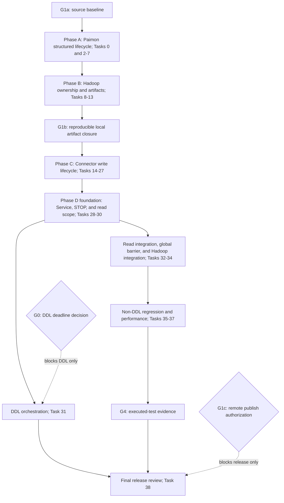

# Implementation Plan：Paimon Spill 与异步资源生命周期根治（Spec V5.1）

## 1. 计划状态

- 阶段：Phased implementation；2026-09-01 已授权按 Task 的 RED/GREEN、独立 commit 与审查门禁实施。
- 事实源：`connectors/paimon-plus-connector/src/doc/paimon-spill-compaction-lifecycle-root-fix-spec.md`（APPROVED FOR PHASED IMPLEMENTATION v5.1）。
- Connector 实施分支：`codex/paimon-spill-lifecycle-spec-v5`，基线 `develop@3b8e6d982266e430d825b1309038e84f4645d3ef`；Paimon 实施分支：`codex/spill-lifecycle-root-fix`，基线 `1.3.2@c05f7d1f1b1e5d37e64edab0f2978124d90b64f7`；Hadoop 基线：`3.3.6`。
- 现有工作区：保留用户已有 `pom.xml`、`.run/` 和 Connector 文档变更，不覆盖、不清理。
- 执行约束：严格按 `tasks/todo.md` 的依赖实施；每个显式编号实现切片/commit最多修改 5 个文件，RED/GREEN 与证据未完成时不得越过门禁。源码审计扩大范围时先拆子任务，不用“同一Task”规避文件预算。

当前已落地的Paimon切片事实：`f70e5267e`、`98a18ab81`、`60044a2a7`新增并加固additive structured iterator API与escaping wrapper failure retention；`8307184b0`、`844bc1d1b`以RED/GREEN修复`SemaphoredDelegatingExecutor` permit accounting；`0d9bb4a23`、`41957490b`、`67655eb9a`开始迁移manifest、`FileEntry`与incremental scanner consumer。旧`Iterable`/`Iterator` descriptor仍保留。该状态不代表Task 3A/3B调用点全部闭合、maintenance、Core capability、制品闭包或Connector接入完成。

Connector Task 25A已按源码审查拆成25A.1（身份型evidence/registry primitive）与25A.2（dormant carrier/coordinator seam），每个切片独立commit和审查。25A.2只提供Task 25B/26/28将消费的API；Factory/Service生产入口尚未采用前，不得把它标为production-active。

## 2. 目标与完成定义

根治同一故障族：父操作在 lazy/static child、compaction、maintenance、reader、spill 文件或 Hadoop raw FileSystem 仍可能运行/被借用时提前返回，上层随后关闭 IO 或删除目录，形成 use-after-close / delete-before-use。

完成必须同时满足：

1. Paimon以 additive ABI新增显式`AutoCloseable` structured iterator/operation，保留旧`Iterable`/`Iterator` descriptor。每个handle恰有一个owner：跨read边界由read child scope接管，不逃逸边界则由lexical owner eager-drain；所有success/failure/early-stop/interrupt路径执行`closeAndDrain()`。
2. `FAILED_DRAINED`只证明runnable已退出，不代表业务成功；仅maintenance SUCCESS且无`maintainError`、writer/committer均成功时允许关闭IO/spill。physical lease仍由外层场景ownership finalizer持有，不能由dependency outcome释放。
3. active termination wait与terminal retained严格分离；前者继续同一operation join，后者不在同进程重试未知部分close。
4. Factory、STOP、DDL、read和write使用同一proof/lease模型，无逆序close旁路、自等待或伪造proof。
5. Hadoop owned mode在Catalog创建/首次probe前启用；probe无遗失handle，first access single-flight，close/create线性化，禁止production反射与broad cache close。
6. patched Maven制品形成可解析的effective-POM闭包，不混装upstream/patched API/Common/Core。
7. deterministic real-spill、五种BucketMode、read/DDL/STOP并发、安全删除、性能与发布证据全部通过。

## 3. 源码证据基线

| 事实 | Paimon/Hadoop 位置 | 对 Plan 的约束 |
|---|---|---|
| lazy helper返回普通Iterator/Iterable | `paimon-api/.../ThreadPoolUtils.java:78-168` | 必须增加显式structured handle并审计全部consumer |
| manifest scan使用lazy helper | `paimon-core/.../operation/AbstractFileStoreScan.java:335-409` | read scope必须拥有handle并`closeAndDrain()` |
| deletion自有`allOf().get()` | `paimon-core/.../operation/FileDeletionBase.java:456-470` | 普通failure已等all-of；修interrupt与multi-error aggregation |
| maintenance先close commit、再`shutdownNow` | `paimon-core/.../table/sink/TableCommitImpl.java:348-411` | 改为graceful lifecycle outcome；`maintainError`非空即retained |
| bootstrap必经`ParallelExecution` | `paimon-core/.../crosspartition/IndexBootstrap.java:72-125` | 生产调用count=0；使用version-locked sequential adapter |
| async ORC reader使用static pool | `paimon-core/.../io/KeyValueFileReaderFactory.java:98-104,268-279`、`.../utils/AsyncRecordReader.java:37-110` | false时本次factory不构造AsyncRecordReader、不提交Future |
| access probe创建后丢失实例 | `paimon-common/.../fs/FileIO.java:609-619` | 复用validated FileIO或exact rollback，失败fail-fast |
| HadoopFileIO `get/create/put`非原子 | `paimon-common/.../fs/hadoop/HadoopFileIO.java:178-201` | `OwnedFileSystemEntry` single-flight与close/create状态机 |
| `newInstance`仍用unique cache key | Hadoop `FileSystem.java:585-611,3666-3743` | 不遍历cache；exact close只处理自己的unique entry |
| Core POM对多模块使用`${project.version}` | 本地`paimon-core-1.3.2.pom:38-112` | 归档effective POM并显式闭合unforked ecosystem版本 |

## 4. 硬门禁

| 门禁 | 通过条件 | 阻断范围 |
|---|---|---|
| G0：DDL产品决策 | 人工裁决Spec Q4：cumulative action-admission deadline及数值，或completion-driven | 仅阻断Task 31、DDL-specific验证和最终发布裁决；不阻断Tasks 32–35等非DDL实现 |
| G1a：Paimon源码基线 | 可写fork、固定commit、模块与source JAR一致、RED fixture可复现 | 阻断Paimon补丁实施；不依赖G0 |
| G1b：Paimon本地制品闭包 | 隔离空本地仓库可解析patched API/Common/Core、sources、effective POM、dependency tree、SHA-256与capability marker | 阻断Connector依赖切换和本地集成 |
| G1c：远端不可变发布 | 明确repository URL/id、凭证注入方式与发布授权；deploy后下载校验SHA-256且空仓库可解析 | 只阻断发布，不阻断本地实现 |
| G2：安全中间态 | 不存在旧Connector搭配语义改变但无gate的新内核，或新Connector搭配未修复内核 | 阻断合并、部署与回滚候选 |
| G3：生命周期证明 | 只有完整success barrier释放IO；WAITING和terminal retained均保持强引用并阻断global cleanup | 阻断STOP/DDL/global cleanup完成 |
| G4：测试真实执行 | 精确Surefire XML中关键测试`tests > 0`，全模块无filter测试通过 | 阻断发布 |

## 5. 不可回退的语义

### 5.1 Structured iterator/operation

- 保留旧方法descriptor，并以additive新方法返回`Iterator<T> + AutoCloseable`语义的显式handle，提供幂等`closeAndDrain()`；handle持有本invocation全部tickets。
- 每个handle只有一个resource owner；跨read边界必须在发布前转交read child scope，不逃逸边界则lexical eager-drain，STOP/DDL/其他joiner只能加入owner close operation。
- ticket只能由child wrapper `finally`完成；Future done/cancelled不是termination proof。
- read scope在handle逃逸前登记，按“停止消费 → closeAndDrain → batch release → reader close”释放；消费0/1条同样执行。
- 无法暴露handle的调用边界必须eager drain；禁止回退普通lazy iterator。

### 5.2 状态与释放判定

```text
ACTIVE WAITING / CLOSE_DEFERRED_TERMINATION
  = 未证明终止；同一个 operation 继续 join；不发布 CLOSED

SUCCESS
  = parent + child runnable 已退出，maintainError == null

FAILED_DRAINED
  = parent + child runnable 已退出，但存在业务失败
  = dependency retained；最多继续独立且 exactly-once 的 committer close；禁止 IO/spill 和外层 physical-lease ownership transition

DEPENDENCY_CLOSE_FAILED_RETAINED / IO_CLOSE_FAILED_RETAINED
  = terminal；保留 strong handle + sticky failure；同进程不重试未知部分 close
```

合法释放条件是：`compaction TERMINATED && writer close success && maintenance SUCCESS && maintainError == null && committer close success`。`FAILED_DRAINED`不得出现在允许IO close的判定中。

### 5.3 Factory与写路径

- proof reason仅`STOP | DDL | FACTORY_ROLLBACK`；fatal write只设置sticky fence与`failureOrigin=WRITE_PATH`，不能启动或冒充STOP teardown。
- PreparedWriter按两个独立提交闭合：19A通过`FileStoreTable.newWrite(commitUser)`取得具体`TableWriteImpl`并在任何first-use前绑定IO/Compaction；19B迁移最后一个bucket factory测试seam并删除过渡raw overload。19B完成前不得宣称生产raw writer类型边界已经闭合。
- Write-resource fixed safety order：proof → graceful compaction shutdown → await actual TERMINATED → writer → maintenance closeAndDrain → committer → full-success判定 → IO → spill unregister → resource `CLOSED_SUCCESS`。physical lease不属于该lifecycle；Factory envelope仅在SAFE rollback后exact-release，retained时转移给retained marker。外层finalizer必须按“admission锁内typed reservation → 锁外claim lifecycle authority → admission锁内提交”消费evidence；STOP由coordinator exact-remove Context后release，DDL先完成purpose-aware final admission，再凭identity-bound permit与coordinator-owned Context receipt确认same-lease transfer。
- GlobalIndex创建后立即staged-own；只有`endBoostrap`成功才transfer，外部注入对象是`IOManager`且不得被assigner close。
- Context/generation持有一个全生命周期WRITER physical lease；每次write/commit只获取operation admission并在表锁后revalidate，不重复申请physical lease。

### 5.4 DDL

- 有Context时继续持有其WRITER lease；无Context时申请DDL_ONLY。两种purpose都进入同一purpose-aware final admission；expired/interrupt保留source carrier/lease/fence，STOP按WRITER/DDL_ONLY purpose exact-finalize，DDL admitted后才允许detach/transfer。DDL等待其他foreground/read borrower，绝不等待自己持有的lease。
- 先fence目标表read，再request/join child；deadline先于action时保持active deferred，只允许内部STOP join，restart后用户显式重试。
- 成功或失败都保持当前finally cache/guard cleanup语义；action failure原子转移WRITER/DDL_ONLY到`RetainedDdlActionLease`，callback count=0。

### 5.5 Hadoop owned FileSystem

- owner mode进入CatalogContext/options并早于`CatalogFactory.createCatalog`和`FileIO.checkAccess`。
- access check复用同一validated FileIO；无法复用时exact rollback provisional，rollback失败fail-fast。
- `OwnedFileSystemEntry`分离operational wrapper与exact raw owner，状态`OPEN -> CLOSING -> CLOSED_SUCCESS | CLOSE_FAILED_RETAINED`。
- create在锁外，reservation/publish/close在线性化短锁；close join in-flight creator，losing/late raw exact-close。
- HDFS/S3A验证raw identity；`file://`验证LocalFileIO/stream隔离；native`s3://`不由S3A证明代替。
- production cleanup/capability禁止反射；只读诊断反射不得unwrap/close/clear或通过gate。

### 5.6 Spill安全

- manager必须是stable real approved root的direct child，basename严格`paimon-io-<UUID>`。
- root/manager/marker/traversal全部NOFOLLOW，删除前revalidate parent、basename、fileKey；identity缺失即fail-closed。
- 优先`SecureDirectoryStream` descriptor-relative deletion；平台无等价能力时自动递归cleanup fail-closed。

## 6. 架构与依赖图





任务级依赖以 [`tasks/todo.md`](todo.md) 每个 Task 的“依赖”字段为规范来源。纯 Markdown 阶段关系如下：

| 阶段 | Task | 前置门禁 | 阶段出口 |
|---|---|---|---|
| A：Paimon structured lifecycle | 0、2–7 | G1a | structured 0/1-item drain、maintenance、async reader、GlobalIndex测试通过 |
| B：Hadoop ownership与制品 | 8–13 | A | G1b：effective POM、dependency tree、checksum、capability闭合 |
| C：Connector write lifecycle | 14–27 | G1b | Factory fixed rollback与真实spill测试通过 |
| D0：Service/STOP/read scope基础 | 28–30 | C | 不依赖G0；完成Service/STOP接入与read scope owner模型，四类public read接入留给Task 32 |
| D1a：read与global barrier | 32–34 | D0；不依赖G0 | read/global cleanup/Hadoop实际实例收口 |
| D1b：DDL orchestration | 31 | D0 + G0 | DDL exact lease、read fence和policy分支通过 |
| E：回归与发布 | 35–38 | D1a；Task 38额外依赖D1b与G1c | G4：关键Surefire XML中`tests > 0`且全量测试通过 |

## 7. 实施阶段与 Checkpoint

### Phase A：Paimon结构化并发生命周期（Task 0、2–7）

- 输出：structured API、全lazy consumer审计、FileDeletion interrupt/multi-error、maintenance outcome、async-reader显式disable、GlobalIndex自有状态清理。
- Checkpoint A：0/1-item early-stop latch证明`closeAndDrain()`在sibling返回前不结束；`FAILED_DRAINED`使IO close count=0。

### Phase B：Hadoop ownership与制品闭包（Task 8–13）

- 输出：non-owning wrapper、access-probe复用、single-flight owned entry、actual-instance capability、effective-POM闭包及由checksum固定的本地可复现candidate artifacts；远端immutable deploy留到G1c。
- Checkpoint B：S3A probe只有一个live raw；create/close竞态无lost handle；dependency tree无patched/upstream stack混装。

### Phase C：Connector写生命周期（Task 14–27）

- 输出：startup gate、coordinator、proof/lease、spill security、runtime table、sequential bootstrap、fixed-order Factory rollback与deterministic real-spill测试。
- Checkpoint C：Factory只返回`SAFE_ROLLBACK | RETAINED_RESTART_REQUIRED`；真实spill在worker阻塞时目录存在且IO/action close count=0。

### Phase D：Service、read、STOP、DDL与global barrier（Task 28–34）

- 输出：Service adoption、STOP/write failure拆分、read-scope structured ownership、global barrier与Hadoop实际实例收口不依赖Q4；DDL exact lease与action-admission policy作为Task 31独立分支。
- Checkpoint D：read未`closeAndDrain()`时DDL action=0且global close=0；fatal write不触发teardown；production reflection helper彻底删除。

### Phase E：回归、性能与发布（Task 35–38）

- 输出：五BucketMode、Surefire XML、W1-W4、部署清理调查、release manifest。
- Checkpoint E：所有hard threshold通过，关键测试`tests > 0`，failure matrix每行都有test/event/outcome证据。

## 8. 测试执行门禁

Paimon fork定向测试应按模块运行，避免跨reactor指定不存在测试造成假失败；如果必须单命令，使用`-Dsurefire.failIfNoSpecifiedTests=false`并检查XML：

```bash
mvn -pl paimon-api -Dtest=ThreadPoolUtilsTest -Dsurefire.failIfNoSpecifiedTests=false test
mvn -pl paimon-common -Dtest=HadoopFileIOTest,HadoopSecuredFileSystemTest -Dsurefire.failIfNoSpecifiedTests=false test
mvn -pl paimon-core -Dtest=FileDeletionStructuredDrainTest,TableCommitMaintenanceLifecycleTest,KeyValueFileReaderFactoryTest,GlobalIndexAssignerTest -Dsurefire.failIfNoSpecifiedTests=false test
mvn -pl paimon-api,paimon-common,paimon-core -am -DskipITs test
```

Connector精确测试使用Surefire `*Test`，不得以`*IT`配合`-DskipITs`冒充执行：

```bash
mvn -pl connectors/paimon-plus-connector -am \
  -Dtest=PaimonServiceResourceCoordinatorTest,PaimonWriteResourceLifecycleTest,PaimonRuntimeTableFactoryTest,PaimonSequentialIndexBootstrapTest,PaimonReadResourceScopeTest,PaimonTableReadBorrowTest,PaimonHadoopFileSystemOwnershipTest,PaimonSpillDirCleanerSecurityTest,PaimonCompactionSpillLifecycleTest,KeyDynamicBucketWriterStrategyTest \
  -Dsurefire.failIfNoSpecifiedTests=false test

mvn -pl connectors/paimon-plus-connector -am test
```

CI必须保存Surefire XML并断言至少`PaimonCompactionSpillLifecycleTest`、`PaimonHadoopFileSystemOwnershipTest`、`PaimonSequentialIndexBootstrapTest`、`KeyDynamicBucketWriterStrategyTest`各自`tests > 0`。

## 9. Definition of Done

- [ ] Spec V5.1 Required语义无回退；G0仅阻断DDL-specific工作，G1a/G1b无自依赖，G1c只阻断远端发布。
- [ ] 每个structured iterator/operation有且仅有一个owner；跨read边界由read scope `closeAndDrain()`，非逃逸边界lexical eager-drain；0/1-item early-stop、error、interrupt均有latch证据。
- [ ] `FAILED_DRAINED`、active WAITING、terminal retained在代码、测试、metrics和Failure Matrix完全一致。
- [ ] Factory fixed safety order、GlobalIndex staged ownership、write/commit admission与physical lease合同通过。
- [ ] Hadoop probe/single-flight/close-create、HDFS/S3A/file差异、unique cache membership与禁止reflection通过。
- [ ] patched Maven effective-POM闭包、coordinates、sources、SHA-256、dependency tree与capability marker齐全。
- [ ] deterministic real-spill阈值、事件偏序、>=3 runs/readers、无`.channel ENOENT`通过。
- [ ] 五BucketMode和W1-W4 hard gate通过；默认全模块测试通过且XML证明关键测试实际执行。
- [ ] 未修改Paimon snapshot/offset/callback/exactly-once边界，未引入`prepareCommit(true)`。
- [x] 已获分阶段编码授权；每个切片仍须独立RED/GREEN、commit和审查。

## 10. 尚需人工裁决

仅保留Spec Q4：DDL是否启用cumulative action-admission deadline及默认值。该决策不改变任何安全不变量；未裁决时Task 31及DDL-specific evidence保持blocked，Tasks 2–30、32–37可继续。Task 38最终发布审查必须同时取得Q4裁决、非DDL门禁证据和远端发布授权。
